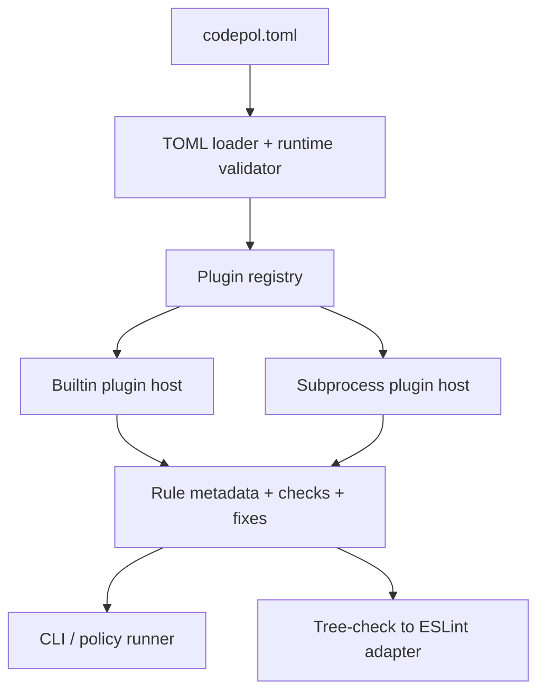

# TOML And Process Plugins

## Decisions

- Adopt `codepol.toml` as the only discovered config format.
- Make plugin resolution transport-neutral. Plugin IDs remain opaque strings and no longer imply Node module resolution.
- Target universal third-party plugins via a subprocess protocol. Built-in plugins use the same registry/host interface.
- Keep lint integration host-owned. Plugins should expose generic rule metadata, checks, and optional fixes; the host adapts those to ESLint where needed.

## Current Chokepoints

- `[packages/core/src/config/configDiscover.ts](packages/core/src/config/configDiscover.ts)` hardcodes JS/TS filenames and `jiti` loading:

```29:35:packages/core/src/config/configDiscover.ts
const CONFIG_FILENAMES = [
  'codepol.config.ts',
  'codepol.config.mts',
  'codepol.config.js',
  'codepol.config.mjs',
  'codepol.config.cjs',
] as const;
```

- `[packages/core/src/policy/policyPluginsGet.ts](packages/core/src/policy/policyPluginsGet.ts)` is the Node-specific plugin choke point today:

```87:112:packages/core/src/policy/policyPluginsGet.ts
const requireFromCwd = createRequire(path.join(cwd, 'package.json'));

// ...
moduleSource = pathToFileURL(requireFromCwd.resolve(moduleSpecifier)).href;

// ...
moduleLoaded = await import(moduleSource);
```

- `[apps/cli/src/index.ts](apps/cli/src/index.ts)` only avoids that path for one built-in plugin by pre-registering `@codepol/plugin`.
- `[packages/plugin/src/index.ts](packages/plugin/src/index.ts)` already exports tree-check-centric rules, which makes subprocess plugins viable without trying to transport native ESLint rule objects.
- `[scripts/build-binary.mjs](scripts/build-binary.mjs)` still carries a stub only to make TS config loading work; TOML-only should remove that requirement.

## Proposed Architecture



- Replace `PolicyPluginDeclaration = string | { module: string }` in `[packages/core/src/policy/policyTypes.ts](packages/core/src/policy/policyTypes.ts)` with transport-neutral declarations that fit TOML, for example builtin and process sources.
- Preserve existing rule IDs where possible so policies can keep identifiers like `@codepol/plugin/no-unused-exports` even though resolution no longer goes through Node package import semantics.
- Introduce a versioned subprocess protocol in new core runtime files for:
  - handshake / plugin metadata
  - rule listing and capability discovery
  - check requests returning generic diagnostics
  - optional fix requests
  - optional `requiresProjectIndex` declaration
- Reuse the existing tree-check-to-ESLint path in `[packages/core/src/index.ts](packages/core/src/index.ts)` rather than tunneling platform-native lint rule objects across the subprocess boundary.

## Implementation Plan

1. Config Layer

- Replace discovery and loading in `[packages/core/src/config/configDiscover.ts](packages/core/src/config/configDiscover.ts)` with TOML-only discovery and a TOML parser/validator module.
- Add runtime validation because `defineConfig()` and TS inference disappear when moving to `codepol.toml`.
- Decide the TOML layout for `targets`, `rules`, `exclude`, `plugins`, and any remaining runtime options such as ESLint config path.
- Update cache behavior, error messages, and public API docs to refer to `codepol.toml` only.

1. Plugin Declaration Model

- Update `[packages/core/src/policy/policyTypes.ts](packages/core/src/policy/policyTypes.ts)` so plugin declarations describe `id` plus `source.kind`, instead of JS module specifiers.
- Keep the plugin namespace independent from transport so built-ins and subprocess plugins resolve the same way.
- Refactor `[packages/core/src/policy/policyPluginsGet.ts](packages/core/src/policy/policyPluginsGet.ts)` into a transport-neutral registry/host flow instead of `createRequire()` and `import()`.

1. Subprocess Plugin Runtime

- Add new runtime files under `packages/core/src/` for protocol types, process spawning, handshake caching, request/response validation, and timeout/error handling.
- Start with generic capabilities only: rule metadata, tree checks, fixes, and project-index requirements.
- Keep v1 intentionally narrow and do not attempt to support process-defined native ESLint providers.

1. Consumer Integration

- Update `[apps/cli/src/index.ts](apps/cli/src/index.ts)` to resolve built-in and subprocess plugins through the new host.
- Update `[packages/core/src/index.ts](packages/core/src/index.ts)` and any `providerRulesConfigGet` callers so ESLint config generation consumes host-resolved rule metadata/capabilities.
- Remove config-loading-specific binary stub logic from `[scripts/build-binary.mjs](scripts/build-binary.mjs)` once TOML is the only format.

1. Migration, Tests, And Docs

- Replace `codepol.config.*` examples and discovery docs in `[README.md](README.md)`, `[docs/getting-started.md](docs/getting-started.md)`, `[docs/api-reference.md](docs/api-reference.md)`, and `[docs/creating-custom-plugins.md](docs/creating-custom-plugins.md)`.
- Add TOML parsing/validation tests near the config loader and end-to-end tests for subprocess plugin resolution.
- Update existing tests that currently depend on JS config files or `node_modules` symlinks, especially `[tests/e2e.cli.spec.ts](tests/e2e.cli.spec.ts)` and `[tests/esbuild.policy-plugin.spec.ts](tests/esbuild.policy-plugin.spec.ts)`.
- Remove or rewrite legacy docs/tests that still present JSON/JS/TS config as the primary path.

## Scope Guardrail

- The main risk is letting subprocess plugins become a transport for platform-native adapters. Keep v1 focused on generic diagnostics/fixes so `codepol` owns adapter generation and the subprocess protocol stays stable and portable.
