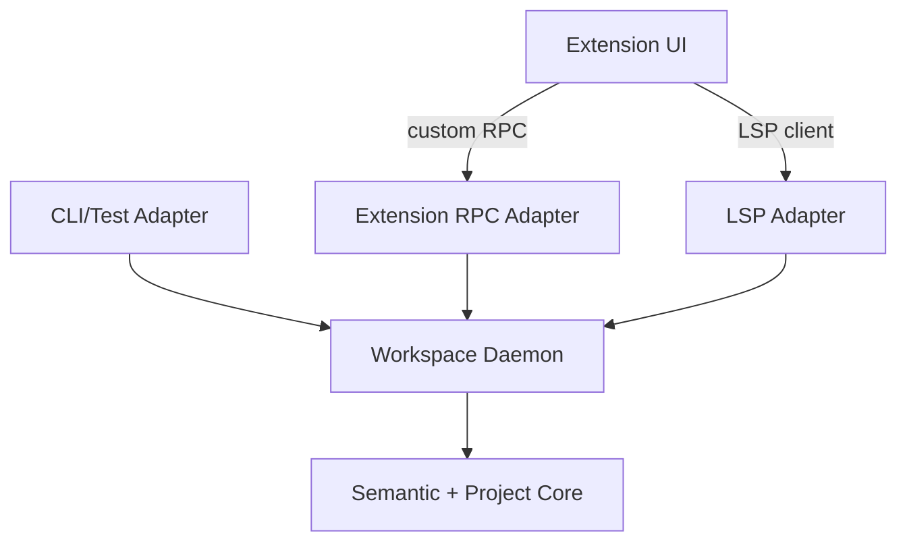

# Codepol LSP / Workspace Service TODO

This document tracks the recommended architecture and implementation order for a Codepol-owned LSP plus daemon-backed workspace service.

The goal is to make Codepol the primary workspace analysis backend while keeping the LSP adapter thin, editor-agnostic, and reusable across CLI, tests, and future extension-only features.

This expands the brief LSP note in `packages/core/src/index/TODO.md` into an implementation-focused plan.

## Current Intent

- `packages/core` stays the semantic and project truth layer.
- A reusable daemon/service host owns lifecycle, caching, overlays, scheduling, and multiplexing.
- Adapters stay thin and translate transport-specific requests into stable internal service calls.
- The extension UI layer owns commands, views, panels, decorations, and editor glue only.
- The first implementation may still wrap ESLint and Ruff behind a Codepol-owned service boundary.
- The long-term direction is for Codepol to replace wrapped lint analyzers behind stable service contracts where that improves quality and ownership.

## Recommendation

Choose the hybrid architecture:

- semantic/project core
- reusable daemon/service host
- thin LSP adapter
- thin extension RPC adapter
- extension UI layer

Do not build the core around LSP method names or VS Code APIs.

Do not make the extension host the source of truth for indexing, diagnostics, or workspace lifecycle.

Do not try to replace typecheckers such as `tsserver`, `Pylance`, or `Pyright` in the first phase.

## Why This Fits The Current Repo

- `apps/cli/src/index.ts` is currently the only place that aggregates ESLint, Ruff, and tree-check diagnostics into one result stream.
- `packages/core/src/policy/policyCheck.ts` only covers tree-check execution and pretty-printing, not the full aggregated pipeline.
- `packages/core/src/policy/policyTreeCheck.ts` reads file contents from disk inside `policyViolationsGetForFile()`, which is incompatible with unsaved editor buffers.
- `packages/plugin-eslint/src/eslintAdapter.ts` already demonstrates the right editor-facing pattern: use in-memory source and incrementally refresh the project index.
- `packages/plugin-ruff/src/ruffRunner.ts` and `packages/core/src/policy/policyPluginProcess.ts` currently use blocking subprocess execution, which is acceptable in CLI code but not ideal for an interactive daemon hot path.
- `packages/core/src/index/TODO.md` already calls out missing index persistence, watch-mode integration, incremental index updates, and LSP integration. Those items are directly relevant to an editor-backed service host.

## Architecture Options Considered

### 1. Thin standalone LSP over the current core

Pros:

- fastest path to first-party diagnostics
- lowest operational complexity
- best editor portability

Cons:

- weak fit for multi-window reuse
- poor fit for non-LSP features such as dependency graphs or semantic search panels
- tends to push lifecycle and cache concerns into transport code
- weak fit for the long-term goal of making Codepol the main analysis platform

### 2. Extension-only in-process host

Pros:

- simple overlay handling
- fast UI iteration
- fewer moving parts at first

Cons:

- couples semantics and caching to VS Code/Cursor runtime behavior
- weak reuse for CLI, tests, and headless workflows
- poor portability to other editors
- makes extension code too important to the backend architecture

### 3. Recommended: hybrid daemon plus thin adapters

Pros:

- reusable backend logic
- multi-window reuse
- cross-session warm caches
- clean separation between semantics and transport
- supports richer extension-only features without distorting LSP
- supports gradual replacement of wrapped linters behind stable APIs

Cons:

- highest initial complexity
- requires stronger lifecycle, observability, and failure isolation work up front

## High-Level Shape



## Responsibility Split

### A. Semantic + project core

Keep this layer stable and reusable.

Own here:

- parsers and parse-tree access
- project model
- semantic index
- diagnostics
- rename/refactor/search logic
- cross-file analysis
- workspace queries over files, overlays, and config
- normalized internal data types

Do not let this layer know:

- which editor is calling
- which panel is open
- extension UI state
- JSON-RPC wire details
- LSP method names

### B. Workspace daemon / service host

This is the reusable long-lived process layer.

Own here:

- workspace registration
- client/session registration
- per-client overlays
- filesystem watchers
- incremental invalidation
- background indexing
- job scheduling and prioritization
- external tool orchestration
- cache persistence
- telemetry and observability
- concurrency control

### C. LSP adapter

Keep this adapter thin.

Own here:

- document sync to overlay updates
- LSP request translation
- LSP response mapping
- cancellation and progress plumbing

It should not own semantic business logic.

### D. Extension RPC adapter

Use this for richer Codepol-specific capabilities that do not map well to standard LSP methods.

Examples:

- dependency graph
- semantic search
- impacted tests
- index status
- architecture summaries
- guided refactor workflows

### E. Extension UI layer

Own here:

- command palette commands
- context menus
- tree views
- webviews
- decorations
- status items
- local persisted UI state

This layer should compose backend capabilities, not implement semantics.

## Core API First

Design the core around stable semantic operations instead of LSP method names.

Likely shape:

```ts
type WorkspaceService = {
  openWorkspace: (input: OpenWorkspaceRequest) => Promise<WorkspaceHandle>;

  openOverlay: (input: OpenOverlayRequest) => Promise<void>;
  applyOverlayEdit: (input: ApplyOverlayEditRequest) => Promise<void>;
  closeOverlay: (input: CloseOverlayRequest) => Promise<void>;

  queryDiagnostics: (
    input: DiagnosticsQuery
  ) => Promise<WorkspaceDiagnostic[]>;
  queryDefinition: (input: DefinitionQuery) => Promise<LocationResult[]>;
  queryReferences: (input: ReferencesQuery) => Promise<LocationResult[]>;
  queryHover: (input: HoverQuery) => Promise<HoverResult | null>;
  queryWorkspaceSymbols: (
    input: WorkspaceSymbolsQuery
  ) => Promise<SymbolResult[]>;

  prepareRename: (input: PrepareRenameQuery) => Promise<RenameRange | null>;
  runRename: (input: RenameCommand) => Promise<WorkspaceEditResult>;

  querySemanticSearch: (
    input: SemanticSearchQuery
  ) => Promise<SearchResult[]>;
  queryDependencyGraph: (
    input: DependencyGraphQuery
  ) => Promise<GraphResult>;
  queryIndexStatus: (input: IndexStatusQuery) => Promise<IndexStatusResult>;
};
```

Important API rules:

- use editor-neutral types at the core boundary
- make capability commands explicit rather than hiding them in query payloads
- define stable workspace, client, document, and snapshot identities
- decide position encoding up front
- be explicit about URI vs absolute path vs workspace-relative identity

## Shared State vs Isolated State

The daemon should share world state and isolate client state.

Shared:

- filesystem snapshot
- parse caches
- semantic index
- dependency graph
- build metadata
- persisted workspace caches

Isolated per client:

- unsaved overlays
- cursor and selection context
- temporary editor-local options
- UI-specific filters
- auth or session-specific context if added later

The daemon must support multiple overlays over the same base file without corrupting analysis across clients.

## Current Code Areas That Matter

### Aggregated diagnostics and CLI flow

- `apps/cli/src/index.ts`
- current source of truth for:
  - plugin loading
  - provider filtering
  - ESLint execution
  - Ruff execution
  - tree-check aggregation
  - fix ordering

Implication:

- this logic should move into reusable service code
- the CLI should become an adapter over that service

### Tree-check execution

- `packages/core/src/policy/policyTreeCheck.ts`
- `packages/core/src/policy/policyCheck.ts`

Current constraint:

- `policyViolationsGetForFile()` reads from disk via `fs.readFileSync`

Implication:

- add source-aware and overlay-aware APIs before building editor diagnostics on top of this path

### Plugin loading and process plugins

- `packages/core/src/policy/policyPluginsGet.ts`
- `packages/core/src/policy/policyPluginProcess.ts`
- `packages/core/src/policy/policyTypes.ts`

Current constraints:

- process plugins describe rules, tree checks, and fixes
- process plugins are not symmetrical with built-in `lintProviders`
- process transport is blocking and synchronous

Implication:

- the daemon can host external lint execution in phase 1
- process plugin capabilities may need to expand later if plugin symmetry becomes important

### Editor-facing in-memory indexing pattern

- `packages/plugin-eslint/src/eslintAdapter.ts`

Current value:

- already demonstrates:
  - using in-memory source
  - incremental project index refresh
  - project-index caching by config path

Implication:

- use this as the reference for overlay-aware indexing behavior in the new service layer

### Ruff integration

- `packages/plugin-ruff/src/ruffRunner.ts`
- `packages/plugin-ruff/src/ruffAdapter.ts`

Current constraints:

- CLI uses `ruffRunner.ts`
- current runner is synchronous
- `ruffAdapter.ts` is useful infrastructure but is not the current aggregation path

Implication:

- move Ruff execution behind an async service boundary
- keep the normalized output contract stable even if the underlying implementation changes later

### Config and file targeting

- `packages/core/src/config/configDiscover.ts`
- `packages/core/src/policy/policyGet.ts`

Implication:

- workspace identity should be keyed by config and environment, not just repo root
- file targeting and rule matching should remain inside the shared backend, not in adapters

### Semantic index and existing roadmap

- `packages/core/src/index/TODO.md`
- `packages/core/src/index/indexBuilder.ts`
- `packages/core/src/index/indexQuery.ts`
- `packages/core/src/index/indexSnapshot.ts`

Implication:

- LSP work depends on index persistence, incremental updates, and watch integration
- the daemon is the natural host for those concerns

## Critical Design Decisions

### 1. Diagnostic model

Current issue:

- `PolicyViolation` is not rich enough for a first-class editor transport because it lacks explicit severity and commonly lacks end ranges

Decision:

- define an editor-friendly diagnostic transport for the service layer
- either promote `LintDiagnostic` or add a new `WorkspaceDiagnostic`

Required fields:

- source
- code
- severity
- message
- file identity
- start and end range
- optional fix payload

### 2. Overlay-aware analysis

Current issue:

- many checks assume on-disk source

Decision:

- the service layer must accept overlay content per client
- tree checks, index updates, diagnostics, and rename/refactor flows must all operate on overlay-aware snapshots

### 3. Workspace identity and reuse

Decision:

- workspace instances should be keyed by more than repo root
- include at least:
  - workspace root
  - config path or config identity
  - environment/toolchain identity when relevant

### 4. Transport

Recommended default:

- local socket or named pipe for the daemon
- stdio fallback for single-client or simpler embedding scenarios

Rationale:

- reconnectable
- supports multiple clients
- cleaner than forcing everything through one stdio channel

### 5. External linter orchestration

Phase 1 decision:

- keep ESLint and Ruff as wrapped analyzers inside the daemon/service host
- adapters should see one unified Codepol diagnostic service

Long-term decision:

- replace external analyzers only behind stable service contracts
- do not let transport layers know or care whether diagnostics came from native Codepol logic or wrapped tools

### 6. Observability

Expose from day one:

- workspace open time
- index progress
- cache hit rate
- invalidation counts
- query latency by operation
- queue depth
- memory by workspace
- overlay count by client

### 7. Failure isolation

The daemon should isolate failures at the workspace or capability level where possible.

Examples:

- one workspace can be evicted without killing all workspaces
- a failed dependency graph query does not block diagnostics
- external linter timeouts do not poison native semantic features

## Open Design Decisions

The sections above define the recommended architecture, but the following contracts still need explicit decisions before implementation starts in earnest.

Keep this file focused on:

- architectural decisions
- rollout and sequencing
- cross-cutting constraints
- links to deeper implementation notes

When a subsection grows into concrete type shapes, planner rules, state machines, or engine-specific workflows, extract it to a companion `TODO_CODEPOL_LSP_<TOPIC>.md` file. In the main TODO, keep only:

- the decision summary
- why it matters
- when to read the detailed note

### 1. Fix and code-action model

Decision:

- define a first-class service-level fix/code-action contract
- normalize all executable fix sources into one internal edit model before LSP or editor adapters see them

Why it matters:

- Codepol currently has heterogeneous fix producers: plugin `FixProvider`, tree-check fixes, ESLint autofix, and Ruff `--fix`.
- Without a shared planner and canonical edit model, `quick fix`, `fix all for rule`, and `fix all in file` behavior will diverge.
- Adapters should not own overlap detection, ordering, stale-revision checks, or merge policy.

Key invariants:

- `EditPlan` is the canonical internal executable edit model, not raw LSP `WorkspaceEdit`.
- Adapters consume planned actions; they do not merge, reorder, or resolve conflicts.
- Providers may author fixes in local formats, but executable results must resolve into normalized plans before exposure or application.

Read the detailed note when:

- implementing `CodeActionService`
- defining `EditPlan`, `FixCandidate`, `CodeAction`, or conflict types
- wiring plugin `FixProvider`, tree-check fixes, ESLint autofix, or Ruff `--fix`
- deciding batching, overlap detection, stale-revision handling, or `fix all` orchestration

Detailed note:

- [TODO_CODEPOL_LSP_FIX_MODEL.md](TODO_CODEPOL_LSP_FIX_MODEL.md)

### 2. Capability ownership matrix by language

Decision:

- for TypeScript/JavaScript and Python, Codepol does not replace `tsserver`, `Pylance`, or `Pyright` in phase 1
- existing language servers remain the source of truth for core language intelligence and standard language-semantic features
- Codepol may only act as a supplemental provider for Codepol-owned semantic classes:
  - project or domain entities
  - architecture or policy objects
  - generated artifacts
  - config-derived navigation and symbols
- define ownership by semantic class, not only by feature name
- when coexistence is ambiguous, prefer explicit Codepol commands, views, or clearly labeled alternate results over competing default handlers

Why it matters:

- without an explicit matrix, implementation will drift into duplicate UI entries, inconsistent jump targets, conflicting rename scopes, and user confusion about which result is authoritative
- an underspecified phase-1 boundary creates pressure to "just implement the missing 20%" until Codepol accidentally becomes a second language server

Key invariants:

- phase-1 Codepol capabilities must not compete with standard language intelligence on normal code symbols
- any shared editor surface must label Codepol results clearly and carry provenance plus semantic-class metadata
- when coexistence is ambiguous, prefer explicit Codepol commands over competing default handlers

Read the detailed note when:

- deciding whether a new LSP capability belongs in phase 1
- implementing `definition`, `references`, `hover`, `rename`, or `workspace/symbol`
- deciding whether results should appear in the default flow or behind explicit Codepol commands
- defining provenance or semantic-class labels for adapter output

Detailed note:

- [TODO_CODEPOL_LSP_CAPABILITY_MATRIX.md](TODO_CODEPOL_LSP_CAPABILITY_MATRIX.md)

### 3. Daemon discovery, launch, and version handshake

Decision:

- define this boundary explicitly as the daemon control plane, not incidental boot code
- use a per-user runtime descriptor for discovery:
  - clients resolve `daemon.info.json` first, then connect to the advertised transport
- make a shared launcher library the sole launch authority:
  - it acquires exclusive `daemon.lock`
  - it is the only component allowed to spawn the shared daemon or clean stale runtime artifacts
- require a mandatory startup `hello` handshake before any normal work:
  - discovery proves where to connect
  - handshake proves protocol compatibility, daemon identity, liveness, and negotiated capabilities
- separate compatibility concerns:
  - control-plane protocol compatibility is strict
  - engine capability compatibility is negotiated and may degrade features
  - cache and index schema versioning is handled separately
- define deterministic stale recovery and fallback:
  - failed connect or handshake enters a lock-guarded recovery path
  - shared daemon mode falls back to private per-client backend mode, then reduced feature mode, then hard fail only if no safe degraded path exists

Why it matters:

- packaging, extension upgrades, CLI sharing, reconnect behavior, and stale socket cleanup all depend on a stable control-plane contract
- without single-launch authority and mandatory handshake, clients will race to spawn daemons, talk to stale endpoints, or silently attach to incompatible builds
- explicit fallback modes let the product degrade predictably instead of treating daemon failures as undefined behavior

Key invariants:

- clients discover a descriptor, not a raw socket or pipe guess
- only the launch-lock holder may spawn, replace, or clean shared runtime artifacts
- socket existence or PID presence alone never proves health; successful handshake does
- reconnect is full rediscovery plus full handshake plus session replay
- daemon readiness, workspace attachment, and feature readiness are separate phases

Read the detailed note when:

- defining runtime and state directory layout, descriptor schema, or launcher ownership rules
- designing handshake RPCs, version negotiation, or capability gating
- implementing stale socket cleanup, reconnect logic, or controlled daemon replacement on upgrade
- making the CLI and editor extension share the same daemon lifecycle contract

Detailed note:

- [TODO_CODEPOL_LSP_DAEMON_CONTROL_PLANE.md](TODO_CODEPOL_LSP_DAEMON_CONTROL_PLANE.md)

### 4. Workspace attachment and session replay

Decision:

- define this boundary as a workspace session protocol layered on top of the daemon control plane
- separate four identities explicitly:
  - `daemon_session_id` for one daemon process incarnation
  - `workspace_id` for stable logical workspace identity
  - `workspace_instance_id` for one live workspace instance inside the current daemon session
  - `client_session_id` for one attached editor or CLI consumer, with client-local document overlays scoped per session
- require a phased attach and replay flow after daemon `hello`:
  - `register_client_session`
  - `attach_workspace`
  - replay subscriptions, open documents, and authoritative overlay snapshots
  - `complete_replay` barrier before normal request flow resumes
- treat reconnect as full re-registration and replay, not continuation:
  - daemon restart invalidates prior registrations, workspace attachments, overlays, subscriptions, and non-resumable in-flight work
- make readiness explicit and separate:
  - daemon ready
  - client registered
  - workspace attached
  - workspace ready
  - feature ready
- define request behavior during warm-up:
  - requests must return structured `not_ready` or explicit degraded results when dependencies are not ready
  - clients must not treat partial or stale answers as full-quality results

Why it matters:

- deterministic reconnect depends on replayable client state, authoritative overlay restore, and explicit readiness barriers
- without a workspace session protocol, daemon restarts can produce stale diagnostics, dropped subscriptions, duplicate warm-up work, and requests that race against half-restored state
- separating daemon session, workspace instance, and client session identities keeps reconnect and multi-client attach behavior correct

Key invariants:

- reconnect is always `register_client_session` plus `attach_workspace` plus replay
- overlay restore uses authoritative snapshots, not edit deltas
- subscriptions are explicit, replayable, and idempotent within one daemon session
- old diagnostics and results from a prior `daemon_session_id` are stale by definition
- transport connection identity is ephemeral and never used as durable client or workspace identity
- workspace-ready and feature-ready are separate phases with separate status signals

Read the detailed note when:

- defining `register_client_session`, `attach_workspace`, replay, or readiness RPCs
- implementing overlay replay, subscription rehydration, or replay barriers after reconnect
- deciding request gating, degraded responses, or timeout behavior during workspace warm-up
- handling diagnostics invalidation, background work restart, or resumable task semantics across daemon restart

Detailed note:

- [TODO_CODEPOL_LSP_WORKSPACE_SESSION_PROTOCOL.md](TODO_CODEPOL_LSP_WORKSPACE_SESSION_PROTOCOL.md)

### 5. Request ordering, cancellation, and snapshot consistency

Decision:

- define this boundary as the snapshot and execution contract for daemon requests and side effects
- every request binds to an explicit state vector capturing at least:
  - `daemon_session_id`
  - `workspace_instance_id`
  - `replay_epoch`
  - `client_session_id` when client-local overlays matter
  - document overlay version or versions when relevant
  - `file_system_revision` when relevant
  - one published `analysis_generation` when relevant
- make pinned snapshots the default read model:
  - reads run against a coherent published snapshot chosen at dispatch time, not a moving target
  - consistency levels are explicit: pinned latest safe, pinned exact, and labeled best-effort only for explicitly degraded features
- treat replay and invalidation as ordered writes with barriers:
  - replay messages form a per-session ordered stream ending in a replay barrier
  - foreground reads must not observe half-applied replay or half-published analysis state
- publish new semantic state by committed generations:
  - background indexing and file-watch invalidation build future generations
  - reads see generation `G` or committed `G+1`, never a mix
- split cancellation semantics:
  - compute cancellation is best-effort
  - publication cancellation is hard, so canceled or superseded work must not publish current replies or side effects
- require metadata on all responses and push events:
  - clients discard stale outputs by daemon session, workspace instance, replay epoch, document version, request id, and analysis generation as applicable

Why it matters:

- without a pinned snapshot contract, technically successful requests can still be operationally wrong because they mix old overlays, new index state, and stale replay visibility
- editor interactions constantly race with edits, reconnect, replay, invalidation, and background indexing, so stale-response handling must be deterministic
- diagnostics, progress, and other push side effects need the same freshness rules as direct request responses

Key invariants:

- every request and publish event is attributable to one daemon session, one workspace instance, and one replay epoch
- document-sensitive reads must not claim success against an older overlay version than requested
- cross-file and project-wide reads execute against one pinned published analysis generation
- no request may observe half-applied replay or half-committed analysis state
- canceled or superseded work may continue internally, but it must not publish user-visible results as current
- correctness-sensitive commands must validate exact snapshot preconditions or fail and require revalidation

Read the detailed note when:

- defining request binding metadata, consistency levels, or snapshot-resolution rules
- implementing replay barriers, generation commit, stale-response discard, or supersession logic
- deciding cancellation and side-effect suppression behavior for diagnostics, progress, or other push channels
- validating rename, refactor, or apply operations against exact snapshot preconditions

Detailed note:

- [TODO_CODEPOL_LSP_SNAPSHOT_EXECUTION_CONTRACT.md](TODO_CODEPOL_LSP_SNAPSHOT_EXECUTION_CONTRACT.md)

### 6. Config reload and invalidation rules

Decision:

- make config reload a first-class subsystem with field-classified invalidation rather than one generic "config changed" path
- split config into explicit reload domains because different changes have different safe actions:
  - rule config for rule enablement, severity, and rule options
  - targeting config for include/exclude globs, ignore files, and target membership
  - semantic environment config for parser, resolver, interpreter, language-version, and source-root behavior
  - plugin and capability config for plugin topology, runtime wiring, capability registration, and sandbox-affecting settings
  - execution environment config for toolchain, executable lookup, and env vars consumed by analyzers
- classify each normalized config field into one reload class:
  - `none`
  - `rules`
  - `targeting`
  - `semantic`
  - `workspace_restart`
- detect config changes by semantic diff, not raw file bytes:
  - parse watched config into normalized form
  - ignore formatting-only and irrelevant changes
  - compute field-level diffs and aggregate the strongest required reload class in the batch
- apply the smallest safe action for the affected partition:
  - `rules` preserves parse, type, and index caches and reruns affected diagnostics only
  - `targeting` recomputes file-to-target membership and adds or prunes affected files
  - `semantic` rebuilds parse, type, and semantic-index state for affected partitions
  - `workspace_restart` restarts the workspace instance and replays overlays and subscriptions
- make invalidation partition-aware rather than workspace-wide when possible:
  - partition by target, config root, language, environment identity, and analyzer pipeline identity
  - one partition changing must not force unrelated language or target rebuilds
- version published workspace state so stale results cannot leak:
  - track at least `config_version`, `target_graph_version`, `semantic_graph_version`, and `plugin_graph_version`
  - require diagnostics, cached results, and push events to carry the versions they were derived from
- be conservative about plugin and runtime topology changes:
  - rule-only plugin option changes may use `rules` or `targeting`
  - plugin add/remove, ABI or version changes, capability-graph changes, and sandbox or runtime mode changes default to `workspace_restart`

Why it matters:

- `codepol.toml`, ESLint config, Ruff config, plugin declarations, and environment changes can affect rules, file targeting, semantic meaning, or runtime capabilities, and those do not share one safe invalidation path
- a field-classified model avoids unnecessary rebuilds while still preventing stale diagnostics, stale index entries, and unsafe hot reload behavior
- partitioned invalidation is a major scalability boundary for mixed-language and multi-target workspaces

Key invariants:

- config reload is field-classified, not file-classified
- formatting-only config edits must not trigger semantic invalidation
- rule-only changes preserve parse, type, and semantic-index caches
- targeting changes recompute membership and prune or add affected files without forcing unrelated semantic rebuilds
- parser, resolver, interpreter, toolchain, and language-version changes invalidate semantic state for affected partitions
- plugin topology, runtime wiring, capability registration, and sandbox changes restart the workspace instance unless hot-reload safety is explicitly proven
- old results are stale by definition once their version vector no longer matches current workspace state

Default mapping:

- rule severity, enablement, or rule option changes trigger partial rule re-evaluation
- include/exclude, ignore, override, or target declaration changes trigger target or file-match recomputation
- parser, module-resolution, source-root, interpreter, or language-version changes trigger index rebuild
- plugin topology, plugin runtime compatibility, transport capability, or sandbox and security changes trigger daemon workspace restart

Reload pipeline:

- watch `codepol.toml`, ESLint config, Ruff config, plugin manifests, and relevant environment or toolchain fingerprints
- parse each source into normalized semantic form and compute a field-level diff
- map changed fields and plugin manifest changes to reload classes
- aggregate the strongest required action per batch and per affected partition
- increment the relevant workspace-state versions before publishing new results
- emit explicit lifecycle events such as `config_reload_started`, `index_rebuild_started`, `workspace_restarting`, and `config_reload_completed`

### 7. Trust and sandboxing model

Decision:

- treat external execution as a first-class trust and execution-policy subsystem owned by the daemon host rather than scattered checks in adapters or plugins
- separate trust into three layers:
  - daemon trust: the daemon runs as the user but defaults to a reduced execution posture and does not implicitly execute workspace-defined commands, workspace binaries, or process plugins
  - workspace trust: each workspace is explicitly `untrusted` or `trusted`, and opening a folder never grants execution rights by itself
  - tool trust: tools and plugins are classified and approved separately by origin such as `builtin`, `user_global`, `workspace_configured_global`, `workspace_local`, `downloaded_runtime`, and `plugin_process`
- gate execution by capability and origin rather than one broad allow flag:
  - classify requests by capability such as `static_analysis`, `linting`, `formatting`, `build_metadata_probe`, `test_discovery`, `code_generation`, `arbitrary_command`, and `process_plugin`
  - evaluate policy over at least `workspace_trust`, `tool_origin`, `capability_class`, `resource_profile`, `env_profile`, requested cwd, and whether the action is explicit user invocation
- make `untrusted` workspaces read-only by default:
  - allow parsing, indexing, config parsing as data, and bundled in-process analyzers
  - block process plugins, repo-configured external tools, workspace-local executables, arbitrary commands, secret env passthrough, and other execution that requires separate approval
- make `trusted` workspaces eligible, but not automatically entitled, to bounded external execution:
  - built-in tools and user-configured global linters or formatters may auto-run under sanitized env and cwd restrictions
  - repo-selected global commands, process plugins, workspace-local executables, downloaded helper runtimes, and extra env or network access require additional approval
  - arbitrary commands and write- or network-affecting build, test, or codegen flows require explicit user invocation
- sanitize and constrain every child-process launch centrally:
  - build child env from allowlisted profiles and named env classes rather than daemon-env passthrough
  - restrict cwd to workspace root, subdirectories, or daemon-managed temp dirs after canonicalization
  - enforce timeouts, memory ceilings, process-tree cancellation, concurrency caps, and structured audit metadata on every execution
- make prompts and failures specific and auditable:
  - trust prompts identify the exact executable or plugin, origin, feature, cwd, and requested env classes
  - blocked, denied, timed-out, and missing-tool failures surface as structured status, not repeated generic prompts

Why it matters:

- a long-lived daemon turns "open repo" into a potential execution surface, so trust for the daemon, the workspace, and the tool origin must stay separate
- editor-driven auto-runs happen frequently and implicitly, so capability-specific policy is safer than feature-local allow checks
- centralized policy prevents privilege creep, inconsistent prompts, and accidental secret exposure across tool adapters

Key invariants:

- opening a workspace does not imply permission to execute repo-defined code
- workspace trust is explicit, persisted per workspace identity, and revocable
- process plugins require both workspace trust and separate plugin approval
- workspace-local executables never auto-run solely because repo config referenced them
- child processes receive sanitized env, bounded cwd, and resource ceilings by default
- arbitrary commands are explicit user actions, not background daemon behavior
- the daemon host owns policy enforcement, while adapters only declare requested capabilities

Read the detailed note when:

- defining trust persistence, execution requests, policy-engine inputs, or approval records
- integrating process plugins, external linters, or repo-local helper executables
- deciding env profiles, cwd canonicalization rules, resource ceilings, or process-tree supervision
- designing trust prompts, blocked-execution UX, audit logs, or network and filesystem policy classes

Detailed note:

- [TODO_CODEPOL_LSP_TRUST_EXECUTION_POLICY.md](TODO_CODEPOL_LSP_TRUST_EXECUTION_POLICY.md)

### 8. Multi-root and remote execution scope

Decision:

- MVP supports local single-root execution only:
  - one local workspace root
  - standard `file:` URIs only
  - daemon runs on the same machine as the editor extension and accesses the local filesystem directly
- explicitly defer:
  - multiple workspace folders
  - SSH/remote hosts
  - remote containers
  - non-`file:` or virtual document schemes
- treat this as an intentional product boundary, not an accidental omission
- keep the architecture future-ready even though MVP scope is narrow:
  - use URI-based workspace and document identifiers rather than raw path-only types
  - separate document identity from content access and file watching so providers can evolve later
  - keep transport and daemon-placement concerns out of the semantic core
  - model workspace instances explicitly rather than assuming one global root forever

Why it matters:

- multi-root changes workspace identity, config precedence, dependency partitioning, and cross-root query semantics; it is not just a transport detail
- remote support changes daemon placement, transport, file watching, cache locality, auth, and latency or cancellation behavior
- non-`file:` schemes change assumptions about document identity, canonicalization, persistence, and whether a stable on-disk backing file even exists
- constraining MVP to local single-root keeps lifecycle, cache ownership, URI normalization, and transport assumptions simple while preserving headroom for later expansion

Key invariants:

- v1 adapters accept only `file:` workspace and document URIs and reject other schemes explicitly
- each workspace instance currently has exactly one canonical local root URI
- local IPC and direct local filesystem access are valid v1 host assumptions, but they must not leak into semantic-core types
- adding multi-root, remote execution, or non-`file:` support later should not require redesigning the semantic core

### 9. Persistence contract and cache versioning

Decision:

- treat persistence as an explicit semantic contract owned by the workspace service rather than an internal cache optimization
- separate persisted state into four artifact classes with explicit trust levels:
  - Tier A `authoritative_metadata`: workspace manifest, discovered project roots, config-resolution results, dependency graph structure derived from declared config, file fingerprints, toolchain or environment fingerprints, and shard inventory; safe to trust if structurally valid
  - Tier B `derived_semantic_shards`: AST or CST blobs, symbol tables, import or export summaries, diagnostics snapshots, reference-index shards, workspace symbol shards, search indexes, and similar intermediate semantic assets; reusable only when the full reuse key matches exactly
  - Tier C `ephemeral_runtime_state`: overlays, unsaved buffers, in-flight jobs, session bindings, debounce state, and cancellation state; do not persist as correctness-bearing state
  - Tier D `telemetry_and_history`: last successful index time, cache hit rates, crash markers, and clean-shutdown markers; persist separately and never let them affect semantic correctness
- persist a minimum durable set per workspace:
  - a workspace manifest with `workspace_id`, storage format version, semantic schema version, producer version, capability or plugin-set hash, environment fingerprint, toolchain fingerprint, relevant config fingerprints, shard inventory, timestamps, and clean or dirty shutdown marker
  - a file fingerprint table with canonical file identity, content hash, size, mtime as a hint only, language or parse mode, dependency-edge summary, and shard membership
  - granular per-file or per-module shards for parse blobs, symbol summaries, import or export summaries, diagnostics snapshots, local reference summaries, and similar reusable intermediate state
  - workspace-level index shards for workspace symbols, cross-file reference indexes, dependency graph snapshots, and search indexes
- do not persist user-facing semantic answers as trusted truth:
  - rename plans, hover or completion payloads, code actions, full cross-workspace reference results, and cursor- or overlay-sensitive answers are recomputed from persisted inputs rather than reused directly
- require every persisted artifact to carry an explicit reuse key over:
  - semantic schema version
  - storage format version
  - workspace identity
  - toolchain and environment fingerprint
  - relevant config fingerprints
  - source and dependency fingerprints
  - feature options and capability or plugin-set fingerprint when applicable
- use separate version axes rather than one app version:
  - `storage_format_version` for on-disk encoding compatibility
  - `semantic_schema_version` for meaning and correctness compatibility
  - `producer_version` for diagnostics and cautious rollback handling
  - `capability_set_version` or hash when plugins contribute semantic data

Reuse contract:

- an artifact is reusable for correctness-sensitive queries only if:
  - its checksum validates
  - its storage format is supported
  - its semantic schema version exactly matches
  - its producer capability or plugin set is compatible
  - its workspace identity matches
  - its required toolchain or environment fingerprint matches
  - its required config, source, and dependency fingerprints match
  - it has a committed manifest or journal entry and is not superseded or orphaned
- if any required condition fails:
  - ignore the artifact for correctness-sensitive queries
  - optionally use it only as a rebuild hint when that artifact class is explicitly advisory

Invalidation and retention:

- hard-invalidate an artifact on storage or schema mismatch, incompatible toolchain or capability fingerprint, config mismatch, required content or dependency hash mismatch, missing dependency shard, or missing committed manifest entry
- allow soft-invalidated artifacts to accelerate rebuild only when explicitly marked advisory, such as stale search segments or artifacts waiting for hash recomputation
- use TTL only for cleanup and eviction, never for semantic correctness
- separate reuse eligibility from retention:
  - reuse is governed strictly by validation and reuse-key matching
  - retention is governed by disk budget, per-workspace budget, LRU or recency, last access time, validation age, crash leftovers, and eager removal of obsolete schema versions

Crash-safe write behavior:

- never overwrite committed artifacts in place
- write new shards to temp paths, checksum and fsync them, atomically rename them into place, then publish the manifest or journal entry and fsync that metadata
- treat a shard as reusable only after its manifest or journal entry is durably committed
- on startup after unclean shutdown, remove temp files, ignore orphan or uncommitted shards, replay the journal if needed, and validate workspace-level indexes before trusting them
- prefer small independently validatable shards over one workspace-wide cache blob so partial reuse and crash recovery stay cheap and predictable

Why it matters:

- warm-start behavior is only safe if the daemon can explain exactly what persisted state means and what proof is required before reuse
- semantic answers depend on toolchain, config, dependency, and overlay context, so weak invalidation risks silent corruption rather than obvious crashes
- granular committed shards improve recovery, partial reuse, and cleanup without forcing a full workspace rebuild after every change

Key invariants:

- persisted state stores intermediate semantic assets and coordination metadata, not fragile context-specific user-facing answers
- content hashes are the source of truth for correctness; mtimes are optimization hints only
- correctness-sensitive reuse requires exact match of every declared reuse-key dimension
- artifacts without committed manifest or journal publication are never reusable
- TTL and age affect retention only, not trust
- telemetry and crash history never change semantic results; they only influence operations and recovery

### 10. Process-plugin capability roadmap

Current gap:

- the document notes that process plugins are less expressive than built-in lint providers, but it does not decide whether that asymmetry is temporary or intentional

Why it matters:

- this affects whether long-term analyzer replacement happens through:
  - richer process-plugin contracts
  - host-owned runners only
  - a mix of both

Decision:

- make the asymmetry intentional at the adapter boundary:
  - process plugins may grow richer editor-neutral semantic capabilities, but they do not become transport-native `lintProvider`, LSP, or extension-UI implementations
- keep external execution and orchestration host-owned:
  - the daemon/service host owns process lifecycle, trust policy, scheduling, caching, overlay/session plumbing, cancellation, and multiplexing
  - adapters only translate normalized service operations to LSP, CLI, or extension RPC surfaces
- converge built-in analyzers and process plugins at the shared workspace-service contract rather than at transport-specific plugin shapes:
  - if a built-in or external analyzer can produce normalized diagnostics, fixes, symbols, graph data, or other semantic results, adapters should consume those results uniformly
- allow the process-plugin protocol to grow only in editor-agnostic directions when needed:
  - richer metadata
  - index-aware queries
  - structured semantic results
  - explicit commands over stable versioned contracts
- if a feature exists only to satisfy a particular editor transport or UX, implement it in the daemon host or adapter layer rather than extending the process-plugin protocol

Key invariants:

- the semantic/workspace core owns correctness and durable semantic types
- the daemon host owns execution, lifecycle, caching, and policy
- LSP and custom extension RPC are thin adapters, not the place where analyzer semantics live
- process plugins return normalized semantic data or invoke normalized capabilities; they do not serialize native ESLint rules or editor-specific objects

## Non-Goals For The First Implementation

- replacing `tsserver`, `Pylance`, or `Pyright`
- implementing a formatter
- shipping every possible custom panel before the core service boundary is stable
- extending the semantic index to solve unrelated deferred items such as full type inference

## Suggested Package / App Shape

The exact names can change, but keep the boundary shape explicit.

Likely direction:

- `packages/core`
  - semantic/project logic
  - normalized query and command types
  - overlay-aware analysis primitives
- `packages/workspace-service`
  - daemon host
  - workspace/session lifecycle
  - scheduler, caches, telemetry
  - aggregated diagnostics orchestration
- `apps/lsp`
  - standalone LSP server entrypoint
  - thin adapter from LSP to `WorkspaceService`
- `apps/cli`
  - adapter over the shared service
- future extension package
  - custom RPC client plus UI glue

Status on 2026-04-05:

- `packages/workspace-service` now owns shared diagnostics orchestration plus a sessionized workspace service with daemon transport, replay, watcher invalidation, warm-cache restore, and queueing/freshness control
- `apps/lsp` exists as a stdio server and now ships diagnostics, code actions, edit-plan execution, `workspace/symbol`, read-only `codepol/*` RPC, sessionized overlay sync, and cold-start index status/progress through the shared service
- `apps/cli` is now a thin adapter over the shared service
- per-client overlay isolation and session-scoped edit plans now exist in the shared service layer
- generic hover, rename, definition, and references remain deferred until Codepol-owned semantics are defined for those surfaces

## Implementation Phases

### Phase 0: contracts first

- [x] Define the workspace service interface before moving code.
- [x] Define stable editor-neutral result types for diagnostics, locations, symbols, edits, and index status.
- [x] Decide whether `LintDiagnostic` becomes the primary service diagnostic type or whether a new `WorkspaceDiagnostic` type is cleaner.
- [x] Decide package boundaries and public APIs before adding transport code.

### Phase 1: shared diagnostics service

- [x] Extract aggregated diagnostics logic from `apps/cli/src/index.ts` into reusable service code.
- [x] Preserve current provider filtering semantics from `PolicyRule.providers`.
- [x] Preserve current fix ordering semantics while moving the orchestration boundary.
- [ ] Add async execution and cancellation support for external linter runners.
- [x] Ensure the CLI calls the shared service rather than owning the orchestration logic.

### Phase 2: overlay-aware tree checks and index updates

- [x] Add source-aware analysis APIs to replace disk-only reads in `packages/core/src/policy/policyTreeCheck.ts`.
- [x] Add per-client overlay registration and update flows.
- [x] Reuse the incremental indexing pattern already demonstrated in `packages/plugin-eslint/src/eslintAdapter.ts`.
- [x] Make cross-file analysis use overlay-aware snapshots rather than stale on-disk content where possible.

Current gap: per-client overlays are now isolated in the in-process service, but daemon replay, watcher-driven invalidation, and persisted warm-state reuse are still pending.

### Phase 3: daemon/service host

- [x] Implement workspace instance lifecycle and client/session registration in the shared in-process service layer.
- [x] Add file watching, invalidation, and background indexing.
- [x] Add cache persistence and warm-start behavior.
- [x] Add telemetry and health/status reporting.
- [x] Add request cancellation, timeouts, and queue prioritization.

Current gap: the daemon/session lifecycle is now in place, but richer observability and more explicit latency budgeting are still follow-up work.

### Phase 4: LSP adapter

- [x] Implement document open/change/close to overlay sync.
- [x] Implement diagnostics publication using the shared diagnostic service.
- [x] Implement `workspace/symbol` as a narrow Codepol-owned module-only `workspace_module` surface.
- [x] Add progress and status signals for cold-start indexing.
- [ ] Keep generic `definition`, `references`, `hover`, `prepare rename`, and `rename` deferred until Codepol-owned semantics for those surfaces are defined.

Current status: the LSP server registers a client session, attaches a workspace, and implements overlay sync, diagnostics, `textDocument/codeAction`, `workspace/executeCommand`, module-only `workspace/symbol`, cold-start status publication, and read-only `codepol/indexStatus`, `codepol/dependencyGraph`, `codepol/semanticSearch`, and `codepol/architectureSummary` requests against the sessionized service boundary. Generic semantic navigation and rename are still pending by design.

### Phase 5: CLI and tests migrate fully

- [x] Make CLI and tests use the same service boundary used by the LSP.
- [x] Add regression tests covering overlay-aware diagnostics and index freshness.
- [x] Add daemon-level tests for multi-client overlay isolation.
- [x] Add adapter-level tests for LSP request/response mapping.

Current status: in-process integration coverage now includes multi-client overlay isolation, session-scoped edit-plan ownership, and per-session index-status transitions; daemon and adapter regression coverage now also includes read-RPC freshness, read-request supersession, and reconnect-driven status-progress behavior.

### Phase 6: extension RPC and richer features

- [x] Use the existing LSP JSON-RPC stream as the first custom RPC carrier for read-only Codepol capabilities.
- [x] Add first read-only custom RPC methods for dependency graphs, semantic search, index status, and architecture summaries.
- [ ] Add a separate extension RPC adapter only if later UI workflows outgrow the current LSP JSON-RPC carrier.
- [ ] Add more invasive extension-only workflows only after the service API is stable.

### Phase 7: replacement roadmap

- [x] Add tranche-4A analyzer ownership and scorecard foundations inside the workspace service.
- [x] Keep the service contracts stable so adapters do not change during the replacement effort.
- [ ] Inventory which wrapped analyzers are worth replacing with native Codepol analysis.
- [ ] Replace analyzers only where Codepol can preserve or improve diagnostic quality and fix support.

Current status: the workspace service now resolves JS/TS native-vs-wrapped ownership before execution, runs tree/native and wrapped analyzers through one internal scorecarded contract, records a per-analysis internal wrapped-candidate inventory for latency and parity tracking, preserves wrapped-only behavior, and degrades diagnostics when a native-owned rule fails instead of silently falling back to wrapped output. The repo now ships `@codepol/plugin/no-unused-vars` as a real non-test JS/TS builtin with both native and wrapped ESLint implementations, so tranche 4B is unblocked for parity validation rather than waiting on a future candidate.

## Acceptance Criteria For An MVP

- [x] unsaved buffer diagnostics are accurate
- [x] per-client overlays do not leak across clients
- [x] the CLI and the LSP use the same aggregated diagnostic service
- [x] cross-file rules use fresh incremental index state
- [ ] diagnostics preserve severity, source, code, ranges, and fix data
- [ ] daemon restarts do not require architecture changes in adapters
- [ ] cold-start indexing exposes status and does not make the extension feel hung

Note on diagnostics and fixes: severity, source, code, and ranges are normalized on `WorkspaceDiagnostic`, while fix data currently lives on `WorkspaceCodeAction` and `WorkspaceEditPlan` rather than being embedded directly on diagnostics.

## Test Coverage To Add

- [ ] unit tests for normalized service result types and adapters
- [ ] unit tests for overlay-aware analysis entrypoints
- [x] integration tests for open buffer with unsaved changes
- [ ] integration tests for cross-file rename against overlays
- [ ] integration tests for diagnostics merged from native tree checks and wrapped linters
- [ ] integration tests for cancellation and timeout behavior
- [ ] daemon tests for multi-client isolation
- [ ] daemon tests for workspace reuse
- [ ] daemon tests for cache invalidation
- [ ] daemon tests for warm-start behavior
- [x] LSP adapter tests for request translation
- [x] LSP adapter tests for response mapping
- [x] LSP adapter tests for diagnostics publication

## Risks To Watch

- current process plugins only expose `describe`, `check`, and `fix`, which makes them less expressive than built-in lint providers
- current Python index support is still single-file in important areas, which limits some cross-file LSP features for Python
- blocking subprocess integration will become a latency bottleneck unless moved behind async scheduling
- position and fix data are currently split across multiple internal types and need consolidation
- warm-cache correctness is harder once overlays and multiple clients are introduced

## Suggested Order

1. Define the service API and normalized result types.
2. Extract shared diagnostics orchestration from the CLI.
3. Make tree checks and indexing overlay-aware.
4. Introduce the daemon host.
5. Add the LSP adapter.
6. Move CLI and tests fully onto the shared service.
7. Add extension-only RPC features.
8. Replace wrapped analyzers selectively behind the same service contracts.
