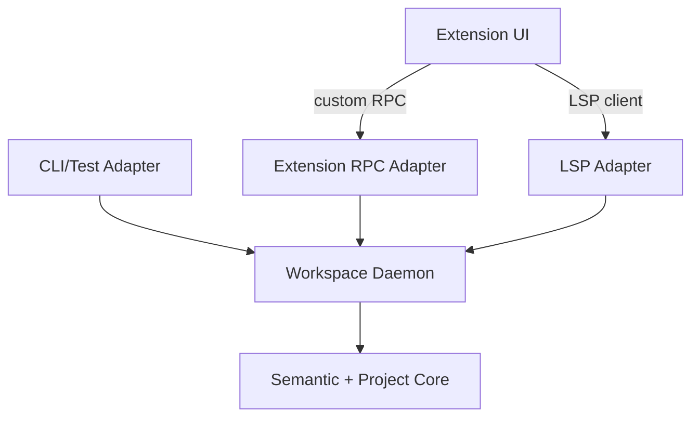

# Codepol LSP / Workspace Service TODO

This document tracks the recommended architecture and implementation order for a Codepol-owned LSP plus daemon-backed workspace service.

The goal is to make Codepol the primary workspace analysis backend while keeping the LSP adapter thin, editor-agnostic, and reusable across CLI, tests, and future extension-only features.

This expands the brief LSP note in `packages/core/src/index/TODO.md` into an implementation-focused plan.

## Current Intent

- `packages/core` stays the semantic and project truth layer.
- A reusable daemon/service host owns lifecycle, caching, overlays, scheduling, and multiplexing.
- Adapters stay thin and translate transport-specific requests into stable internal service calls.
- The extension UI layer owns commands, views, panels, decorations, and editor glue only.
- The first implementation may still wrap ESLint and Ruff behind a Codepol-owned service boundary.
- The long-term direction is for Codepol to replace wrapped lint analyzers behind stable service contracts where that improves quality and ownership.

## Recommendation

Choose the hybrid architecture:

- semantic/project core
- reusable daemon/service host
- thin LSP adapter
- thin extension RPC adapter
- extension UI layer

Do not build the core around LSP method names or VS Code APIs.

Do not make the extension host the source of truth for indexing, diagnostics, or workspace lifecycle.

Do not try to replace typecheckers such as `tsserver`, `Pylance`, or `Pyright` in the first phase.

## Why This Fits The Current Repo

- `apps/cli/src/index.ts` is currently the only place that aggregates ESLint, Ruff, and tree-check diagnostics into one result stream.
- `packages/core/src/policy/policyCheck.ts` only covers tree-check execution and pretty-printing, not the full aggregated pipeline.
- `packages/core/src/policy/policyTreeCheck.ts` reads file contents from disk inside `policyViolationsGetForFile()`, which is incompatible with unsaved editor buffers.
- `packages/plugin-eslint/src/eslintAdapter.ts` already demonstrates the right editor-facing pattern: use in-memory source and incrementally refresh the project index.
- `packages/plugin-ruff/src/ruffRunner.ts` and `packages/core/src/policy/policyPluginProcess.ts` currently use blocking subprocess execution, which is acceptable in CLI code but not ideal for an interactive daemon hot path.
- `packages/core/src/index/TODO.md` already calls out missing index persistence, watch-mode integration, incremental index updates, and LSP integration. Those items are directly relevant to an editor-backed service host.

## Architecture Options Considered

### 1. Thin standalone LSP over the current core

Pros:

- fastest path to first-party diagnostics
- lowest operational complexity
- best editor portability

Cons:

- weak fit for multi-window reuse
- poor fit for non-LSP features such as dependency graphs or semantic search panels
- tends to push lifecycle and cache concerns into transport code
- weak fit for the long-term goal of making Codepol the main analysis platform

### 2. Extension-only in-process host

Pros:

- simple overlay handling
- fast UI iteration
- fewer moving parts at first

Cons:

- couples semantics and caching to VS Code/Cursor runtime behavior
- weak reuse for CLI, tests, and headless workflows
- poor portability to other editors
- makes extension code too important to the backend architecture

### 3. Recommended: hybrid daemon plus thin adapters

Pros:

- reusable backend logic
- multi-window reuse
- cross-session warm caches
- clean separation between semantics and transport
- supports richer extension-only features without distorting LSP
- supports gradual replacement of wrapped linters behind stable APIs

Cons:

- highest initial complexity
- requires stronger lifecycle, observability, and failure isolation work up front

## High-Level Shape



## Responsibility Split

### A. Semantic + project core

Keep this layer stable and reusable.

Own here:

- parsers and parse-tree access
- project model
- semantic index
- diagnostics
- rename/refactor/search logic
- cross-file analysis
- workspace queries over files, overlays, and config
- normalized internal data types

Do not let this layer know:

- which editor is calling
- which panel is open
- extension UI state
- JSON-RPC wire details
- LSP method names

### B. Workspace daemon / service host

This is the reusable long-lived process layer.

Own here:

- workspace registration
- client/session registration
- per-client overlays
- filesystem watchers
- incremental invalidation
- background indexing
- job scheduling and prioritization
- external tool orchestration
- cache persistence
- telemetry and observability
- concurrency control

### C. LSP adapter

Keep this adapter thin.

Own here:

- document sync to overlay updates
- LSP request translation
- LSP response mapping
- cancellation and progress plumbing

It should not own semantic business logic.

### D. Extension RPC adapter

Use this for richer Codepol-specific capabilities that do not map well to standard LSP methods.

Examples:

- dependency graph
- semantic search
- impacted tests
- index status
- architecture summaries
- guided refactor workflows

### E. Extension UI layer

Own here:

- command palette commands
- context menus
- tree views
- webviews
- decorations
- status items
- local persisted UI state

This layer should compose backend capabilities, not implement semantics.

## Core API First

Design the core around stable semantic operations instead of LSP method names.

Likely shape:

```ts
type WorkspaceService = {
  openWorkspace: (input: OpenWorkspaceRequest) => Promise<WorkspaceHandle>;

  openOverlay: (input: OpenOverlayRequest) => Promise<void>;
  applyOverlayEdit: (input: ApplyOverlayEditRequest) => Promise<void>;
  closeOverlay: (input: CloseOverlayRequest) => Promise<void>;

  queryDiagnostics: (
    input: DiagnosticsQuery
  ) => Promise<WorkspaceDiagnostic[]>;
  queryDefinition: (input: DefinitionQuery) => Promise<LocationResult[]>;
  queryReferences: (input: ReferencesQuery) => Promise<LocationResult[]>;
  queryHover: (input: HoverQuery) => Promise<HoverResult | null>;
  queryWorkspaceSymbols: (
    input: WorkspaceSymbolsQuery
  ) => Promise<SymbolResult[]>;

  prepareRename: (input: PrepareRenameQuery) => Promise<RenameRange | null>;
  runRename: (input: RenameCommand) => Promise<WorkspaceEditResult>;

  querySemanticSearch: (
    input: SemanticSearchQuery
  ) => Promise<SearchResult[]>;
  queryDependencyGraph: (
    input: DependencyGraphQuery
  ) => Promise<GraphResult>;
  queryIndexStatus: (input: IndexStatusQuery) => Promise<IndexStatusResult>;
};
```

Important API rules:

- use editor-neutral types at the core boundary
- make capability commands explicit rather than hiding them in query payloads
- define stable workspace, client, document, and snapshot identities
- decide position encoding up front
- be explicit about URI vs absolute path vs workspace-relative identity

## Shared State vs Isolated State

The daemon should share world state and isolate client state.

Shared:

- filesystem snapshot
- parse caches
- semantic index
- dependency graph
- build metadata
- persisted workspace caches

Isolated per client:

- unsaved overlays
- cursor and selection context
- temporary editor-local options
- UI-specific filters
- auth or session-specific context if added later

The daemon must support multiple overlays over the same base file without corrupting analysis across clients.

## Current Code Areas That Matter

### Aggregated diagnostics and CLI flow

- `apps/cli/src/index.ts`
- current source of truth for:
  - plugin loading
  - provider filtering
  - ESLint execution
  - Ruff execution
  - tree-check aggregation
  - fix ordering

Implication:

- this logic should move into reusable service code
- the CLI should become an adapter over that service

### Tree-check execution

- `packages/core/src/policy/policyTreeCheck.ts`
- `packages/core/src/policy/policyCheck.ts`

Current constraint:

- `policyViolationsGetForFile()` reads from disk via `fs.readFileSync`

Implication:

- add source-aware and overlay-aware APIs before building editor diagnostics on top of this path

### Plugin loading and process plugins

- `packages/core/src/policy/policyPluginsGet.ts`
- `packages/core/src/policy/policyPluginProcess.ts`
- `packages/core/src/policy/policyTypes.ts`

Current constraints:

- process plugins describe rules, tree checks, and fixes
- process plugins are not symmetrical with built-in `lintProviders`
- process transport is blocking and synchronous

Implication:

- the daemon can host external lint execution in phase 1
- process plugin capabilities may need to expand later if plugin symmetry becomes important

### Editor-facing in-memory indexing pattern

- `packages/plugin-eslint/src/eslintAdapter.ts`

Current value:

- already demonstrates:
  - using in-memory source
  - incremental project index refresh
  - project-index caching by config path

Implication:

- use this as the reference for overlay-aware indexing behavior in the new service layer

### Ruff integration

- `packages/plugin-ruff/src/ruffRunner.ts`
- `packages/plugin-ruff/src/ruffAdapter.ts`

Current constraints:

- CLI uses `ruffRunner.ts`
- current runner is synchronous
- `ruffAdapter.ts` is useful infrastructure but is not the current aggregation path

Implication:

- move Ruff execution behind an async service boundary
- keep the normalized output contract stable even if the underlying implementation changes later

### Config and file targeting

- `packages/core/src/config/configDiscover.ts`
- `packages/core/src/policy/policyGet.ts`

Implication:

- workspace identity should be keyed by config and environment, not just repo root
- file targeting and rule matching should remain inside the shared backend, not in adapters

### Semantic index and existing roadmap

- `packages/core/src/index/TODO.md`
- `packages/core/src/index/indexBuilder.ts`
- `packages/core/src/index/indexQuery.ts`
- `packages/core/src/index/indexSnapshot.ts`

Implication:

- LSP work depends on index persistence, incremental updates, and watch integration
- the daemon is the natural host for those concerns

## Critical Design Decisions

### 1. Diagnostic model

Current issue:

- `PolicyViolation` is not rich enough for a first-class editor transport because it lacks explicit severity and commonly lacks end ranges

Decision:

- define an editor-friendly diagnostic transport for the service layer
- either promote `LintDiagnostic` or add a new `WorkspaceDiagnostic`

Required fields:

- source
- code
- severity
- message
- file identity
- start and end range
- optional fix payload

### 2. Overlay-aware analysis

Current issue:

- many checks assume on-disk source

Decision:

- the service layer must accept overlay content per client
- tree checks, index updates, diagnostics, and rename/refactor flows must all operate on overlay-aware snapshots

### 3. Workspace identity and reuse

Decision:

- workspace instances should be keyed by more than repo root
- include at least:
  - workspace root
  - config path or config identity
  - environment/toolchain identity when relevant

### 4. Transport

Recommended default:

- local socket or named pipe for the daemon
- stdio fallback for single-client or simpler embedding scenarios

Rationale:

- reconnectable
- supports multiple clients
- cleaner than forcing everything through one stdio channel

### 5. External linter orchestration

Phase 1 decision:

- keep ESLint and Ruff as wrapped analyzers inside the daemon/service host
- adapters should see one unified Codepol diagnostic service

Long-term decision:

- replace external analyzers only behind stable service contracts
- do not let transport layers know or care whether diagnostics came from native Codepol logic or wrapped tools

### 6. Observability

Expose from day one:

- workspace open time
- index progress
- cache hit rate
- invalidation counts
- query latency by operation
- queue depth
- memory by workspace
- overlay count by client

### 7. Failure isolation

The daemon should isolate failures at the workspace or capability level where possible.

Examples:

- one workspace can be evicted without killing all workspaces
- a failed dependency graph query does not block diagnostics
- external linter timeouts do not poison native semantic features

## Open Design Decisions

The sections above define the recommended architecture, but the following contracts still need explicit decisions before implementation starts in earnest.

Keep this file focused on:

- architectural decisions
- rollout and sequencing
- cross-cutting constraints
- links to deeper implementation notes

When a subsection grows into concrete type shapes, planner rules, state machines, or engine-specific workflows, extract it to a companion `TODO_CODEPOL_LSP_<TOPIC>.md` file. In the main TODO, keep only:

- the decision summary
- why it matters
- when to read the detailed note

### 1. Fix and code-action model

Decision:

- define a first-class service-level fix/code-action contract
- normalize all executable fix sources into one internal edit model before LSP or editor adapters see them

Why it matters:

- Codepol currently has heterogeneous fix producers: plugin `FixProvider`, tree-check fixes, ESLint autofix, and Ruff `--fix`.
- Without a shared planner and canonical edit model, `quick fix`, `fix all for rule`, and `fix all in file` behavior will diverge.
- Adapters should not own overlap detection, ordering, stale-revision checks, or merge policy.

Key invariants:

- `EditPlan` is the canonical internal executable edit model, not raw LSP `WorkspaceEdit`.
- Adapters consume planned actions; they do not merge, reorder, or resolve conflicts.
- Providers may author fixes in local formats, but executable results must resolve into normalized plans before exposure or application.

Read the detailed note when:

- implementing `CodeActionService`
- defining `EditPlan`, `FixCandidate`, `CodeAction`, or conflict types
- wiring plugin `FixProvider`, tree-check fixes, ESLint autofix, or Ruff `--fix`
- deciding batching, overlap detection, stale-revision handling, or `fix all` orchestration

Detailed note:

- [TODO_CODEPOL_LSP_FIX_MODEL.md](TODO_CODEPOL_LSP_FIX_MODEL.md)

### 2. Capability ownership matrix by language

Decision:

- for TypeScript/JavaScript and Python, Codepol does not replace `tsserver`, `Pylance`, or `Pyright` in phase 1
- existing language servers remain the source of truth for core language intelligence and standard language-semantic features
- Codepol may only act as a supplemental provider for Codepol-owned semantic classes:
  - project or domain entities
  - architecture or policy objects
  - generated artifacts
  - config-derived navigation and symbols
- define ownership by semantic class, not only by feature name
- when coexistence is ambiguous, prefer explicit Codepol commands, views, or clearly labeled alternate results over competing default handlers

Why it matters:

- without an explicit matrix, implementation will drift into duplicate UI entries, inconsistent jump targets, conflicting rename scopes, and user confusion about which result is authoritative
- an underspecified phase-1 boundary creates pressure to "just implement the missing 20%" until Codepol accidentally becomes a second language server

Key invariants:

- phase-1 Codepol capabilities must not compete with standard language intelligence on normal code symbols
- any shared editor surface must label Codepol results clearly and carry provenance plus semantic-class metadata
- when coexistence is ambiguous, prefer explicit Codepol commands over competing default handlers

Read the detailed note when:

- deciding whether a new LSP capability belongs in phase 1
- implementing `definition`, `references`, `hover`, `rename`, or `workspace/symbol`
- deciding whether results should appear in the default flow or behind explicit Codepol commands
- defining provenance or semantic-class labels for adapter output

Detailed note:

- [TODO_CODEPOL_LSP_CAPABILITY_MATRIX.md](TODO_CODEPOL_LSP_CAPABILITY_MATRIX.md)

### 3. Daemon discovery, launch, and version handshake

Decision:

- define this boundary explicitly as the daemon control plane, not incidental boot code
- use a per-user runtime descriptor for discovery:
  - clients resolve `daemon.info.json` first, then connect to the advertised transport
- make a shared launcher library the sole launch authority:
  - it acquires exclusive `daemon.lock`
  - it is the only component allowed to spawn the shared daemon or clean stale runtime artifacts
- require a mandatory startup `hello` handshake before any normal work:
  - discovery proves where to connect
  - handshake proves protocol compatibility, daemon identity, liveness, and negotiated capabilities
- separate compatibility concerns:
  - control-plane protocol compatibility is strict
  - engine capability compatibility is negotiated and may degrade features
  - cache and index schema versioning is handled separately
- define deterministic stale recovery and fallback:
  - failed connect or handshake enters a lock-guarded recovery path
  - shared daemon mode falls back to private per-client backend mode, then reduced feature mode, then hard fail only if no safe degraded path exists

Why it matters:

- packaging, extension upgrades, CLI sharing, reconnect behavior, and stale socket cleanup all depend on a stable control-plane contract
- without single-launch authority and mandatory handshake, clients will race to spawn daemons, talk to stale endpoints, or silently attach to incompatible builds
- explicit fallback modes let the product degrade predictably instead of treating daemon failures as undefined behavior

Key invariants:

- clients discover a descriptor, not a raw socket or pipe guess
- only the launch-lock holder may spawn, replace, or clean shared runtime artifacts
- socket existence or PID presence alone never proves health; successful handshake does
- reconnect is full rediscovery plus full handshake plus session replay
- daemon readiness, workspace attachment, and feature readiness are separate phases

Read the detailed note when:

- defining runtime and state directory layout, descriptor schema, or launcher ownership rules
- designing handshake RPCs, version negotiation, or capability gating
- implementing stale socket cleanup, reconnect logic, or controlled daemon replacement on upgrade
- making the CLI and editor extension share the same daemon lifecycle contract

Detailed note:

- [TODO_CODEPOL_LSP_DAEMON_CONTROL_PLANE.md](TODO_CODEPOL_LSP_DAEMON_CONTROL_PLANE.md)

### 4. Workspace attachment and session replay

Decision:

- define this boundary as a workspace session protocol layered on top of the daemon control plane
- separate four identities explicitly:
  - `daemon_session_id` for one daemon process incarnation
  - `workspace_id` for stable logical workspace identity
  - `workspace_instance_id` for one live workspace instance inside the current daemon session
  - `client_session_id` for one attached editor or CLI consumer, with client-local document overlays scoped per session
- require a phased attach and replay flow after daemon `hello`:
  - `register_client_session`
  - `attach_workspace`
  - replay subscriptions, open documents, and authoritative overlay snapshots
  - `complete_replay` barrier before normal request flow resumes
- treat reconnect as full re-registration and replay, not continuation:
  - daemon restart invalidates prior registrations, workspace attachments, overlays, subscriptions, and non-resumable in-flight work
- make readiness explicit and separate:
  - daemon ready
  - client registered
  - workspace attached
  - workspace ready
  - feature ready
- define request behavior during warm-up:
  - requests must return structured `not_ready` or explicit degraded results when dependencies are not ready
  - clients must not treat partial or stale answers as full-quality results

Why it matters:

- deterministic reconnect depends on replayable client state, authoritative overlay restore, and explicit readiness barriers
- without a workspace session protocol, daemon restarts can produce stale diagnostics, dropped subscriptions, duplicate warm-up work, and requests that race against half-restored state
- separating daemon session, workspace instance, and client session identities keeps reconnect and multi-client attach behavior correct

Key invariants:

- reconnect is always `register_client_session` plus `attach_workspace` plus replay
- overlay restore uses authoritative snapshots, not edit deltas
- subscriptions are explicit, replayable, and idempotent within one daemon session
- old diagnostics and results from a prior `daemon_session_id` are stale by definition
- transport connection identity is ephemeral and never used as durable client or workspace identity
- workspace-ready and feature-ready are separate phases with separate status signals

Read the detailed note when:

- defining `register_client_session`, `attach_workspace`, replay, or readiness RPCs
- implementing overlay replay, subscription rehydration, or replay barriers after reconnect
- deciding request gating, degraded responses, or timeout behavior during workspace warm-up
- handling diagnostics invalidation, background work restart, or resumable task semantics across daemon restart

Detailed note:

- [TODO_CODEPOL_LSP_WORKSPACE_SESSION_PROTOCOL.md](TODO_CODEPOL_LSP_WORKSPACE_SESSION_PROTOCOL.md)

### 5. Request ordering, cancellation, and snapshot consistency

Decision:

- define this boundary as the snapshot and execution contract for daemon requests and side effects
- every request binds to an explicit state vector capturing at least:
  - `daemon_session_id`
  - `workspace_instance_id`
  - `replay_epoch`
  - `client_session_id` when client-local overlays matter
  - document overlay version or versions when relevant
  - `file_system_revision` when relevant
  - one published `analysis_generation` when relevant
- make pinned snapshots the default read model:
  - reads run against a coherent published snapshot chosen at dispatch time, not a moving target
  - consistency levels are explicit: pinned latest safe, pinned exact, and labeled best-effort only for explicitly degraded features
- treat replay and invalidation as ordered writes with barriers:
  - replay messages form a per-session ordered stream ending in a replay barrier
  - foreground reads must not observe half-applied replay or half-published analysis state
- publish new semantic state by committed generations:
  - background indexing and file-watch invalidation build future generations
  - reads see generation `G` or committed `G+1`, never a mix
- split cancellation semantics:
  - compute cancellation is best-effort
  - publication cancellation is hard, so canceled or superseded work must not publish current replies or side effects
- require metadata on all responses and push events:
  - clients discard stale outputs by daemon session, workspace instance, replay epoch, document version, request id, and analysis generation as applicable

Why it matters:

- without a pinned snapshot contract, technically successful requests can still be operationally wrong because they mix old overlays, new index state, and stale replay visibility
- editor interactions constantly race with edits, reconnect, replay, invalidation, and background indexing, so stale-response handling must be deterministic
- diagnostics, progress, and other push side effects need the same freshness rules as direct request responses

Key invariants:

- every request and publish event is attributable to one daemon session, one workspace instance, and one replay epoch
- document-sensitive reads must not claim success against an older overlay version than requested
- cross-file and project-wide reads execute against one pinned published analysis generation
- no request may observe half-applied replay or half-committed analysis state
- canceled or superseded work may continue internally, but it must not publish user-visible results as current
- correctness-sensitive commands must validate exact snapshot preconditions or fail and require revalidation

Read the detailed note when:

- defining request binding metadata, consistency levels, or snapshot-resolution rules
- implementing replay barriers, generation commit, stale-response discard, or supersession logic
- deciding cancellation and side-effect suppression behavior for diagnostics, progress, or other push channels
- validating rename, refactor, or apply operations against exact snapshot preconditions

Detailed note:

- [TODO_CODEPOL_LSP_SNAPSHOT_EXECUTION_CONTRACT.md](TODO_CODEPOL_LSP_SNAPSHOT_EXECUTION_CONTRACT.md)

### 6. Config reload and invalidation rules

Current gap:

- the plan talks about workspace identity and caches, but it does not define how config changes invalidate state

Why it matters:

- `codepol.toml`, ESLint config, Ruff config, plugin declarations, and environment changes can all alter diagnostics, indexing scope, or transport behavior

Decision needed:

- define which changes trigger:
  - partial rule re-evaluation
  - target/file-match recomputation
  - index rebuild
  - daemon workspace restart

### 7. Trust and sandboxing model

Current gap:

- the repo already supports process plugins and external tool execution, but the plan does not define the trust model for running those inside a long-lived editor daemon

Why it matters:

- a persistent daemon makes command execution and environment handling more security-sensitive than one-shot CLI execution

Decision needed:

- define:
  - workspace trust requirements
  - when process plugins and external linters may run
  - environment variable passthrough rules
  - cwd restrictions
  - timeout and memory ceilings
  - user-visible failure and trust prompts if needed

### 8. Multi-root and remote execution scope

Current gap:

- the current document assumes a local workspace-centric daemon, but it does not say whether the first implementation supports:
  - multiple workspace folders
  - remote containers
  - SSH/remote hosts
  - non-file URI schemes

Why it matters:

- these choices affect URI normalization, transport assumptions, daemon placement, and workspace identity

Decision needed:

- explicitly decide whether MVP scope is:
  - local single-root only
  - local multi-root
  - remote-aware from day one

### 9. Persistence contract and cache versioning

Current gap:

- the plan calls for warm-start behavior and persistent caches, but it does not define what is persisted or how persisted state is invalidated

Why it matters:

- incorrect cache reuse can silently corrupt semantic answers

Decision needed:

- define:
  - what artifacts are persisted
  - cache key inputs
  - schema/version invalidation rules
  - crash-safe write behavior
  - cleanup and TTL policy

### 10. Process-plugin capability roadmap

Current gap:

- the document notes that process plugins are less expressive than built-in lint providers, but it does not decide whether that asymmetry is temporary or intentional

Why it matters:

- this affects whether long-term analyzer replacement happens through:
  - richer process-plugin contracts
  - host-owned runners only
  - a mix of both

Decision needed:

- define whether process plugins should eventually support richer lint-provider-style capabilities, or whether external lint orchestration remains exclusively a daemon-host concern

## Non-Goals For The First Implementation

- replacing `tsserver`, `Pylance`, or `Pyright`
- implementing a formatter
- shipping every possible custom panel before the core service boundary is stable
- extending the semantic index to solve unrelated deferred items such as full type inference

## Suggested Package / App Shape

The exact names can change, but keep the boundary shape explicit.

Likely direction:

- `packages/core`
  - semantic/project logic
  - normalized query and command types
  - overlay-aware analysis primitives
- `packages/workspace-service`
  - daemon host
  - workspace/session lifecycle
  - scheduler, caches, telemetry
  - aggregated diagnostics orchestration
- `apps/lsp`
  - standalone LSP server entrypoint
  - thin adapter from LSP to `WorkspaceService`
- `apps/cli`
  - adapter over the shared service
- future extension package
  - custom RPC client plus UI glue

## Implementation Phases

### Phase 0: contracts first

- [ ] Define the workspace service interface before moving code.
- [ ] Define stable editor-neutral result types for diagnostics, locations, symbols, edits, and index status.
- [ ] Decide whether `LintDiagnostic` becomes the primary service diagnostic type or whether a new `WorkspaceDiagnostic` type is cleaner.
- [ ] Decide package boundaries and public APIs before adding transport code.

### Phase 1: shared diagnostics service

- [ ] Extract aggregated diagnostics logic from `apps/cli/src/index.ts` into reusable service code.
- [ ] Preserve current provider filtering semantics from `PolicyRule.providers`.
- [ ] Preserve current fix ordering semantics while moving the orchestration boundary.
- [ ] Add async execution and cancellation support for external linter runners.
- [ ] Ensure the CLI calls the shared service rather than owning the orchestration logic.

### Phase 2: overlay-aware tree checks and index updates

- [ ] Add source-aware analysis APIs to replace disk-only reads in `packages/core/src/policy/policyTreeCheck.ts`.
- [ ] Add per-client overlay registration and update flows.
- [ ] Reuse the incremental indexing pattern already demonstrated in `packages/plugin-eslint/src/eslintAdapter.ts`.
- [ ] Make cross-file analysis use overlay-aware snapshots rather than stale on-disk content where possible.

### Phase 3: daemon/service host

- [ ] Implement workspace instance lifecycle and client/session registration.
- [ ] Add file watching, invalidation, and background indexing.
- [ ] Add cache persistence and warm-start behavior.
- [ ] Add telemetry and health/status reporting.
- [ ] Add request cancellation, timeouts, and queue prioritization.

### Phase 4: LSP adapter

- [ ] Implement document open/change/close to overlay sync.
- [ ] Implement diagnostics publication using the shared diagnostic service.
- [ ] Implement at least:
  - definition
  - references
  - hover
  - workspace symbols
  - prepare rename
  - rename
- [ ] Add progress and status signals for cold-start indexing.

### Phase 5: CLI and tests migrate fully

- [ ] Make CLI and tests use the same service boundary used by the LSP.
- [ ] Add regression tests covering overlay-aware diagnostics and index freshness.
- [ ] Add daemon-level tests for multi-client overlay isolation.
- [ ] Add adapter-level tests for LSP request/response mapping.

### Phase 6: extension RPC and richer features

- [ ] Add a custom RPC adapter for features that do not fit LSP cleanly.
- [ ] Add first extension-only features only after the service API is stable.
- [ ] Prefer read-only capabilities first, such as dependency graphs or index status, before more invasive workflows.

### Phase 7: replacement roadmap

- [ ] Inventory which wrapped analyzers are worth replacing with native Codepol analysis.
- [ ] Replace analyzers only where Codepol can preserve or improve diagnostic quality and fix support.
- [ ] Keep the service contracts stable so adapters do not change during the replacement effort.

## Acceptance Criteria For An MVP

- unsaved buffer diagnostics are accurate
- per-client overlays do not leak across clients
- the CLI and the LSP use the same aggregated diagnostic service
- cross-file rules use fresh incremental index state
- diagnostics preserve severity, source, code, ranges, and fix data
- daemon restarts do not require architecture changes in adapters
- cold-start indexing exposes status and does not make the extension feel hung

## Test Coverage To Add

- unit tests for normalized service result types and adapters
- unit tests for overlay-aware analysis entrypoints
- integration tests for:
  - open buffer with unsaved changes
  - cross-file rename against overlays
  - diagnostics merged from native tree checks and wrapped linters
  - cancellation and timeout behavior
- daemon tests for:
  - multi-client isolation
  - workspace reuse
  - cache invalidation
  - warm-start behavior
- LSP adapter tests for:
  - request translation
  - response mapping
  - diagnostics publication

## Risks To Watch

- current process plugins only expose `describe`, `check`, and `fix`, which makes them less expressive than built-in lint providers
- current Python index support is still single-file in important areas, which limits some cross-file LSP features for Python
- blocking subprocess integration will become a latency bottleneck unless moved behind async scheduling
- position and fix data are currently split across multiple internal types and need consolidation
- warm-cache correctness is harder once overlays and multiple clients are introduced

## Suggested Order

1. Define the service API and normalized result types.
2. Extract shared diagnostics orchestration from the CLI.
3. Make tree checks and indexing overlay-aware.
4. Introduce the daemon host.
5. Add the LSP adapter.
6. Move CLI and tests fully onto the shared service.
7. Add extension-only RPC features.
8. Replace wrapped analyzers selectively behind the same service contracts.
