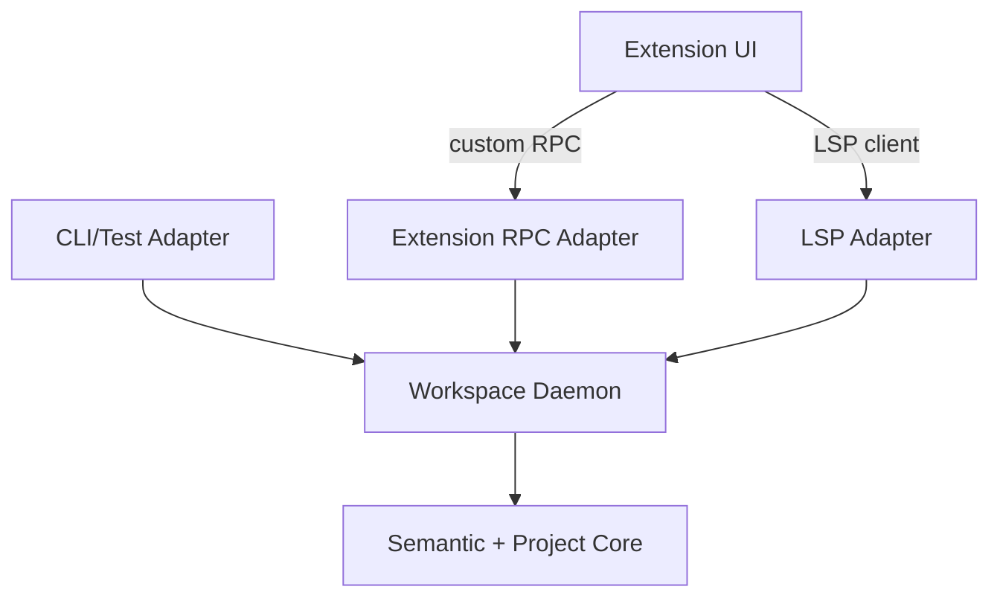

# Codepol LSP / Workspace Service TODO

This document tracks the recommended architecture and implementation order for a Codepol-owned LSP plus daemon-backed workspace service.

The goal is to make Codepol the primary workspace analysis backend while keeping the LSP adapter thin, editor-agnostic, and reusable across CLI, tests, and future extension-only features.

This expands the brief LSP note in `packages/core/src/index/TODO.md` into an implementation-focused plan.

## Current Intent

- `packages/core` stays the semantic and project truth layer.
- A reusable daemon/service host owns lifecycle, caching, overlays, scheduling, and multiplexing.
- Adapters stay thin and translate transport-specific requests into stable internal service calls.
- The extension UI layer owns commands, views, panels, decorations, and editor glue only.
- The first implementation may still wrap ESLint and Ruff behind a Codepol-owned service boundary.
- The long-term direction is for Codepol to replace wrapped lint analyzers behind stable service contracts where that improves quality and ownership.

## Recommendation

Choose the hybrid architecture:

- semantic/project core
- reusable daemon/service host
- thin LSP adapter
- thin extension RPC adapter
- extension UI layer

Do not build the core around LSP method names or VS Code APIs.

Do not make the extension host the source of truth for indexing, diagnostics, or workspace lifecycle.

Do not try to replace typecheckers such as `tsserver`, `Pylance`, or `Pyright` in the first phase.

## Why This Fits The Current Repo

- `apps/cli/src/index.ts` is currently the only place that aggregates ESLint, Ruff, and tree-check diagnostics into one result stream.
- `packages/core/src/policy/policyCheck.ts` only covers tree-check execution and pretty-printing, not the full aggregated pipeline.
- `packages/core/src/policy/policyTreeCheck.ts` reads file contents from disk inside `policyViolationsGetForFile()`, which is incompatible with unsaved editor buffers.
- `packages/plugin-eslint/src/eslintAdapter.ts` already demonstrates the right editor-facing pattern: use in-memory source and incrementally refresh the project index.
- `packages/plugin-ruff/src/ruffRunner.ts` and `packages/core/src/policy/policyPluginProcess.ts` currently use blocking subprocess execution, which is acceptable in CLI code but not ideal for an interactive daemon hot path.
- `packages/core/src/index/TODO.md` already calls out missing index persistence, watch-mode integration, incremental index updates, and LSP integration. Those items are directly relevant to an editor-backed service host.

## Architecture Options Considered

### 1. Thin standalone LSP over the current core

Pros:

- fastest path to first-party diagnostics
- lowest operational complexity
- best editor portability

Cons:

- weak fit for multi-window reuse
- poor fit for non-LSP features such as dependency graphs or semantic search panels
- tends to push lifecycle and cache concerns into transport code
- weak fit for the long-term goal of making Codepol the main analysis platform

### 2. Extension-only in-process host

Pros:

- simple overlay handling
- fast UI iteration
- fewer moving parts at first

Cons:

- couples semantics and caching to VS Code/Cursor runtime behavior
- weak reuse for CLI, tests, and headless workflows
- poor portability to other editors
- makes extension code too important to the backend architecture

### 3. Recommended: hybrid daemon plus thin adapters

Pros:

- reusable backend logic
- multi-window reuse
- cross-session warm caches
- clean separation between semantics and transport
- supports richer extension-only features without distorting LSP
- supports gradual replacement of wrapped linters behind stable APIs

Cons:

- highest initial complexity
- requires stronger lifecycle, observability, and failure isolation work up front

## High-Level Shape



## Responsibility Split

### A. Semantic + project core

Keep this layer stable and reusable.

Own here:

- parsers and parse-tree access
- project model
- semantic index
- diagnostics
- rename/refactor/search logic
- cross-file analysis
- workspace queries over files, overlays, and config
- normalized internal data types

Do not let this layer know:

- which editor is calling
- which panel is open
- extension UI state
- JSON-RPC wire details
- LSP method names

### B. Workspace daemon / service host

This is the reusable long-lived process layer.

Own here:

- workspace registration
- client/session registration
- per-client overlays
- filesystem watchers
- incremental invalidation
- background indexing
- job scheduling and prioritization
- external tool orchestration
- cache persistence
- telemetry and observability
- concurrency control

### C. LSP adapter

Keep this adapter thin.

Own here:

- document sync to overlay updates
- LSP request translation
- LSP response mapping
- cancellation and progress plumbing

It should not own semantic business logic.

### D. Extension RPC adapter

Use this for richer Codepol-specific capabilities that do not map well to standard LSP methods.

Examples:

- dependency graph
- semantic search
- impacted tests
- index status
- architecture summaries
- guided refactor workflows

### E. Extension UI layer

Own here:

- command palette commands
- context menus
- tree views
- webviews
- decorations
- status items
- local persisted UI state

This layer should compose backend capabilities, not implement semantics.

## Core API First

Design the core around stable semantic operations instead of LSP method names.

Likely shape:

```ts
type WorkspaceService = {
  openWorkspace: (input: OpenWorkspaceRequest) => Promise<WorkspaceHandle>;

  openOverlay: (input: OpenOverlayRequest) => Promise<void>;
  applyOverlayEdit: (input: ApplyOverlayEditRequest) => Promise<void>;
  closeOverlay: (input: CloseOverlayRequest) => Promise<void>;

  queryDiagnostics: (
    input: DiagnosticsQuery
  ) => Promise<WorkspaceDiagnostic[]>;
  queryDefinition: (input: DefinitionQuery) => Promise<LocationResult[]>;
  queryReferences: (input: ReferencesQuery) => Promise<LocationResult[]>;
  queryHover: (input: HoverQuery) => Promise<HoverResult | null>;
  queryWorkspaceSymbols: (
    input: WorkspaceSymbolsQuery
  ) => Promise<SymbolResult[]>;

  prepareRename: (input: PrepareRenameQuery) => Promise<RenameRange | null>;
  runRename: (input: RenameCommand) => Promise<WorkspaceEditResult>;

  querySemanticSearch: (
    input: SemanticSearchQuery
  ) => Promise<SearchResult[]>;
  queryDependencyGraph: (
    input: DependencyGraphQuery
  ) => Promise<GraphResult>;
  queryIndexStatus: (input: IndexStatusQuery) => Promise<IndexStatusResult>;
};
```

Important API rules:

- use editor-neutral types at the core boundary
- make capability commands explicit rather than hiding them in query payloads
- define stable workspace, client, document, and snapshot identities
- decide position encoding up front
- be explicit about URI vs absolute path vs workspace-relative identity

## Shared State vs Isolated State

The daemon should share world state and isolate client state.

Shared:

- filesystem snapshot
- parse caches
- semantic index
- dependency graph
- build metadata
- persisted workspace caches

Isolated per client:

- unsaved overlays
- cursor and selection context
- temporary editor-local options
- UI-specific filters
- auth or session-specific context if added later

The daemon must support multiple overlays over the same base file without corrupting analysis across clients.

## Current Code Areas That Matter

### Aggregated diagnostics and CLI flow

- `apps/cli/src/index.ts`
- current source of truth for:
  - plugin loading
  - provider filtering
  - ESLint execution
  - Ruff execution
  - tree-check aggregation
  - fix ordering

Implication:

- this logic should move into reusable service code
- the CLI should become an adapter over that service

### Tree-check execution

- `packages/core/src/policy/policyTreeCheck.ts`
- `packages/core/src/policy/policyCheck.ts`

Current constraint:

- `policyViolationsGetForFile()` reads from disk via `fs.readFileSync`

Implication:

- add source-aware and overlay-aware APIs before building editor diagnostics on top of this path

### Plugin loading and process plugins

- `packages/core/src/policy/policyPluginsGet.ts`
- `packages/core/src/policy/policyPluginProcess.ts`
- `packages/core/src/policy/policyTypes.ts`

Current constraints:

- process plugins describe rules, tree checks, and fixes
- process plugins are not symmetrical with built-in `lintProviders`
- process transport is blocking and synchronous

Implication:

- the daemon can host external lint execution in phase 1
- process plugin capabilities may need to expand later if plugin symmetry becomes important

### Editor-facing in-memory indexing pattern

- `packages/plugin-eslint/src/eslintAdapter.ts`

Current value:

- already demonstrates:
  - using in-memory source
  - incremental project index refresh
  - project-index caching by config path

Implication:

- use this as the reference for overlay-aware indexing behavior in the new service layer

### Ruff integration

- `packages/plugin-ruff/src/ruffRunner.ts`
- `packages/plugin-ruff/src/ruffAdapter.ts`

Current constraints:

- CLI uses `ruffRunner.ts`
- current runner is synchronous
- `ruffAdapter.ts` is useful infrastructure but is not the current aggregation path

Implication:

- move Ruff execution behind an async service boundary
- keep the normalized output contract stable even if the underlying implementation changes later

### Config and file targeting

- `packages/core/src/config/configDiscover.ts`
- `packages/core/src/policy/policyGet.ts`

Implication:

- workspace identity should be keyed by config and environment, not just repo root
- file targeting and rule matching should remain inside the shared backend, not in adapters

### Semantic index and existing roadmap

- `packages/core/src/index/TODO.md`
- `packages/core/src/index/indexBuilder.ts`
- `packages/core/src/index/indexQuery.ts`
- `packages/core/src/index/indexSnapshot.ts`

Implication:

- LSP work depends on index persistence, incremental updates, and watch integration
- the daemon is the natural host for those concerns

## Critical Design Decisions

### 1. Diagnostic model

Current issue:

- `PolicyViolation` is not rich enough for a first-class editor transport because it lacks explicit severity and commonly lacks end ranges

Decision:

- define an editor-friendly diagnostic transport for the service layer
- either promote `LintDiagnostic` or add a new `WorkspaceDiagnostic`

Required fields:

- source
- code
- severity
- message
- file identity
- start and end range
- optional fix payload

### 2. Overlay-aware analysis

Current issue:

- many checks assume on-disk source

Decision:

- the service layer must accept overlay content per client
- tree checks, index updates, diagnostics, and rename/refactor flows must all operate on overlay-aware snapshots

### 3. Workspace identity and reuse

Decision:

- workspace instances should be keyed by more than repo root
- include at least:
  - workspace root
  - config path or config identity
  - environment/toolchain identity when relevant

### 4. Transport

Recommended default:

- local socket or named pipe for the daemon
- stdio fallback for single-client or simpler embedding scenarios

Rationale:

- reconnectable
- supports multiple clients
- cleaner than forcing everything through one stdio channel

### 5. External linter orchestration

Phase 1 decision:

- keep ESLint and Ruff as wrapped analyzers inside the daemon/service host
- adapters should see one unified Codepol diagnostic service

Long-term decision:

- replace external analyzers only behind stable service contracts
- do not let transport layers know or care whether diagnostics came from native Codepol logic or wrapped tools

### 6. Observability

Expose from day one:

- workspace open time
- index progress
- cache hit rate
- invalidation counts
- query latency by operation
- queue depth
- memory by workspace
- overlay count by client

### 7. Failure isolation

The daemon should isolate failures at the workspace or capability level where possible.

Examples:

- one workspace can be evicted without killing all workspaces
- a failed dependency graph query does not block diagnostics
- external linter timeouts do not poison native semantic features

## Open Design Decisions

The sections above define the recommended architecture, but the following contracts still need explicit decisions before implementation starts in earnest.

### 1. Fix and code-action model

Decision:

- define a first-class service-level fix/code-action contract
- normalize all executable fix sources into one internal edit model before LSP or editor adapters see them

This is the cleanest boundary.

If normalization happens too late, the implementation will accumulate:

- editor-specific fix semantics leaking inward
- engine-specific ordering bugs
- inconsistent `fix all` behavior
- no single place to reason about overlap, conflicts, or safety

### Recommendation

Use a layered model:

- diagnostics / violations identify problems
- fix candidates describe possible remediations
- code actions package one or more fix candidates into user-visible operations
- a workspace edit planner validates, orders, merges, or rejects edits
- adapters only translate the final service model into LSP or editor-native commands

Put differently:

> All fix-producing subsystems may use provider-local logic internally, but all executable results must resolve into a normalized `EditPlan` before adapter exposure or application.

### Why This Is The Right Boundary

Codepol already has heterogeneous fix producers:

- plugin `FixProvider`
- tree-check violation-local fixes
- ESLint autofix
- Ruff `--fix`

These differ in:

- granularity
- safety guarantees
- locality
- determinism
- whether they return edits or mutate files externally
- whether they operate per violation, per rule, or per file

If those sources are surfaced directly to adapters, Codepol loses:

- consistent UX semantics
- conflict handling
- explainability
- composability
- safe batching

A single internal contract provides:

- one model for quick fix and `fix all` flows
- one planner for overlap detection and ordering
- one place to enforce invariants
- one provenance trail for debugging and skipped-fix explanations

### Core Distinctions To Preserve

Separate fix intent, fix edits, and fix execution mode.

#### A. Fix intent

What problem is being addressed and at what scope?

Examples:

- fix this violation
- fix all violations of rule `X` in this file
- fix all auto-fixable issues in this file
- run Ruff safe fixes in this file
- run ESLint fixes for a specific rule family

#### B. Fix edits

Concrete text or file changes.

Examples:

- replace byte range `120..133`
- insert import at top of file
- remove unused binding
- rename file
- create or delete file

#### C. Fix execution mode

How the edits are obtained.

Examples:

- directly returned as edits by a provider
- computed lazily on request
- delegated to an external engine and then diffed
- full-file rewrite from engine output

This matters because ESLint and Ruff may not naturally behave like "here are three local edits". Sometimes the safer abstraction is "engine proposes a new file snapshot" which Codepol then diffs and normalizes.

### Proposed Service-Level Types

Prefer composable `type` aliases over wide `interface` declarations for this model.

The design goal is algebraic:

- products via intersections
- variants via discriminated unions
- reusable traits as small named types

Use four main semantic layers, backed by shared helper types.

#### ID and primitive helpers

```ts
type Brand<T, B extends string> = T & { readonly __brand: B };

type ViolationId = Brand<string, 'ViolationId'>;
type FixCandidateId = Brand<string, 'FixCandidateId'>;
type CodeActionId = Brand<string, 'CodeActionId'>;
type EditPlanId = Brand<string, 'EditPlanId'>;
type WorkspaceId = Brand<string, 'WorkspaceId'>;
type ClientId = Brand<string, 'ClientId'>;
type DocumentId = Brand<string, 'DocumentId'>;
type FileId = Brand<string, 'FileId'>;
type RevisionId = Brand<string, 'RevisionId'>;
type RuleId = Brand<string, 'RuleId'>;
type SourceId = Brand<string, 'SourceId'>;
```

#### Common literals

```ts
type Severity = 'error' | 'warning' | 'info' | 'hint';
type DiagnosticTag = 'unnecessary' | 'deprecated';

type Applicability = 'safe' | 'unsafe' | 'manual_review';

type FixKind =
  | 'quickfix'
  | 'source.fixAll'
  | 'source.fixAll.rule'
  | 'source.organizeImports'
  | 'refactor';

type FixScope =
  | 'single_diagnostic'
  | 'rule_in_file'
  | 'file'
  | 'workspace';

type ResolveMode = 'already_resolved' | 'resolve_on_request';

type ComputeMode = 'eager_edits' | 'lazy_edits' | 'external_engine';
```

#### Text and location primitives

```ts
type TextPosition = {
  line: number;
  columnUtf16: number;
};

type TextRange = {
  start: TextPosition;
  end: TextPosition;
};

type SourceRange = {
  documentId: DocumentId;
  start: TextPosition;
  end: TextPosition;
};
```

#### Shared metadata building blocks

```ts
type WithId<TId> = {
  id: TId;
};

type WithTitle = {
  title: string;
};

type WithSource = {
  source: SourceId | string;
};

type WithRule = {
  ruleId: RuleId | string;
};

type WithFile = {
  fileId: FileId | string;
};

type WithApplicability = {
  applicability: Applicability;
};

type WithDiagnostics = {
  targetDiagnostics: ViolationId[];
};

type WithScope = {
  scope: FixScope;
};
```

#### Layer 1: diagnostic / violation

Diagnostics identify problems. They should not be the primary execution container for fixes.

```ts
type DiagnosticRecord = WithId<ViolationId> &
  WithSource &
  WithFile &
  WithRule & {
    severity: Severity;
    message: string;
    range: TextRange;
    tags?: DiagnosticTag[];
    data?: Record<string, unknown>;
  };

type DiagnosticFixAvailability = {
  availableFixCount?: number;
  preferredFixCandidateId?: FixCandidateId;
  availableActionKinds?: FixKind[];
};

type DiagnosticRecordWithFixAvailability = DiagnosticRecord &
  DiagnosticFixAvailability;
```

Diagnostics may reference fix availability, but they should not be the final fix protocol.

#### Edit provenance and normalized edit operations

```ts
type EditProvenance = {
  source: SourceId | string;
  ruleId?: RuleId | string;
  diagnosticIds?: ViolationId[];
  fixCandidateId?: FixCandidateId;
};

type TextEditOp = {
  startByte: number;
  endByte: number;
  newText: string;
  provenance: EditProvenance;
};

type FileEdit = WithFile & {
  baseRevision: RevisionId | string;
  operations: TextEditOp[];
};

type EditPlanOrigin = {
  source: SourceId | string;
  ruleId?: RuleId | string;
  diagnosticIds?: ViolationId[];
  fixCandidateIds?: FixCandidateId[];
  description?: string;
};
```

#### Layer 2: fix candidate

A fix candidate is semantic and provider-neutral. Model it as a discriminated union over compute mode.

```ts
type FixComputeRequest = {
  workspaceId: WorkspaceId | string;
  clientId?: ClientId | string;
  documentId?: DocumentId | string;
  fileId?: FileId | string;
  revisionId?: RevisionId | string;
};

type FixCandidateBase = WithId<FixCandidateId> &
  WithTitle &
  WithSource &
  WithApplicability &
  WithScope &
  WithDiagnostics & {
    kind: FixKind;
    fileId?: FileId | string;
    ruleId?: RuleId | string;
    computeMode: ComputeMode;
    isPreferred?: boolean;
    groupKey?: string;
  };

type EagerEditsFixCandidate = FixCandidateBase & {
  computeMode: 'eager_edits';
  precomputedPlan: EditPlan;
};

type LazyEditsFixCandidate = FixCandidateBase & {
  computeMode: 'lazy_edits';
  computeEdits: (request: FixComputeRequest) => Promise<EditPlan>;
};

type ExternalEngineFixCandidate = FixCandidateBase & {
  computeMode: 'external_engine';
  computeEdits: (request: FixComputeRequest) => Promise<EditPlan>;
  engineHint?: 'eslint' | 'ruff' | string;
};

type FixCandidate =
  | EagerEditsFixCandidate
  | LazyEditsFixCandidate
  | ExternalEngineFixCandidate;
```

This is the key abstraction. All sources map into this layer.

#### Layer 3: code action

Code action is the user-visible operation.

```ts
type CodeActionBase = WithId<CodeActionId> &
  WithTitle &
  WithApplicability &
  WithDiagnostics & {
    kind: FixKind;
    fixCandidateIds: FixCandidateId[];
  };

type ResolvedCodeAction = CodeActionBase & {
  resolveMode: 'already_resolved';
  plan: EditPlan;
};

type UnresolvedCodeAction = CodeActionBase & {
  resolveMode: 'resolve_on_request';
};

type CodeAction = ResolvedCodeAction | UnresolvedCodeAction;
```

A code action may wrap:

- one fix candidate
- many fix candidates
- one engine-wide file pass

#### Layer 4: normalized edit plan

This is the canonical executable model and the most important layer.

```ts
type EditRef = {
  fileId: FileId | string;
  startByte: number;
  endByte: number;
  provenance?: EditProvenance;
};

type OverlappingTextEditsConflict = {
  type: 'overlapping_text_edits';
  fileId: FileId | string;
  editA: EditRef;
  editB: EditRef;
};

type StaleBaseRevisionConflict = {
  type: 'stale_base_revision';
  fileId: FileId | string;
  expectedRevision: RevisionId | string;
  actualRevision: RevisionId | string;
};

type DuplicateRuleDomainConflict = {
  type: 'duplicate_rule_domain';
  fileId: FileId | string;
  sources: Array<SourceId | string>;
  ruleId?: RuleId | string;
};

type NonCommutativeEnginePassesConflict = {
  type: 'non_commutative_engine_passes';
  fileId: FileId | string;
  sources: Array<SourceId | string>;
};

type PlannedConflict =
  | OverlappingTextEditsConflict
  | StaleBaseRevisionConflict
  | DuplicateRuleDomainConflict
  | NonCommutativeEnginePassesConflict;

type EditPlan = WithId<EditPlanId> &
  WithTitle &
  WithApplicability & {
    scope: FixScope;
    changes: FileEdit[];
    origin: EditPlanOrigin[];
    conflicts?: PlannedConflict[];
    requiresConfirmation?: boolean;
  };
```

All providers must eventually resolve into this model.

#### Apply result and request types

```ts
type CodeActionQuery = {
  fileId: FileId | string;
  range?: TextRange;
  diagnosticIds?: ViolationId[];
  requestedKinds?: FixKind[];
};

type FileFixAllRequest = {
  workspaceId: WorkspaceId | string;
  fileId: FileId | string;
  applicability?: Applicability | 'any';
  includeSources?: Array<SourceId | string>;
  excludeSources?: Array<SourceId | string>;
};

type RuleFixAllRequest = {
  workspaceId: WorkspaceId | string;
  fileId: FileId | string;
  ruleId: RuleId | string;
  applicability?: Applicability | 'any';
  includeSources?: Array<SourceId | string>;
  excludeSources?: Array<SourceId | string>;
};

type AppliedEditSummary = {
  fileId: FileId | string;
  operationCount: number;
};

type SkippedEditSummary = {
  fileId: FileId | string;
  reason:
    | 'conflict'
    | 'stale_revision'
    | 'not_applicable'
    | 'planner_rejected';
};

type ApplyResult = {
  planId: EditPlanId | string;
  applied: AppliedEditSummary[];
  skipped?: SkippedEditSummary[];
  conflicts?: PlannedConflict[];
};
```

### Normalization Rule

Yes, normalize everything into one planner-level edit model.

Important nuance:

- providers may author fixes in provider-local structures
- ESLint and Ruff adapters may initially consume engine-native outputs
- but before execution or adapter exposure, everything must compile into one `EditPlan`

That gives implementation flexibility without compromising system semantics.

The invariant should be:

> All fix-capable subsystems may author fixes in provider-local format, but executable results must resolve into a normalized `EditPlan` with explicit file revisions, sorted non-overlapping text operations, provenance, and applicability metadata before any adapter exposes or executes them.

### How Each Existing Source Maps In

#### A. Plugin `FixProvider`

Preferred mapping:

- provider-local fix -> `FixCandidate`
- fix resolution -> `EditPlan`

Strong requirements:

- target a specific snapshot or revision
- declare applicability or safety
- do not mutate files directly in the main service flow

#### B. Tree-check fixes carried on violations

These are likely the simplest to normalize.

A violation may expose:

- zero or more available fix templates
- one preferred fix

But those fixes should still become `FixCandidate` and then `EditPlan`, rather than being treated as execution-ready directly on the violation object.

#### C. ESLint autofix

Support two paths:

- per-message fixes from ESLint results
- engine-level autofix pass

Recommended mapping:

- per diagnostic quick fix -> `FixCandidate`
- fix all for rule or file -> dedicated ESLint-backed `FixCandidate` that resolves into an `EditPlan`

Important rule:

- do not let ESLint write files directly in the core service path
- use an API mode that returns fixes, or run against in-memory content and normalize the diff into `EditPlan`

#### D. Ruff `--fix`

Ruff is more likely to want file-wide or engine-run semantics.

Model it as:

- one or more file- or rule-scoped `FixCandidate`s
- resolution runs Ruff against a specific base snapshot
- resulting content diff is converted into normalized `TextEditOp[]`

Again:

- no direct file mutation in the main service path
- diff into the internal edit model first

### UX Operations To Support Explicitly

These should be first-class service actions.

#### A. Single quick fix

Semantics:

- one code action
- usually one `FixCandidate`
- resolves to one `EditPlan`

#### B. Fix all for a rule

Semantics:

- at least file-scoped in MVP
- aggregates matching diagnostics or runs one engine-backed rule fix pass
- resolves to one `EditPlan`

#### C. Fix all in file

Semantics:

- broader orchestration action
- may combine multiple fix candidates and multiple engines
- must go through the shared planner

### Planner Rules: Ordering And Conflict Policy

The planner should be the only place that handles ordering, batching, conflicts, and stale-base checks.

#### Rule 1: never blindly apply overlapping edits

If two operations overlap in byte range on the same base revision:

- treat them as conflicting unless an explicit merge rule exists

Safe default:

- mark conflict
- do not auto-merge

#### Rule 2: every file edit must declare a base revision

Each `FileEdit` must declare the snapshot, revision, or content hash it was computed against.

If the current buffer differs:

- re-resolve the plan, or
- reject it as stale

Do not apply old byte offsets to new text.

#### Rule 3: batch actions should be planned, not streamed

For `fix all in file`:

1. resolve all selected candidates into proposed edits
2. group by file
3. sort by range
4. detect overlap and other conflicts
5. merge compatible edits
6. emit one final `EditPlan`

Do not apply candidate A, mutate the buffer, then compute candidate B against already-mutated content unless that sequencing is explicitly modeled as part of the action.

#### Rule 4: engine-level passes should run as phases

For ESLint or Ruff rule-wide or file-wide passes, treat the engine run as producing one coherent proposal for the file, then compare or merge at planner level.

That is safer than interleaving arbitrary local edits with whole-file rewrites.

#### Rule 5: prefer deterministic phase ordering

A practical default ordering is:

1. local semantic or tree-check fixes with precise ranges
2. import or symbol cleanup and other structural source actions
3. linter autofix engine passes
4. formatter pass, if one exists in the future, last

The exact order matters less than:

- deterministic policy
- documented precedence
- per-source conflict rules

### Conflict Model

Define explicit conflict types.

```ts
type EditRef = {
  fileId: FileId | string;
  startByte: number;
  endByte: number;
  provenance?: EditProvenance;
};

type OverlappingTextEditsConflict = {
  type: 'overlapping_text_edits';
  fileId: FileId | string;
  editA: EditRef;
  editB: EditRef;
};

type StaleBaseRevisionConflict = {
  type: 'stale_base_revision';
  fileId: FileId | string;
  expectedRevision: RevisionId | string;
  actualRevision: RevisionId | string;
};

type DuplicateRuleDomainConflict = {
  type: 'duplicate_rule_domain';
  fileId: FileId | string;
  sources: Array<SourceId | string>;
  ruleId?: RuleId | string;
};

type NonCommutativeEnginePassesConflict = {
  type: 'non_commutative_engine_passes';
  fileId: FileId | string;
  sources: Array<SourceId | string>;
};

type PlannedConflict =
  | OverlappingTextEditsConflict
  | StaleBaseRevisionConflict
  | DuplicateRuleDomainConflict
  | NonCommutativeEnginePassesConflict;
```

This improves explainability and enables clearer UI behavior, such as:

- `12 fixes applied, 3 skipped due to overlap`
- `fix all rejected because the file changed since planning`

### Merge Rules

Not all multiple edits are conflicts.

Safe merge cases:

- disjoint edits on the same base revision
- duplicate identical replacements on the same range
- final full-file diff chosen as authoritative when the planner explicitly prefers it

Unsafe by default:

- partially overlapping ranges
- same range with different replacement text
- edits computed from different base revisions
- full-file rewrite plus local edits unless explicitly re-diffed and re-planned

Core invariant:

> The final `EditPlan` given to adapters must contain per-file operations that are sorted and non-overlapping.

### Internal Model vs LSP `WorkspaceEdit`

Yes, normalize all fix sources into one internal edit model, but do not use raw LSP `WorkspaceEdit` as the canonical service type.

`WorkspaceEdit` is too weak internally because it lacks:

- provenance
- applicability or safety metadata
- conflict information
- execution source
- base revision invariants
- planning diagnostics

Use:

- `EditPlan` as the canonical internal model
- `WorkspaceEdit` as one serialization target for adapters

### Suggested Contract Wording

Use a strong boundary:

> All fix-producing subsystems must surface fixes through a unified service-level code-action contract. Providers may compute fixes using subsystem-local logic, but executable results must resolve into a normalized `EditPlan` containing file-scoped, revision-anchored, provenance-carrying, non-overlapping text edits before adapter exposure or application.

And:

> Adapters must not perform fix merging, ordering, or conflict resolution. Those responsibilities belong to the service-layer planner.

### Recommended Service Interfaces

Something like:

```ts
type ResolvedCodeActionResult = {
  action: CodeAction;
  plan: EditPlan;
};

type CodeActionService = {
  listCodeActions: (query: CodeActionQuery) => Promise<CodeAction[]>;
  resolveCodeAction: (
    actionId: CodeActionId | string
  ) => Promise<ResolvedCodeActionResult>;
  planFileFixAll: (request: FileFixAllRequest) => Promise<EditPlan>;
  planRuleFixAll: (request: RuleFixAllRequest) => Promise<EditPlan>;
  applyEditPlan: (planId: EditPlanId | string) => Promise<ApplyResult>;
};
```

This is enough for:

- quick fix
- fix all for a rule
- fix all in file

### Optional Provider-Facing Types

These help plugin, tree-check, and engine adapters fit the same contract.

```ts
type FixProviderContext = {
  workspaceId: WorkspaceId | string;
  fileId: FileId | string;
  revisionId: RevisionId | string;
  diagnostics: DiagnosticRecord[];
};

type FixProvider = {
  listFixCandidates: (
    context: FixProviderContext
  ) => Promise<FixCandidate[]>;
};

type ExternalFixEngine = {
  source: SourceId | string;
  listFixCandidates?: (
    context: FixProviderContext
  ) => Promise<FixCandidate[]>;
  computePlanForFile?: (
    request: FileFixAllRequest
  ) => Promise<EditPlan>;
  computePlanForRule?: (
    request: RuleFixAllRequest
  ) => Promise<EditPlan>;
};
```

This `type`-alias version is preferable to the earlier `interface` sketches because it composes better and models variants more clearly:

- small reusable traits via intersections like `WithId & WithTitle & WithSource`
- cleaner discriminated unions for `FixCandidate` and `CodeAction`
- clearer sum-type modeling for conflicts and resolution states

### Practical Policy Choices

Use these defaults unless there is a strong reason to deviate:

- define a first-class service-level fix/code-action contract
- normalize all executable fixes into canonical internal `EditPlan`s before adapters
- keep a richer internal model than raw `WorkspaceEdit`
- do not allow providers or engines to mutate files directly in the main service flow
- centralize batching, ordering, overlap detection, stale-revision checks, and merge policy
- use deterministic orchestration phases for `fix all in file`
- track provenance on every edit

### Important Subtlety

Tree-check fixes carried on violations should participate in the same model as plugin fixes and external-engine fixes, but violations should reference fix availability rather than acting as the canonical fix container.

Why:

- one diagnostic may have multiple possible fixes
- fixes may be lazy to compute
- fixes may be grouped into broader actions
- broader actions may include diagnostics from many sources

Diagnostics should therefore expose things like:

- fix count
- preferred fix id
- available action kinds

Actual fix execution should route through the shared `CodeActionService`.

### 2. Capability ownership matrix by language

Current gap:

- the plan says not to replace `tsserver`, `Pylance`, or `Pyright` in phase 1, but it also includes LSP features such as definition, references, hover, and rename

Why it matters:

- without an explicit matrix, implementation may drift into duplicate or conflicting results

Decision needed:

- define, per language and per feature, whether Codepol is:
  - source of truth
  - supplemental provider
  - not implemented yet

At minimum, decide this for:

- diagnostics
- definition
- references
- hover
- rename
- workspace symbols

### 3. Daemon discovery, launch, and version handshake

Current gap:

- the plan recommends a daemon over socket or named pipe, but it does not define how clients discover, launch, reconnect to, or version-check that daemon

Why it matters:

- this affects packaging, stale socket cleanup, extension upgrades, CLI interoperability, and fallback behavior when the daemon is unavailable or out of date

Decision needed:

- define:
  - daemon discovery path
  - launch authority
  - startup handshake
  - version compatibility rules
  - stale process and stale socket recovery
  - fallback mode when the daemon cannot be used

### 4. Config reload and invalidation rules

Current gap:

- the plan talks about workspace identity and caches, but it does not define how config changes invalidate state

Why it matters:

- `codepol.toml`, ESLint config, Ruff config, plugin declarations, and environment changes can all alter diagnostics, indexing scope, or transport behavior

Decision needed:

- define which changes trigger:
  - partial rule re-evaluation
  - target/file-match recomputation
  - index rebuild
  - daemon workspace restart

### 5. Trust and sandboxing model

Current gap:

- the repo already supports process plugins and external tool execution, but the plan does not define the trust model for running those inside a long-lived editor daemon

Why it matters:

- a persistent daemon makes command execution and environment handling more security-sensitive than one-shot CLI execution

Decision needed:

- define:
  - workspace trust requirements
  - when process plugins and external linters may run
  - environment variable passthrough rules
  - cwd restrictions
  - timeout and memory ceilings
  - user-visible failure and trust prompts if needed

### 6. Multi-root and remote execution scope

Current gap:

- the current document assumes a local workspace-centric daemon, but it does not say whether the first implementation supports:
  - multiple workspace folders
  - remote containers
  - SSH/remote hosts
  - non-file URI schemes

Why it matters:

- these choices affect URI normalization, transport assumptions, daemon placement, and workspace identity

Decision needed:

- explicitly decide whether MVP scope is:
  - local single-root only
  - local multi-root
  - remote-aware from day one

### 7. Persistence contract and cache versioning

Current gap:

- the plan calls for warm-start behavior and persistent caches, but it does not define what is persisted or how persisted state is invalidated

Why it matters:

- incorrect cache reuse can silently corrupt semantic answers

Decision needed:

- define:
  - what artifacts are persisted
  - cache key inputs
  - schema/version invalidation rules
  - crash-safe write behavior
  - cleanup and TTL policy

### 8. Process-plugin capability roadmap

Current gap:

- the document notes that process plugins are less expressive than built-in lint providers, but it does not decide whether that asymmetry is temporary or intentional

Why it matters:

- this affects whether long-term analyzer replacement happens through:
  - richer process-plugin contracts
  - host-owned runners only
  - a mix of both

Decision needed:

- define whether process plugins should eventually support richer lint-provider-style capabilities, or whether external lint orchestration remains exclusively a daemon-host concern

## Non-Goals For The First Implementation

- replacing `tsserver`, `Pylance`, or `Pyright`
- implementing a formatter
- shipping every possible custom panel before the core service boundary is stable
- extending the semantic index to solve unrelated deferred items such as full type inference

## Suggested Package / App Shape

The exact names can change, but keep the boundary shape explicit.

Likely direction:

- `packages/core`
  - semantic/project logic
  - normalized query and command types
  - overlay-aware analysis primitives
- `packages/workspace-service`
  - daemon host
  - workspace/session lifecycle
  - scheduler, caches, telemetry
  - aggregated diagnostics orchestration
- `apps/lsp`
  - standalone LSP server entrypoint
  - thin adapter from LSP to `WorkspaceService`
- `apps/cli`
  - adapter over the shared service
- future extension package
  - custom RPC client plus UI glue

## Implementation Phases

### Phase 0: contracts first

- [ ] Define the workspace service interface before moving code.
- [ ] Define stable editor-neutral result types for diagnostics, locations, symbols, edits, and index status.
- [ ] Decide whether `LintDiagnostic` becomes the primary service diagnostic type or whether a new `WorkspaceDiagnostic` type is cleaner.
- [ ] Decide package boundaries and public APIs before adding transport code.

### Phase 1: shared diagnostics service

- [ ] Extract aggregated diagnostics logic from `apps/cli/src/index.ts` into reusable service code.
- [ ] Preserve current provider filtering semantics from `PolicyRule.providers`.
- [ ] Preserve current fix ordering semantics while moving the orchestration boundary.
- [ ] Add async execution and cancellation support for external linter runners.
- [ ] Ensure the CLI calls the shared service rather than owning the orchestration logic.

### Phase 2: overlay-aware tree checks and index updates

- [ ] Add source-aware analysis APIs to replace disk-only reads in `packages/core/src/policy/policyTreeCheck.ts`.
- [ ] Add per-client overlay registration and update flows.
- [ ] Reuse the incremental indexing pattern already demonstrated in `packages/plugin-eslint/src/eslintAdapter.ts`.
- [ ] Make cross-file analysis use overlay-aware snapshots rather than stale on-disk content where possible.

### Phase 3: daemon/service host

- [ ] Implement workspace instance lifecycle and client/session registration.
- [ ] Add file watching, invalidation, and background indexing.
- [ ] Add cache persistence and warm-start behavior.
- [ ] Add telemetry and health/status reporting.
- [ ] Add request cancellation, timeouts, and queue prioritization.

### Phase 4: LSP adapter

- [ ] Implement document open/change/close to overlay sync.
- [ ] Implement diagnostics publication using the shared diagnostic service.
- [ ] Implement at least:
  - definition
  - references
  - hover
  - workspace symbols
  - prepare rename
  - rename
- [ ] Add progress and status signals for cold-start indexing.

### Phase 5: CLI and tests migrate fully

- [ ] Make CLI and tests use the same service boundary used by the LSP.
- [ ] Add regression tests covering overlay-aware diagnostics and index freshness.
- [ ] Add daemon-level tests for multi-client overlay isolation.
- [ ] Add adapter-level tests for LSP request/response mapping.

### Phase 6: extension RPC and richer features

- [ ] Add a custom RPC adapter for features that do not fit LSP cleanly.
- [ ] Add first extension-only features only after the service API is stable.
- [ ] Prefer read-only capabilities first, such as dependency graphs or index status, before more invasive workflows.

### Phase 7: replacement roadmap

- [ ] Inventory which wrapped analyzers are worth replacing with native Codepol analysis.
- [ ] Replace analyzers only where Codepol can preserve or improve diagnostic quality and fix support.
- [ ] Keep the service contracts stable so adapters do not change during the replacement effort.

## Acceptance Criteria For An MVP

- unsaved buffer diagnostics are accurate
- per-client overlays do not leak across clients
- the CLI and the LSP use the same aggregated diagnostic service
- cross-file rules use fresh incremental index state
- diagnostics preserve severity, source, code, ranges, and fix data
- daemon restarts do not require architecture changes in adapters
- cold-start indexing exposes status and does not make the extension feel hung

## Test Coverage To Add

- unit tests for normalized service result types and adapters
- unit tests for overlay-aware analysis entrypoints
- integration tests for:
  - open buffer with unsaved changes
  - cross-file rename against overlays
  - diagnostics merged from native tree checks and wrapped linters
  - cancellation and timeout behavior
- daemon tests for:
  - multi-client isolation
  - workspace reuse
  - cache invalidation
  - warm-start behavior
- LSP adapter tests for:
  - request translation
  - response mapping
  - diagnostics publication

## Risks To Watch

- current process plugins only expose `describe`, `check`, and `fix`, which makes them less expressive than built-in lint providers
- current Python index support is still single-file in important areas, which limits some cross-file LSP features for Python
- blocking subprocess integration will become a latency bottleneck unless moved behind async scheduling
- position and fix data are currently split across multiple internal types and need consolidation
- warm-cache correctness is harder once overlays and multiple clients are introduced

## Suggested Order

1. Define the service API and normalized result types.
2. Extract shared diagnostics orchestration from the CLI.
3. Make tree checks and indexing overlay-aware.
4. Introduce the daemon host.
5. Add the LSP adapter.
6. Move CLI and tests fully onto the shared service.
7. Add extension-only RPC features.
8. Replace wrapped analyzers selectively behind the same service contracts.
