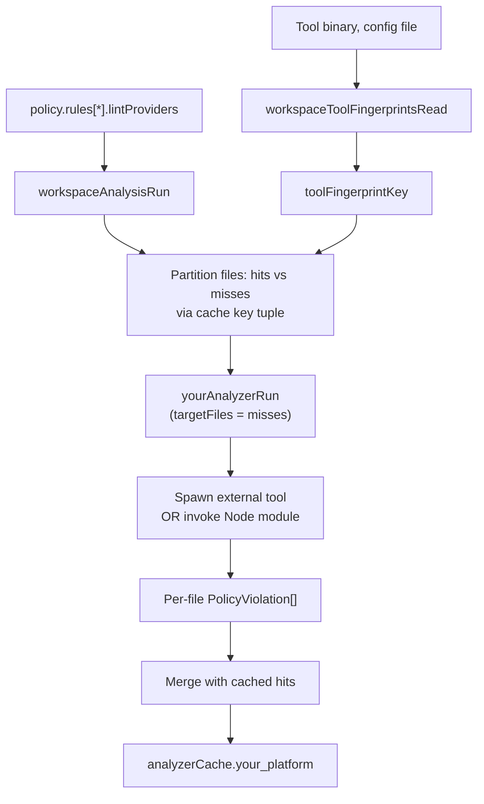

# Adding a New Lint Provider

This guide is for contributors extending codepol with a **new external lint platform** (for example, `deno lint`, `oxlint`, or `clippy`). If you only want to add a new rule that reuses an existing provider (ESLint, Biome, Ruff), see [Creating Custom Plugins](./creating-custom-plugins.md) instead.

A lint provider is the bridge between codepol's policy engine and an external linter. It plugs into three subsystems:

1. **Policy contract** — a `LintProvider` descriptor plus a platform-specific config type.
2. **Analyzer** — a function inside `@codepol/workspace-service` that runs the external tool and returns per-file violations.
3. **Analysis cache** — the fingerprint slice that invalidates cached results when the provider's inputs change.

Skipping any of these three steps produces correctness bugs. The analysis cache in particular will silently serve stale results if you forget to fingerprint your provider's binaries and config files.

## Architecture



## Step 1: Declare the provider contract

Add a provider config type to [`packages/core/src/policy/policyTypes.ts`](../packages/core/src/policy/policyTypes.ts) alongside `EslintProviderConfig`, `BiomeProviderConfig`, and `RuffProviderConfig`.

```typescript
/**
 * Deno lint provider configuration.
 */
export type DenoProviderConfig = {
  /** Path to the deno binary (default: 'deno') */
  denoBin?: string;
  /** Path to deno.json / deno.jsonc */
  configPath?: string;
  /** Extra CLI arguments */
  extraArgs?: string[];
};
```

Re-export it from [`packages/core/src/index.ts`](../packages/core/src/index.ts) so workspace-service and user plugins can import it.

Nothing else changes at this layer — `LintProvider<TConfig>` is already generic. Rule plugins describe your provider like this:

```typescript
const denoProvider: LintProvider<DenoProviderConfig> = {
  platform: 'deno',
  languages: ['typescript', 'javascript'],
  config: { denoBin: 'deno', configPath: './deno.json' },
};
```

## Step 2: Write the analyzer

Create a new package (`packages/plugin-deno`) modelled on [`packages/plugin-biome`](../packages/plugin-biome) and [`packages/plugin-ruff`](../packages/plugin-ruff). The package's public surface is a single async runner that accepts a file list and returns `Result<PolicyViolation[], string>`.

Then add an analyzer function to [`packages/workspace-service/src/index.ts`](../packages/workspace-service/src/index.ts) following the shape of `biomeAnalyzerRun` and `ruffAnalyzerRun`:

```typescript
async function denoAnalyzerRun(
  input: {
    files: string[];
    lintProviderEntries: LintProviderEntry[];
    nativeOwnedWrappedRuleIds: ReadonlySet<string>;
    fix: boolean;
    signal?: AbortSignal;
    // Required for the per-analyzer cache: when provided, only lint this subset.
    targetFiles?: ReadonlySet<string>;
  },
): Promise<WorkspaceAnalyzerRunResult> {
  // 1. Skip-early when no deno providers, no owned rule ids, or no files.
  // 2. Filter `files` by targetFiles before invoking the external tool.
  // 3. Return violations keyed on violation.filePath so the orchestrator
  //    can bucket per-file cache entries.
}
```

### Per-file targetFiles is mandatory

The orchestrator calls your analyzer with `targetFiles` set to the subset of files whose cache key tuple missed. You **must** filter your input files by this set before invoking the external tool, otherwise:

- the analyzer produces violations for files that were cache hits,
- the merge step drops the duplicates,
- but you've paid the full external-tool cost for no reason.

If `targetFiles` is `undefined`, run over all files (full-path runs for `options.fix` / `options.collectEslintOutput`).

### Violations must be keyed per-file

The orchestrator buckets results by `violation.filePath`. If your external tool reports file-global findings, synthesise a violation for each affected file path. Results not tied to a file path in `files` are dropped silently.

### Scorecard fields

Return a `WorkspaceAnalyzerRunResult` via `workspaceAnalyzerRunResultCreate` and `workspaceAnalyzerScorecardCreate`. Use a stable `analyzerId` (e.g. `'deno'`) and `platform` discriminator — consumers read these via `WorkspaceAnalysis.analyzerScorecard`.

## Step 3: Fingerprint your provider's inputs

This is the step that's easy to miss and also the one that breaks correctness if skipped.

The per-analyzer cache keys every entry with a tuple:

```
(contentFingerprint, configFingerprint, pluginFingerprint,
 toolFingerprintKey, treeIndexFingerprint)
```

Your provider's external binary and config file must flow into `toolFingerprintKey`. Update [`workspaceToolFingerprintsRead`](../packages/workspace-service/src/index.ts) to resolve any path-like inputs your provider accepts and add them to the fingerprint set:

```typescript
function workspaceToolFingerprintsRead(
  workspace: WorkspaceContextState,
  lintProviderEntries: LintProviderEntry[],
): WorkspaceWarmCacheFileFingerprint[] {
  const resolvedPaths = new Set<string>();
  // ... existing biome / ruff / eslint handling ...
  for (const entry of lintProviderEntries) {
    if (entry.provider.platform === 'deno') {
      const config = entry.provider.config as DenoProviderConfig | undefined;
      for (const candidate of [config?.denoBin, config?.configPath]) {
        const resolved = workspaceExternalToolPathResolve(workspace, candidate);
        if (resolved) {
          resolvedPaths.add(resolved);
        }
      }
    }
  }
  // ... existing eslint package manifest handling ...
}
```

### Which inputs to fingerprint

- **External binary** (if the user can override it via config): always fingerprint.
- **External config file** (e.g. `deno.json`): always fingerprint.
- **Node-loaded package** (like ESLint): fingerprint its `package.json` via `workspaceNodeModulePackageManifestResolve(workspace.rootPath, 'your-package')`. `package.json` is rewritten on every `npm install`, which flips the fingerprint even when the version string is unchanged.
- **Rule-level options embedded in `policy.rules[].args`**: already covered by `configFingerprint` (the whole policy is JSON-hashed). You do not need to do anything.
- **Plugin capability definitions**: already covered by `pluginFingerprint`.

### What happens if you skip this step

A user upgrades their lint tool or changes its config. The tuple keys still match on-disk content + unchanged `configFingerprint` / `pluginFingerprint`, so every file is a cache hit and we return the pre-upgrade results forever. The cache is silently wrong.

## Step 4: Wire the analyzer into the orchestrator

Both paths in `workspaceAnalysisRun` need updates:

1. **`workspaceAnalysisRunFullPath`** (the `options.fix` / `options.collectEslintOutput` branch): call your analyzer without `targetFiles`, then pass its result into `workspaceAnalysisCompose` and `workspaceAnalyzerCacheRefresh`.

2. **`workspaceAnalysisRunIncremental`**: define a `*FilesInScope` helper (see `workspaceTreeAnalyzerFilesInScopeCollect`, `workspaceBiomeFilesInScopeCollect`), call `workspaceAnalyzerPartitionCompute` with your analyzer key, run your analyzer with `targetFiles = new Set(part.misses)`, and hand the result to `workspaceAnalyzerSliceMerge`.

Add your new analyzer key to:

- `WorkspaceAnalyzerCacheKey = 'tree' | 'eslint' | 'biome' | 'ruff' | 'deno'`
- `workspaceAnalyzerScorecardTemplateForEmpty` (for the "no misses, empty cache" path)
- `workspaceAnalyzerCacheRefresh` (the full-path cache refresh)

Grep for an existing provider name (e.g. `'biome'`) to find every call site. Every match is a place you need to replicate for your new provider.

## Step 5: Declare scope

Two mechanisms decide whether your analyzer is asked about a given file:

- **Language filter**: `LintProvider.languages` tells the policy engine which languages the provider supports. A rule that doesn't apply to any of those languages will be filtered out before reaching your analyzer.
- **File extension filter**: your `*FilesInScope` helper should pre-filter to extensions the tool actually handles (mirror `BIOME_FILE_EXTENSIONS` / `PYTHON_FILE_EXTENSIONS`). Files outside the filter are skipped without bucketing a cache entry.

If a rule uses your provider but codepol has a native tree-check capability for the same rule, `workspaceNativeOwnedWrappedRuleIdsResolve` automatically flags your provider as `native_preferred` and skips execution. Follow the `biomeAnalyzerRun` / `ruffAnalyzerRun` pattern for returning a scorecard with `skippedReason: 'native_preferred'` when this happens.

## Step 6: Tests

Add at minimum:

1. **Provider contract**: a `packages/plugin-deno/src/denoAdapter.spec.ts` that exercises the runner on a fixture file, including cancellation via `AbortSignal`.
2. **Targeted runs**: a workspace-service integration test that opens two files, edits one, and asserts your analyzer is only called for the edited file's cached-miss (use a spy or latency proxy via `analyzerScorecard[i].fileCount`).
3. **Binary change invalidates the cache**: modify (touch) your fingerprinted binary or config file and assert a previously cached result is recomputed. [`tests/workspace-service.integration.spec.ts`](../tests/workspace-service.integration.spec.ts) already has a template for this — search for "discards a warm cache when a configured external tool binary changes".
4. **Native-preferred skip**: assert the scorecard reports `status: 'skipped'` with `skippedReason: 'native_preferred'` when a native tree rule shadows the wrapped rule.

## Checklist

Before merging a new lint provider, confirm:

- [ ] Provider config type added to `@codepol/core` and re-exported.
- [ ] Analyzer function accepts and respects `targetFiles`.
- [ ] Violations are emitted per `violation.filePath`.
- [ ] Scorecard uses a stable, unique `platform` discriminator.
- [ ] `workspaceToolFingerprintsRead` fingerprints the binary and any config files.
- [ ] Node-loaded packages fingerprint their resolved `package.json`.
- [ ] Analyzer key added to `WorkspaceAnalyzerCacheKey`, partition flow, empty-template helper, and cache-refresh helper.
- [ ] `*FilesInScope` helper narrows to supported extensions.
- [ ] `native_preferred` skip path implemented and tested.
- [ ] Integration test shows a single-file edit re-runs only the miss file.
- [ ] Integration test shows binary/config changes flush the cache via fingerprint miss.
