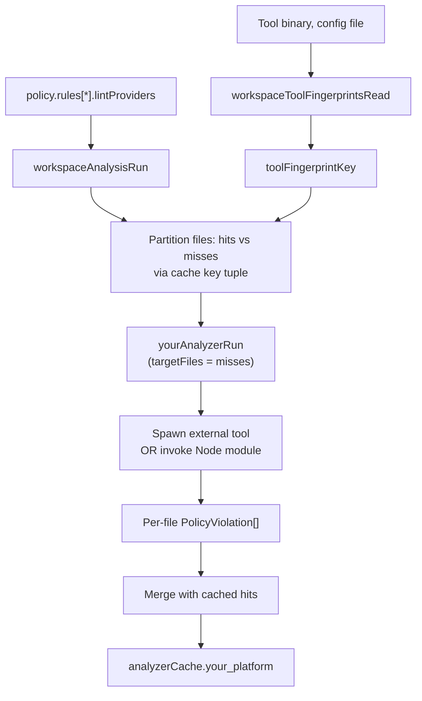

# Adding a New Lint Provider

This guide is for contributors extending codepol with a **new external lint platform** (for example, `deno lint`, `oxlint`, or `clippy`). If you only want to add a new rule that reuses an existing provider (ESLint, Biome, Ruff), see [Creating Custom Plugins](./creating-custom-plugins.md) instead.

A lint provider is the bridge between codepol's policy engine and an external linter. It plugs into four subsystems:

1. **Policy contract** — a `LintProvider` descriptor plus a platform-specific config type.
2. **Runner package** — a `@codepol/plugin-<tool>` package that wraps the external tool (subprocess or Node module).
3. **Analyzer** — a function inside `@codepol/workspace-service` that drives the runner and returns per-file violations.
4. **Analysis cache** — the fingerprint slice that invalidates cached results when the provider's inputs change.

Skipping any of these produces correctness bugs. The analysis cache in particular will silently serve stale results if you forget to fingerprint your provider's binaries and config files.

The canonical references are:

- [`packages/plugin-biome`](../packages/plugin-biome) — spawns an external binary.
- [`packages/plugin-ruff`](../packages/plugin-ruff) — spawns an external binary, per-file input.
- [`packages/plugin-eslint`](../packages/plugin-eslint) — loaded as a Node module; fingerprints `package.json`.

Read at least one end-to-end before starting.

## Architecture



## Step 1: Declare the provider contract

Add a provider config type to [`packages/core/src/policy/policyTypes.ts`](../packages/core/src/policy/policyTypes.ts) alongside `EslintProviderConfig`, `BiomeProviderConfig`, and `RuffProviderConfig`.

```typescript
/**
 * Deno lint provider configuration.
 */
export type DenoProviderConfig = {
  /** Path to the deno binary (default: 'deno') */
  denoBin?: string;
  /** Path to deno.json / deno.jsonc */
  configPath?: string;
  /** Extra CLI arguments */
  extraArgs?: string[];
};
```

Re-export it from [`packages/core/src/index.ts`](../packages/core/src/index.ts) so workspace-service and user plugins can import it.

`LintProvider<TConfig>` is already generic, so rule plugins describe your provider like this:

```typescript
const denoProvider: LintProvider<DenoProviderConfig> = {
  platform: 'deno',
  languages: ['typescript', 'javascript'],
  config: { denoBin: 'deno', configPath: './deno.json' },
};
```

### Extend the platform discriminator

`WorkspaceAnalyzerScorecardEntry.platform` is a closed union (`'codepol_tree' | 'eslint' | 'biome' | 'ruff'`) in [`packages/workspace-service/src/index.ts`](../packages/workspace-service/src/index.ts). Add your new value (e.g. `'deno'`) to that union. Both `analyzerId` and `platform` are surfaced on `WorkspaceAnalysis.analyzerScorecard` and consumed by the LSP server and the daemon; once shipped, renaming them is a breaking change.

## Step 2: Create the runner package

Scaffold `packages/plugin-deno` modelled on [`packages/plugin-biome`](../packages/plugin-biome). The public surface is split across four files:

- `denoTypes.ts` — re-exports `DenoProviderConfig`, declares the raw tool output shape (`DenoDiagnostic`, `DenoReport`, …).
- `denoRunner.ts` — `denoCheckAsync(files, config, { signal })` and `denoFixAsync(...)`, each returning `Result<PolicyViolation[], string>`.
- `denoAdapter.ts` — optional in-process `TreeCheckProvider` adapter (biome has one; ruff does not). Only needed if you want codepol to be able to invoke the tool without spawning. The CLI path never uses this.
- `index.ts` — the public barrel.

Add the package to the root workspace `package.json`, wire `tsconfig.json`, and add a `package.json` that depends on `@codepol/core`.

## Step 3: Write the analyzer

Add an analyzer function to [`packages/workspace-service/src/index.ts`](../packages/workspace-service/src/index.ts) next to `biomeAnalyzerRun` and `ruffAnalyzerRun`. The signature depends on whether your provider takes per-rule config:

```typescript
// Pattern A (ruff-style): flat file list, provider config is global.
async function denoAnalyzerRun(input: {
  files: string[];
  lintProviderEntries: LintProviderEntry[];
  nativeOwnedWrappedRuleIds: ReadonlySet<string>;
  fix: boolean;
  signal?: AbortSignal;
  targetFiles?: ReadonlySet<string>;
}): Promise<WorkspaceAnalyzerRunResult> { … }

// Pattern B (biome-style): files bucketed by config key so that rules
// carrying different per-rule options run in separate invocations.
async function denoAnalyzerRun(input: {
  matches: RuleMatch[];
  lintProviderEntries: LintProviderEntry[];
  nativeOwnedWrappedRuleIds: ReadonlySet<string>;
  fix: boolean;
  signal?: AbortSignal;
  targetFiles?: ReadonlySet<string>;
}): Promise<WorkspaceAnalyzerRunResult> { … }
```

Use Pattern B when rules using your provider can legitimately ship different `config` values (`biomeBin`, `configPath`, …) and you need to group files so the tool is spawned once per config. Otherwise use Pattern A.

### Required control flow

Every analyzer must have these branches in this order. Each corresponds to a distinct scorecard shape that downstream consumers rely on:

1. **`workspaceAbortSignalThrowIfAborted(input.signal)` at entry and between per-config-key iterations.** The existing analyzers call this inside every loop that spawns a subprocess; skipping it means the analyzer ignores cancellation mid-run.
2. **No eligible entries** → return `workspaceAnalyzerRunResultCreate(workspaceAnalyzerScorecardCreate({ ..., status: 'skipped', skippedReason: 'no_matching_rules' }))`.
3. **All matched rules shadowed by native tree rules** → use `workspaceLintProviderEntryIsNativePreferred(entry, input.nativeOwnedWrappedRuleIds)` to partition. If no executable entries remain, return with `skippedReason: 'native_preferred'` and the shadowed ids in `skippedRuleIds`.
4. **Extension filter removes every file** → return with `skippedReason: 'no_matching_files'`.
5. **`targetFiles` filter.** When provided, drop any file not in the set before invoking the tool. Without this filter the analyzer re-runs on cache hits and silently burns CPU (the merge step discards the duplicates, but the tool was already spawned).
6. **Run the tool.** Collect `PolicyViolation[]` keyed by `violation.filePath`. Convert to diagnostics via `providerViolationsToDiagnostics(violations, 'deno')`.
7. **Failure handling.** Push a string to `issues: string[]` on any tool error and set `status: 'failed'`. Do not throw; the orchestrator treats a thrown analyzer as a hard failure and abandons the whole run.
8. **Return** via `workspaceAnalyzerRunResultCreate(workspaceAnalyzerScorecardCreate({ … }), { diagnostics, violations })`.

### Scorecard contract

`workspaceAnalyzerScorecardCreate` requires these fields; do not omit any:

| Field | Values | Notes |
| --- | --- | --- |
| `analyzerId` | stable string, e.g. `'deno'` | Matches your `WorkspaceAnalyzerCacheKey`. |
| `platform` | one of the union values | See Step 1. |
| `languages` | string[] | For JS/TS providers use `[...WORKSPACE_NATIVE_OWNERSHIP_LANGUAGES]`; for Python, `['python']`. |
| `ownedRuleIds` | rule ids that actually executed | Excludes `native_preferred` rules. |
| `skippedRuleIds` | shadowed rule ids | Empty unless `native_preferred` applies. |
| `skippedReason` | `'no_matching_rules' \| 'no_matching_files' \| 'native_preferred'` | Only set when `status === 'skipped'` or when non-empty `skippedRuleIds`. |
| `fixMode` | `'none' \| 'inline' \| 'external'` | `'external'` for subprocess-based tools. `'inline'` is tree/native-only. |
| `status` | `'ran' \| 'skipped' \| 'failed'` | `'failed'` iff `issues.length > 0`. |
| `latencyMs` | `Date.now() - startedAt` | Only on the running path. |
| `issues` | `string[]` | Empty on success. |
| `diagnosticCount` / `violationCount` / `fileCount` | numeric | Only on the running path. |

### Violations must be keyed per-file

The orchestrator buckets results by `violation.filePath`. If your external tool reports file-global findings, synthesise a violation for each affected file path. Results not tied to a file path in `files` / `matches` are dropped silently.

### Fix path: two different mechanisms

There are two orthogonal fix concepts and new providers touch both:

- **External tool autofix.** When `input.fix === true`, call your tool's fix command (biome calls `biomeFixAsync` _before_ `biomeCheckAsync` inside the same analyzer). The analyzer then re-runs the lint to collect surviving violations.
- **`FixProvider`.** A separate capability declared by plugin rules (see [`creating-custom-plugins.md`](./creating-custom-plugins.md)). `fixProvidersCollect` / `fixProvidersApply` run in `workspaceAnalysisRunFullPath` _before_ any analyzer, and apply tree-shaped edits. A lint provider does **not** need a `FixProvider` unless the rule also exposes a codepol-native edit surface.

Almost every new lint provider only needs the first mechanism.

## Step 4: Register a fingerprint extractor

This is the step that's easy to miss and also the one that breaks correctness if skipped.

The per-analyzer cache keys every entry with a tuple:

```
(contentFingerprint, configFingerprint, pluginFingerprint,
 toolFingerprintKey, treeIndexFingerprint)
```

Your provider's external binary, config files, and any Node-loaded package manifest must flow into `toolFingerprintKey`. The workspace-service has a single per-platform registry, `WORKSPACE_PROVIDER_FINGERPRINT_EXTRACTORS` in [`packages/workspace-service/src/index.ts`](../packages/workspace-service/src/index.ts), that maps a `LintProvider.platform` discriminator to the file paths it depends on:

```typescript
const WORKSPACE_PROVIDER_FINGERPRINT_EXTRACTORS: Record<
  string,
  WorkspaceProviderFingerprintExtractor
> = {
  eslint: (workspace) => [
    workspaceExternalToolConfigPathGet(workspace, 'eslint'),
    workspaceNodeModulePackageManifestResolve(workspace.rootPath, 'eslint'),
  ],
  biome: (workspace, providerConfig) => {
    const config = providerConfig as BiomeProviderConfig | undefined;
    return [config?.biomeBin, config?.configPath].map((candidate) =>
      workspaceExternalToolPathResolve(workspace, candidate),
    );
  },
  // ... add yours here ...
};
```

`workspaceExternalToolConfigPathGet(workspace, analyzerId)` reads the bridge
rule's resolved `args.configPath` from `workspace.externalToolConfigs`. Use it
when your platform has a single workspace-level config file (eslint / biome /
ruff today) instead of carrying that path on the per-provider config object.

Add one entry for your platform. The extractor returns `Array<string | undefined>`; the orchestrator filters undefined entries, resolves to absolute paths, fingerprints them, and folds them into `toolFingerprintKey`. There is no other place in the workspace-service that should know your platform discriminator — `workspaceConfigFingerprintCompute`, `workspacePluginFingerprintCompute`, and the orchestrator are all platform-agnostic by design.

```typescript
// Example for a hypothetical 'deno' provider:
deno: (workspace, providerConfig) => {
  const config = providerConfig as DenoProviderConfig | undefined;
  return [config?.denoBin, config?.configPath].map((candidate) =>
    workspaceExternalToolPathResolve(workspace, candidate),
  );
},
```

### Which inputs to return from your extractor

- **External binary** (if the user can override it via config): always include.
- **External config file** (e.g. `deno.json`): always include.
- **Node-loaded package** (like ESLint): include the resolved `package.json` via `workspaceNodeModulePackageManifestResolve(workspace.rootPath, 'your-package')`. `package.json` is rewritten on every `npm install`, which flips the fingerprint even when the version string is unchanged.
- **Bridge-rule config files** (like `workspace.externalToolConfigs.find(c => c.analyzerId === 'eslint')?.configPath`): the extractor receives the full `WorkspaceContextState`, so it can pluck whichever entry is relevant via `workspaceExternalToolConfigPathGet(workspace, '<analyzerId>')`. Prefer deriving from policy rule args rather than adding new top-level config fields.
- **Rule-level options embedded in `policy.rules[].args`**: already covered by `configFingerprint` (the whole policy is JSON-hashed). You do not need to do anything.
- **Plugin capability definitions**: already covered by `pluginFingerprint`.

### What happens if you skip this step

A user upgrades their lint tool or changes its config. The tuple keys still match on-disk content + unchanged `configFingerprint` / `pluginFingerprint`, so every file is a cache hit and we return the pre-upgrade results forever. The cache is silently wrong.

## Step 5: Wire the analyzer into the orchestrator

Every named call site below lives in [`packages/workspace-service/src/index.ts`](../packages/workspace-service/src/index.ts). Each takes the same shape as the existing `biome` / `ruff` lines — add yours directly beneath theirs.

### 5a. Extend the cache key union

```typescript
type WorkspaceAnalyzerCacheKey = 'tree' | 'eslint' | 'biome' | 'ruff' | 'deno';
```

The union is consumed by `WorkspaceAnalyzerCache`, the partition helper, and `workspaceAnalyzerCacheRefresh`, so the TypeScript compiler will surface every downstream edit you still owe.

### 5b. Add a `*FilesInScope` helper

Mirror `workspaceBiomeFilesInScopeCollect` (`matches: RuleMatch[] → string[]`). Pre-filter to the extensions your tool actually handles — e.g. export a new `DENO_FILE_EXTENSIONS` array alongside `BIOME_FILE_EXTENSIONS` and `PYTHON_FILE_EXTENSIONS`. Files outside the filter are skipped without bucketing a cache entry.

### 5c. `workspaceAnalyzerScorecardTemplateForEmpty`

Add a `case 'deno':` that returns the "skipped, `no_matching_rules`" scorecard template used when the analyzer cache is warm but has no fresh run.

### 5d. `workspaceAnalysisRunFullPath`

Add an `await denoAnalyzerRun({ … fix: options.fix, signal: options.signal })` call next to `biomeResult` / `ruffResult`. Do **not** pass `targetFiles` here — full-path runs lint every file. Include the result in `workspaceAnalysisCompose` and `workspaceAnalyzerCacheRefresh`.

### 5e. `workspaceAnalysisRunIncremental`

1. Compute `const denoFilesInScope = workspaceDenoFilesInScopeCollect(matches)`.
2. Call `workspaceAnalyzerPartitionCompute({ analyzer: 'deno', files: denoFilesInScope, keyForFile: baseTuple(treeIndexFp) })`.
3. If `part.misses.length > 0`, run `await denoAnalyzerRun({ …, targetFiles: new Set(part.misses) })`.
4. Feed the result into `workspaceAnalyzerSliceMerge({ analyzer: 'deno', partition: part, freshResult, … })`.

### 5f. `workspaceAnalyzerCacheRefresh`

The full-path branch writes back per-analyzer cache entries so subsequent incremental runs can hit. Add a `deno:` branch symmetric to the existing `biome:` / `ruff:` branches.

### 5g. `workspaceAnalysisCompose`

Accept the new `denoResult` in the input, concatenate its diagnostics/violations, and surface its scorecard via `analyzerScorecard`.

Grep for `'biome'` (as a string literal, not a symbol) to verify you've hit every site; at the time of writing there are roughly eight.

## Step 6: Declare scope and native-preference

Two mechanisms decide whether your analyzer is asked about a given file:

- **Language filter.** `LintProvider.languages` tells the policy engine which languages the provider supports. A rule that doesn't apply to any of those languages is filtered out before reaching your analyzer. For JS/TS providers that overlap the codepol-native tree rules, use `[...WORKSPACE_NATIVE_OWNERSHIP_LANGUAGES]` so the native-preferred logic lines up.
- **File extension filter.** The `*FilesInScope` helper from Step 5b. Files outside the filter are skipped without bucketing a cache entry.

If a rule uses your provider but codepol has a native tree-check capability for the same rule, `workspaceNativeOwnedWrappedRuleIdsResolve` returns that rule id, and `workspaceLintProviderEntryIsNativePreferred` evaluates to `true` for the matching entry. Move such entries out of `executableEntries` into `skippedRuleIds`, and emit a scorecard with `skippedReason: 'native_preferred'` (see Step 3's control flow).

## Step 7: Tests

Add at minimum:

1. **Runner contract.** `packages/plugin-deno/src/denoRunner.spec.ts` exercises `denoCheckAsync` / `denoFixAsync` on a fixture, including cancellation via `AbortSignal`.
2. **Adapter contract** (only if you ship one). `denoAdapter.spec.ts`.
3. **Targeted incremental run.** A workspace-service integration test that opens two files, edits one, and asserts your analyzer is only called for the edited file. Use `analyzerScorecard[i].fileCount` as the signal.
4. **Full-path `fix`.** Assert `options.fix = true` invokes the tool's autofix path and produces fresh violations for the surviving issues.
5. **Binary change invalidates the cache.** Modify (touch) your fingerprinted binary or config file and assert a previously cached result is recomputed. [`tests/workspace-service.integration.spec.ts`](../tests/workspace-service.integration.spec.ts) has a template — search for "discards a warm cache when a configured external tool binary changes".
6. **Native-preferred skip.** Assert the scorecard reports `status: 'skipped'`, `skippedReason: 'native_preferred'`, and a populated `skippedRuleIds` when a native tree rule shadows the wrapped rule.
7. **`no_matching_files` skip.** Configure the provider with a rule that matches no files and assert the scorecard reports that reason.
8. **Cancellation.** Fire `AbortSignal.abort()` mid-run and assert the analyzer rejects with `'Request cancelled'`.

Fixtures live under `tests/fixtures/<name>/` with a `codepol.config.ts` at the root. Mirror an existing provider's fixture (e.g. `tests/fixtures/biome-*`).

## Step 8: Update user-facing docs

Rule authors discover new lint platforms through [`docs/creating-custom-plugins.md`](./creating-custom-plugins.md), not this guide. Add a short section there covering:

- The new `platform` string.
- The config type and a minimal example.
- Any default fingerprinted paths users should be aware of.

## Checklist

Before merging a new lint provider, confirm:

### Contract
- [ ] Provider config type added to `@codepol/core` and re-exported from its `index.ts`.
- [ ] `WorkspaceAnalyzerScorecardEntry.platform` union extended.
- [ ] `WorkspaceAnalyzerCacheKey` union extended.

### Runner package
- [ ] `packages/plugin-<tool>` scaffolded with `<tool>Runner.ts`, `<tool>Types.ts`, optional `<tool>Adapter.ts`, and `index.ts` barrel.
- [ ] Root `package.json`, `tsconfig.json`, and workspace `package.json` list the new package.

### Analyzer
- [ ] Accepts and respects `targetFiles`.
- [ ] Calls `workspaceAbortSignalThrowIfAborted` at entry and inside every per-config/per-file loop.
- [ ] Emits violations per `violation.filePath`.
- [ ] Returns via `workspaceAnalyzerRunResultCreate` / `workspaceAnalyzerScorecardCreate` with all required scorecard fields.
- [ ] Handles every skipped reason: `no_matching_rules`, `no_matching_files`, `native_preferred`.
- [ ] Routes tool errors into `issues` and sets `status: 'failed'` (never throws).
- [ ] `fixMode` matches reality (`'external'` for subprocess tools).
- [ ] When `input.fix`, invokes the tool's autofix path before the lint path.
- [ ] Languages list aligns with `WORKSPACE_NATIVE_OWNERSHIP_LANGUAGES` for JS/TS overlaps.

### Cache fingerprints
- [ ] One entry added to `WORKSPACE_PROVIDER_FINGERPRINT_EXTRACTORS` (the only place the orchestrator should know your platform discriminator).
- [ ] Extractor returns the binary path, every config file path, and (for Node-loaded packages) the resolved `package.json`.
- [ ] No platform-specific code added to `workspaceConfigFingerprintCompute` or `workspacePluginFingerprintCompute`.

### Orchestrator wiring
- [ ] `*FilesInScope` helper narrows to supported extensions, called from both full-path and incremental branches.
- [ ] `workspaceAnalyzerScorecardTemplateForEmpty` has a new `case`.
- [ ] `workspaceAnalysisRunFullPath` awaits the analyzer (no `targetFiles`).
- [ ] `workspaceAnalysisRunIncremental` partitions, runs misses only, and merges.
- [ ] `workspaceAnalyzerCacheRefresh` writes per-file entries back.
- [ ] `workspaceAnalysisCompose` accepts and folds the new result.

### Tests
- [ ] Runner + optional adapter spec (includes cancellation).
- [ ] Integration test for single-file edit re-runs only the miss file.
- [ ] Integration test for `options.fix` full-path run.
- [ ] Integration test for binary/config change flushes the cache.
- [ ] Integration test for `native_preferred` skip.
- [ ] Integration test for `no_matching_files` skip.

### Docs
- [ ] `docs/creating-custom-plugins.md` updated with the new platform string, config, and example.
