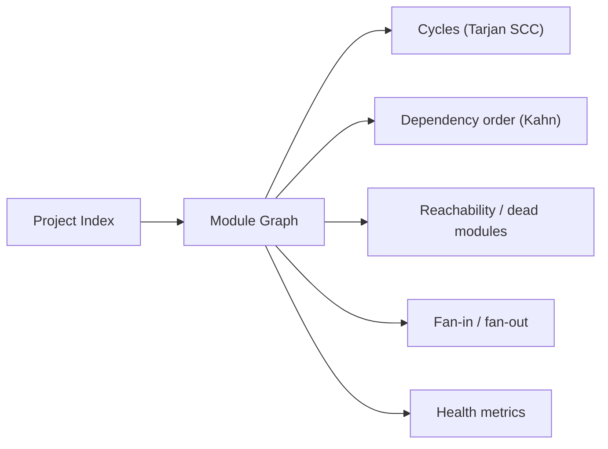

# Architecture Analysis

Codepol builds a module graph from the [semantic index](./semantic-index.md) and
exposes it three ways: as **policy rules** that fail a build, as **CLI queries**
you can script, and as **editor surfaces** you can navigate.

This page covers the model those three share.

## The module graph

Nodes are files. Edges are resolved import relationships — resolved, not
textual: the index links each import specifier to the file it actually names,
following path aliases, monorepo workspace package entry points, and re-export
chains.



Derived from it:

| Concept | Meaning |
| ------- | ------- |
| **Cycle** | A strongly connected component with more than one member |
| **Dependency order** | Topological ordering of files, where one exists |
| **Entry point** | A file with no importers |
| **Dead module** | A file unreachable from the declared entry points |
| **Fan-in** | How many files import this one |
| **Fan-out** | How many files this one imports |
| **Instability** | `fan-out / (fan-in + fan-out)` — how likely a module is to change |

## Enforcing it

Architecture rules run once per rule over the whole graph, rather than once per
file. Attach them like any other rule; see the
[Rule Catalog](./rules/index.md#architecture) for every argument.

```toml
[[rules]]
ruleId = "@codepol/plugin/no-cycles"
severity = "error"
targets = ["src"]

[[rules]]
ruleId = "@codepol/plugin/max-fan-out"
targets = ["src"]
args.max = 15

[[rules]]
ruleId = "@codepol/plugin/no-layer-violation"
targets = ["src"]

[rules.args.layers.domain]
files = ["src/domain/**"]
denies = ["infra"]

[rules.args.layers.infra]
files = ["src/infra/**"]
allows = ["domain"]
```

Because these rules need the graph, enabling any of them makes Codepol build the
project index before checking. That is the main cost of architecture
enforcement — the daemon exists largely to amortize it (see
[Editor Integration](./editor-integration.md#the-daemon)).

### Adopting on an existing codebase

Turning on `no-cycles` in a repo that already has hundreds of cycles produces
noise, not action. Two knobs make adoption incremental:

1. **Cap the blast radius.** `no-cycles` reports at most 50 cycles per run by
   default, so output stays readable.
2. **Ratchet instead of gating.** Use `max-cycle-size` to stop cycles from
   *growing* before you require zero:

```toml
[[rules]]
ruleId = "@codepol/plugin/max-cycle-size"
targets = ["src"]
args.max = 4
args.ignore = ["legacy/**"]
```

Then use baseline diffing (below) to block *new* problems while you work the
existing ones down.

## Querying it

The same graph is scriptable from the CLI. Full flags in the
[CLI Reference](./cli-reference.md#codepol-graph-architecture-queries).

```bash
codepol graph cycles                  # what cycles exist?
codepol graph path src/a.ts src/b.ts  # why does a import b?
codepol graph impact src/core.ts      # what does changing this touch?
codepol graph fan-in --top 10         # what are the hubs?
codepol graph dead --entry src/index.ts
codepol graph metrics
```

`export` renders the graph for external tools:

```bash
codepol graph export --format mermaid > graph.mmd
codepol graph export --format dot | dot -Tsvg > graph.svg
```

## Baselines and diffing

A snapshot is a labeled capture of the graph, stored under
`.codepol/graph-snapshots/`. Diffing the live graph against one turns
architecture from an absolute gate into a **regression** gate — the practical way
to adopt this on a codebase that is not already clean.

```bash
# On the main branch, record the baseline
codepol graph snapshot --label main

# On a PR, compare
codepol graph diff main --fail-on-new-cycle
```

The diff reports added and removed nodes and edges, and newly introduced cycles.
In the editor, the same data drives a diff overlay — set
`codepol.architecture.baselineLabel` and run **Codepol: Show Dependency Diff**.

::: tip CI pattern
Commit the baseline, or regenerate it from the merge-base in CI. Then
`--fail-on-new-cycle` blocks regressions without requiring the repo to be clean
today.
:::

## Symbol-level graphs

Above the module graph, Codepol answers two symbol-level questions:

**Call graph** — who calls this function. Built heuristically from the syntax
tree, then optionally enriched by a real type checker (see below). Re-export
proxies are collapsed to a canonical symbol so a function is not double-counted
when it is re-exported.

**Type hierarchy** — supertypes and subtypes of a class or interface, with edges
labeled by confidence:

| Confidence | Source |
| ---------- | ------ |
| `declared` | An explicit `extends` / `implements` clause |
| `structural-shape` | The type structurally satisfies the contract |
| `type-aware` | Confirmed by a real type checker |

```bash
codepol graph hierarchy <symbolId> --min-confidence type-aware
codepol graph flow <symbolId> --direction incoming
```

`graph flow` covers the case a call graph misses: a function passed as an
argument rather than called directly.

### Type-aware enrichment

Heuristic edges from a syntax tree cannot resolve everything a type checker can.
Codepol therefore accepts type-aware sources that refine call-graph and
type-hierarchy results, backed by real language servers — tsserver, Pyright,
gopls, or rust-analyzer.

Codepol never spawns these itself. The **host** supplies the transport: in the
VS Code extension, queries are answered by the editor's own TypeScript
integration; outside an editor, a Codepol-managed subprocess backend is used as
a fallback. Point a backend at a specific binary with `CODEPOL_PYRIGHT_BIN`,
`CODEPOL_GOPLS_BIN`, or `CODEPOL_RUST_ANALYZER_BIN`.

This is why Go and Rust appear in [language support](./language-support.md) with
type-aware bridges but no rules — the enrichment seam is broader than the
structural indexing.

## What this is not

Codepol's graph is a *structural* model. It is deliberately not a type checker,
and it does not attempt full type inference. Where precision beyond the syntax
tree is required, the answer is to plug in a type-aware source, not to grow the
index into a compiler.
