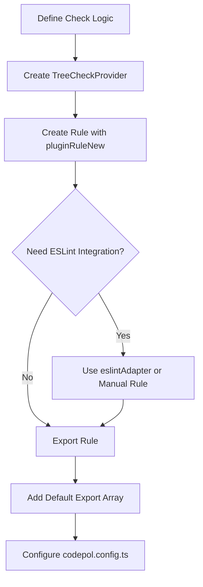

# Creating Custom Plugins

This guide shows how to create a custom codepol plugin. You'll write one check function that works with both the CLI and ESLint.

## Overview

A codepol plugin has two parts:

1. **TreeCheckProvider** - The check logic (runs via CLI with Tree-sitter)
2. **ESLint rule** - Generated automatically using the adapter

The recommended approach uses `eslintAdapter` to convert your TreeCheckProvider into an ESLint rule, so you write the check logic once.



## Quick Start

### 1. Create the Package

::: code-group

```bash [pnpm]
mkdir your-plugin
cd your-plugin
pnpm init
pnpm add -D @codepol/core @codepol/plugin-eslint typescript
```

```bash [npm]
mkdir your-plugin
cd your-plugin
npm init -y
npm install -D @codepol/core @codepol/plugin-eslint typescript
```

```bash [yarn]
mkdir your-plugin
cd your-plugin
yarn init -y
yarn add -D @codepol/core @codepol/plugin-eslint typescript
```

```bash [bun]
mkdir your-plugin
cd your-plugin
bun init
bun add -D @codepol/core @codepol/plugin-eslint typescript
```

:::

### 2. Project Structure

Organize your plugin with clear separation of concerns:

```
your-plugin/
├── src/
│   ├── index.ts              # Entry point: exports plugin rules
│   └── rules/
│       ├── noDuplicateExportsCheck.ts    # TreeCheckProvider check logic
│       └── noDuplicateExportsRule.ts     # Rule definition + ESLint config
├── package.json
└── tsconfig.json
```

### 3. Write the Check Logic

Create `src/rules/noDuplicateExportsCheck.ts` with the pure check function:

```typescript
import type {
  PolicyRule,
  PolicyCheckContext,
  PolicyViolation,
} from '@codepol/core';

export function noDuplicateExportsCheck(
  rule: PolicyRule,
  context: PolicyCheckContext
): PolicyViolation[] {
  const violations: PolicyViolation[] = [];
  const lines = context.source.split('\n');
  const exportedNames = new Map<string, number>();

  // Resolved args from codepol.config.ts are available in context.ruleArgs
  // const args = context.ruleArgs;

  const exportRegex = /export\s+(?:const|let|var|function|class|type|interface)\s+(\w+)/;

  lines.forEach((line, index) => {
    const match = line.match(exportRegex);
    if (match) {
      const name = match[1];
      if (exportedNames.has(name)) {
        violations.push({
          ruleId: rule.id || rule.ruleId,
          filePath: context.filePath,
          message: `Duplicate export '${name}' (first exported on line ${exportedNames.get(name)})`,
          line: index + 1,
          column: match.index! + 1,
        });
      } else {
        exportedNames.set(name, index + 1);
      }
    }
  });

  return violations;
}
```

### 4. Create the Rule Definition

Create `src/rules/noDuplicateExportsRule.ts` with the rule and ESLint configuration:

```typescript
import type {
  CodepolPluginRule,
  LintProvider,
  EslintProviderConfig,
} from '@codepol/core';
import { pluginRuleNew, treeCheckProviderNew } from '@codepol/core';
import { eslintAdapter } from '@codepol/plugin-eslint';
import { noDuplicateExportsCheck } from './noDuplicateExportsCheck';

// Create the TreeCheckProvider using the factory
export const noDuplicateExportsTreeCheck = treeCheckProviderNew({
  languages: ['typescript', 'tsx'],
  check: noDuplicateExportsCheck,
});

// Rule ID must NOT contain '/' - codepol uses '/' for namespacing.
// Your ID will be auto-prefixed: "no-duplicate-exports" → "@scope/plugin/no-duplicate-exports"
const ruleId = 'no-duplicate-exports';

// Create rule plugin base for the adapter
const ruleBase = pluginRuleNew({
  id: ruleId,
  capabilities: { treeCheckProvider: noDuplicateExportsTreeCheck },
});

// Generate ESLint rule from TreeCheckProvider
const eslintRule = eslintAdapter.adapt(ruleBase, {
  ruleName: 'no-duplicate-exports',
});

const eslintConfig: EslintProviderConfig = {
  rules: { 'no-duplicate-exports': eslintRule },
  // severity and ruleOptions are optional
};

const lintProvider: LintProvider = {
  platform: 'eslint',
  languages: ['typescript', 'tsx'],
  config: eslintConfig,
};

// Export the complete rule plugin
export const noDuplicateExportsRule: CodepolPluginRule = pluginRuleNew({
  id: ruleId,
  capabilities: {
    treeCheckProvider: noDuplicateExportsTreeCheck,
    lintProviders: [lintProvider],
  },
});
```

#### Understanding ruleOptions

`ruleOptions` is an **optional** field on `EslintProviderConfig`.

| Field | Type | Default | Description |
|-------|------|---------|-------------|
| `ruleOptions` | `(ctx: LintProviderContext) => unknown` | `{}` | Options to pass to the ESLint rule |

**When is ruleOptions needed?**

- **Simple rules:** Omit entirely — defaults to `{}`
- **Rules using eslintAdapter:** Pass policy context so the adapted rule can filter files
- **Rules with custom arguments:** Forward `ctx.ruleArgs` from config

**Common options for eslintAdapter rules:**

| Option | Type | Description |
|--------|------|-------------|
| `configPath` | `string` | Path to the config file |
| `ruleTargets` | `PolicyRuleTargetContext[]` | Resolved rule targets from the policy |
| `policyExclude` | `string[]` | Global exclude patterns from the policy |

**Example (with ruleOptions):**

```typescript
const eslintConfig: EslintProviderConfig = {
  rules: { 'my-rule': eslintRule },
  ruleOptions: (ctx: LintProviderContext) => ({
    configPath: ctx.configPath,  // Pass config path to the ESLint rule
    ruleTargets: ctx.ruleTargets,
    policyExclude: ctx.policy.exclude,
    ...(ctx.ruleArgs as Record<string, unknown>),
  }),
};
```

**Example (simple rule, defaults only):**

```typescript
const eslintConfig: EslintProviderConfig = {
  rules: { 'simple-rule': eslintRule },
  // ruleOptions defaults to {}
};
```

::: tip Severity in config
Severity is controlled by users in `codepol.config.ts`, not by plugins. This allows teams to customize enforcement per rule. See [Configuring Severity](#configuring-severity).
:::

### 5. Create the Entry Point

Create `src/index.ts` as the clean entry point:

```typescript
export { noDuplicateExportsRule } from './rules/noDuplicateExportsRule';

// Default export is required for codepol to load the plugin
export default [noDuplicateExportsRule];
```

### 6. Configure codepol.config.ts

Create `codepol.config.ts` in your project root. This file declares which plugins to load and how rules apply to your codebase.

For the complete schema reference, see [Policy Schema Reference](./policy-schema.md).

**Minimal example:**

```typescript
// codepol.config.ts
import { defineConfig } from '@codepol/core';

export default defineConfig({
  plugins: ['./path/to/your-plugin'],
  targets: {
    typescript: {
      language: 'typescript',
      files: ['src/**/*.ts'],
    },
  },
  rules: [
    {
      ruleId: 'your-plugin/no-duplicate-exports',
      description: 'Disallow duplicate exports',
      severity: 'warn',
      targets: ['typescript'],
    },
  ],
});
```

#### Configuring Severity

The `severity` field controls how violations are reported:

| Value | Description |
|-------|-------------|
| `'error'` | (default) Violations cause CLI exit code 1 |
| `'warn'` | Violations are reported but don't fail the build |
| `'off'` | Rule is disabled |

::: tip Manual ESLint Configuration
Users can also configure rules directly in their eslint.config.js instead of using codepol.config.ts:

```javascript
rules: {
  'codepol/require-logger-enter-exit': ['error', { /* options */ }],
}
```

This works when running ESLint directly. However, when using `codepol check`, severity from codepol.config.ts takes precedence via ESLint's `overrideConfig`.
:::

#### Filtering Providers

The `providers` field controls which providers a rule applies to. If omitted, the rule applies to all providers.

```json
{
  "ruleId": "@codepol/plugin/require-logger-enter-exit",
  "providers": ["tree-sitter"],
  "targets": ["typescript"]
}
```

| Value | Description |
|-------|-------------|
| `undefined` or `[]` | (default) Rule applies to all providers |
| `['eslint']` | Rule only applies to ESLint |
| `['tree-sitter']` | Rule only applies to tree-sitter checks |
| `['eslint', 'tree-sitter']` | Rule applies to both |

Codepol automatically resolves the `ruleId` by combining the module name and the exported rule ID: `your-plugin/no-duplicate-exports`.

### 7. Test It

::: code-group

```bash [pnpm]
pnpm codepol
```

```bash [npm]
npx codepol
```

```bash [yarn]
yarn codepol
```

```bash [bun]
bunx codepol
```

:::

The CLI auto-discovers `codepol.config.ts` from your project root. You can also specify a custom config path:

```bash
npx codepol --config ./config/codepol.config.ts
```

## Exporting Your Plugin

Plugins must use a **default export** containing an array of `CodepolPluginRule` objects. This is the only export convention codepol uses—consumers never need to specify an export name.

**Important:** All rule plugins must be created using `pluginRuleNew()`. This validates the rule ID at construction time and ensures type safety. Direct object literals won't type-check.

```typescript
// src/index.ts
import { pluginRuleNew, type CodepolPluginRule } from '@codepol/core';

// ✓ Correct - uses pluginRuleNew()
export const myRule: CodepolPluginRule = pluginRuleNew({
  id: 'my-rule',  // Must NOT contain '/'
  capabilities: { /* ... */ },
});

export const anotherRule: CodepolPluginRule = pluginRuleNew({
  id: 'another-rule',
  capabilities: { /* ... */ },
});

// Default export is required for codepol to load the plugin
export default [myRule, anotherRule];
```

::: warning Rule ID Constraint
Rule IDs must **not** contain `/`. The `/` character is reserved for namespacing—codepol automatically prefixes your ID with the module name (e.g., `my-rule` → `@your-org/plugin/my-rule`).
:::

Consumers reference your plugin by module path only:

```json
{ "module": "@your-org/codepol-plugin-foo" }
```

### Multiple Plugin Collections

For packages with multiple distinct plugin collections, use Node.js subpath exports in your `package.json`:

```json
{
  "exports": {
    ".": "./dist/index.js",
    "./security": "./dist/security.js",
    "./logging": "./dist/logging.js"
  }
}
```

Each subpath module should have its own default export:

```typescript
// src/security.ts
export default [xssRule, csrfRule];

// src/logging.ts
export default [loggerRule, auditRule];
```

Consumers reference specific collections via the subpath:

```json
{ "module": "@your-org/plugin/security" }
{ "module": "@your-org/plugin/logging" }
```

## Linter Integration

### ESLint Integration

There are two approaches to integrate your plugin with ESLint:

#### A. Using eslintAdapter (Recommended)

For simple rules without autofix, use the adapter to automatically convert your TreeCheckProvider:

```typescript
import { eslintAdapter } from '@codepol/plugin-eslint';

const eslintRule = eslintAdapter.adapt(rulePlugin, {
  ruleName: 'no-duplicate-exports',
  ruleUrl: 'https://your-docs/rules/no-duplicate-exports',
  severity: 'error', // or 'warning'
});
```

The adapter handles:
- Policy file loading and caching
- File matching against rule targets
- Converting violations to ESLint diagnostics

#### B. Manual ESLint Rule (For Autofix)

For rules that need autofix support or complex ESLint schemas, write the ESLint rule manually. See the built-in logger rule at [`packages/plugin/src/index.ts`](https://github.com/fruitiecutiepie/codepol/blob/master/packages/plugin/src/index.ts) for a complete example with autofix.

Key steps for manual rules:
1. Use `ESLintUtils.RuleCreator` from `@typescript-eslint/utils`
2. Define your schema in the rule's `meta.schema`
3. Implement the `create` function with AST visitors
4. Add `fix` or `suggest` functions for autofix support

#### Configure ESLint

Add to your `eslint.config.js`:

```javascript
import { eslintPluginCreate } from '@codepol/plugin-eslint';
import pluginRules from '@codepol/plugin';       // Built-in rules
import customRules from './your-plugin';         // Your custom rules

export default [
  {
    plugins: {
      codepol: eslintPluginCreate([...pluginRules, ...customRules]),
    },
    rules: {
      'codepol/require-logger-enter-exit': 'error',
      'codepol/no-duplicate-exports': 'error',
    },
  },
];
```

### esbuild Integration

Enforce policies at build time with the esbuild plugin:

```typescript
import { build } from 'esbuild';
import { esbuildPluginCreate } from '@codepol/esbuild-plugin';

await build({
  entryPoints: ['src/index.ts'],
  bundle: true,
  outfile: 'dist/bundle.js',
  plugins: [
    // Auto-discovers codepol.config.ts
    esbuildPluginCreate({
      fix: false, // Set to true to auto-fix violations
    }),
  ],
});
```

The esbuild plugin runs both ESLint checks and Tree-sitter analysis, failing the build if violations are found.

### Other Build Tools

Codepol's architecture supports future adapters via the `LintProvider` interface. The same pattern can be implemented for:

- **Biome** - Fast Rust-based linter
- **Ruff** - Python linter (for Python codepol plugins)
- **Vite** - Via plugin wrapping esbuild

To create an adapter for another platform, implement the `TreeCheckLintAdapter` interface from `@codepol/core`.

## Advanced Topics

### Accessing Rule Arguments

Rule-specific arguments from `codepol.config.ts` are passed via `context.ruleArgs`:

```typescript
function myCheck(rule: PolicyRule, context: PolicyCheckContext): PolicyViolation[] {
  const args = context.ruleArgs as { threshold?: number };
  const threshold = args?.threshold ?? 10;
  // ... use threshold in your check
}
```

### Tree-sitter for AST Analysis

For structural code analysis, use Tree-sitter instead of string matching:

```typescript
import { parserGetForFile, isErr } from '@codepol/core';

function astCheck(rule: PolicyRule, context: PolicyCheckContext): PolicyViolation[] {
  const parserResult = parserGetForFile(context.filePath);
  if (isErr(parserResult)) {
    throw new Error(parserResult.Err);  // treeCheckProviderNew catches and wraps
  }
  
  const parser = parserResult.Ok;
  const tree = parser.parse(context.source);
  
  // Traverse tree.rootNode to analyze AST
  // ...
}
```

See [`packages/plugin/src/policyPluginLogger.ts`](https://github.com/fruitiecutiepie/codepol/blob/master/packages/plugin/src/policyPluginLogger.ts) for a complete Tree-sitter example.

### Adding Fix Capabilities

Plugins can provide automated fixes via the `fixProvider` capability. Fix providers run when users pass the `--fix` flag to the CLI.

#### FixProvider Interface

```typescript
type FixProvider = {
  apply: (context: FixProviderContext) => void | Promise<void>;
};

type FixProviderContext = {
  cwd: string;                              // Current working directory
  policy: PolicyFile;                       // Loaded policy definition
  configPath: string;                       // Path to config file
  files: string[];                          // Files matched by policy rules
  ruleTargets?: PolicyRuleTargetContext[];  // Rule targets with args
};
```

#### Example Implementation

```typescript
import { pluginRuleNew, type FixProvider, type FixProviderContext } from '@codepol/core';
import fs from 'fs';

const myFixProvider: FixProvider = {
  apply: async (context: FixProviderContext) => {
    for (const filePath of context.files) {
      const source = fs.readFileSync(filePath, 'utf8');
      // Apply your fix transformation
      const fixed = source.replace(/TODO/g, 'DONE');
      fs.writeFileSync(filePath, fixed);
    }
  },
};

export const myRule = pluginRuleNew({
  id: 'my-fixer-rule',
  capabilities: {
    treeCheckProvider: myTreeCheck,
    fixProvider: myFixProvider,
  },
});

export default [myRule];
```

#### Execution Order

Fix providers run **before** linting, so the linted output reflects the fixed state. To trigger fixes:

```bash
codepol --fix
```

::: tip
For ESLint-based autofix (inline fixes with AST context), write a manual ESLint rule with `fix` or `suggest` functions instead. See the [Manual ESLint Rule](#b-manual-eslint-rule-for-autofix) section.
:::
