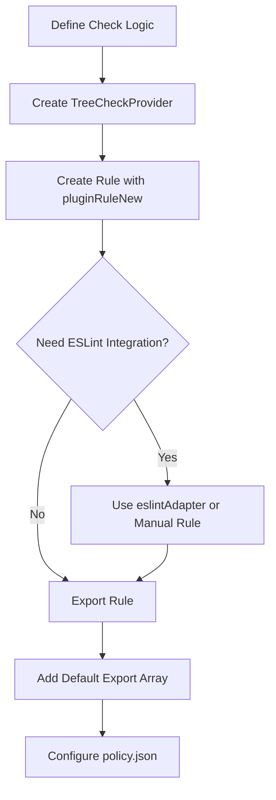

# Creating Custom Plugins

This guide shows how to create a custom codepol plugin. You'll write one check function that works with both the CLI and ESLint.

## Overview

A codepol plugin has two parts:

1. **TreeCheckProvider** - The check logic (runs via CLI with Tree-sitter)
2. **ESLint rule** - Generated automatically using the adapter

The recommended approach uses `eslintAdapter` to convert your TreeCheckProvider into an ESLint rule, so you write the check logic once.



## Quick Start

### 1. Create the Package

::: code-group

```bash [pnpm]
mkdir your-plugin
cd your-plugin
pnpm init
pnpm add -D @codepol/core @codepol/eslint-plugin typescript
```

```bash [npm]
mkdir your-plugin
cd your-plugin
npm init -y
npm install -D @codepol/core @codepol/eslint-plugin typescript
```

```bash [yarn]
mkdir your-plugin
cd your-plugin
yarn init -y
yarn add -D @codepol/core @codepol/eslint-plugin typescript
```

```bash [bun]
mkdir your-plugin
cd your-plugin
bun init
bun add -D @codepol/core @codepol/eslint-plugin typescript
```

:::

### 2. Project Structure

Organize your plugin with clear separation of concerns:

```
your-plugin/
├── src/
│   ├── index.ts              # Entry point: exports plugin rules
│   └── rules/
│       ├── noTodoCheck.ts    # TreeCheckProvider check logic
│       └── noTodoRule.ts     # Rule definition + ESLint config
├── package.json
└── tsconfig.json
```

### 3. Write the Check Logic

Create `src/rules/noTodoCheck.ts` with the pure check function:

```typescript
import type {
  PolicyRule,
  PolicyCheckContext,
  PolicyViolation,
} from '@codepol/core';

export function noTodoCheck(
  rule: PolicyRule,
  context: PolicyCheckContext
): PolicyViolation[] {
  const violations: PolicyViolation[] = [];
  const lines = context.source.split('\n');

  // Resolved args from policy.json are available in context.ruleArgs
  // const args = context.ruleArgs;

  lines.forEach((line, index) => {
    const todoIndex = line.indexOf('TODO');
    if (todoIndex !== -1) {
      violations.push({
        ruleId: rule.id || rule.ruleId,
        filePath: context.filePath,
        message: 'TODO comments are not allowed',
        line: index + 1,
        column: todoIndex + 1,
      });
    }
  });

  return violations;
}
```

### 4. Create the Rule Definition

Create `src/rules/noTodoRule.ts` with the rule and ESLint configuration:

```typescript
import type {
  CodepolPluginRule,
  LintProvider,
  EslintProviderConfig,
} from '@codepol/core';
import { pluginRuleNew, treeCheckProviderNew } from '@codepol/core';
import { eslintAdapter } from '@codepol/eslint-plugin';
import { noTodoCheck } from './noTodoCheck';

// Create the TreeCheckProvider using the factory
export const noTodoTreeCheck = treeCheckProviderNew({
  languages: ['typescript', 'tsx'],
  check: noTodoCheck,
});

// Rule ID must NOT contain '/' - codepol uses '/' for namespacing.
// Your ID will be auto-prefixed: "no-todo-comments" → "@scope/plugin/no-todo-comments"
const ruleId = 'no-todo-comments';

// Create rule plugin base for the adapter
const ruleBase = pluginRuleNew({
  id: ruleId,
  capabilities: { treeCheckProvider: noTodoTreeCheck },
});

// Generate ESLint rule from TreeCheckProvider
const eslintRule = eslintAdapter.adapt(ruleBase, {
  ruleName: 'no-todo-comments',
});

const eslintConfig: EslintProviderConfig = {
  pluginName: 'codepol',
  rules: { 'no-todo-comments': eslintRule },
  rulesConfigGet: () => ({ 'codepol/no-todo-comments': 'error' }),
};

const lintProvider: LintProvider = {
  platform: 'eslint',
  languages: ['typescript', 'tsx'],
  config: eslintConfig,
};

// Export the complete rule plugin
export const noTodoRule: CodepolPluginRule = pluginRuleNew({
  id: ruleId,
  capabilities: {
    treeCheckProvider: noTodoTreeCheck,
    lintProviders: [lintProvider],
  },
});
```

### 5. Create the Entry Point

Create `src/index.ts` as the clean entry point:

```typescript
export { noTodoRule } from './rules/noTodoRule';

// Default export is required for codepol to load the plugin
export default [noTodoRule];
```

### 6. Configure policy.json

Create `policy.json` in your project root. This file declares which plugins to load and how rules apply to your codebase.

For the complete schema reference, see [Policy Schema Reference](./policy-schema.md).

**Minimal example:**

```json
{
  "$schema": "https://raw.githubusercontent.com/fruitiecutiepie/codepol/master/policy.schema.json",
  "plugins": ["./path/to/your-plugin"],
  "rules": [
    {
      "ruleId": "your-plugin/no-todo-comments",
      "description": "Disallow TODO comments",
      "targets": [
        {
          "language": "typescript",
          "files": ["src/**/*.ts"]
        }
      ]
    }
  ]
}
```

Codepol automatically resolves the `ruleId` by combining the module name and the exported rule ID: `your-plugin/no-todo-comments`.

### 7. Test It

::: code-group

```bash [pnpm]
pnpm codepol --policy ./policy.json
```

```bash [npm]
npx codepol --policy ./policy.json
```

```bash [yarn]
yarn codepol --policy ./policy.json
```

```bash [bun]
bunx codepol --policy ./policy.json
```

:::

## Exporting Your Plugin

Plugins must use a **default export** containing an array of `CodepolPluginRule` objects. This is the only export convention codepol uses—consumers never need to specify an export name.

**Important:** All rule plugins must be created using `pluginRuleNew()`. This validates the rule ID at construction time and ensures type safety. Direct object literals won't type-check.

```typescript
// src/index.ts
import { pluginRuleNew, type CodepolPluginRule } from '@codepol/core';

// ✓ Correct - uses pluginRuleNew()
export const myRule: CodepolPluginRule = pluginRuleNew({
  id: 'my-rule',  // Must NOT contain '/'
  capabilities: { /* ... */ },
});

export const anotherRule: CodepolPluginRule = pluginRuleNew({
  id: 'another-rule',
  capabilities: { /* ... */ },
});

// Default export is required for codepol to load the plugin
export default [myRule, anotherRule];
```

::: warning Rule ID Constraint
Rule IDs must **not** contain `/`. The `/` character is reserved for namespacing—codepol automatically prefixes your ID with the module name (e.g., `my-rule` → `@your-org/plugin/my-rule`).
:::

Consumers reference your plugin by module path only:

```json
{ "module": "@your-org/codepol-plugin-foo" }
```

### Multiple Plugin Collections

For packages with multiple distinct plugin collections, use Node.js subpath exports in your `package.json`:

```json
{
  "exports": {
    ".": "./dist/index.js",
    "./security": "./dist/security.js",
    "./logging": "./dist/logging.js"
  }
}
```

Each subpath module should have its own default export:

```typescript
// src/security.ts
export default [xssRule, csrfRule];

// src/logging.ts
export default [loggerRule, auditRule];
```

Consumers reference specific collections via the subpath:

```json
{ "module": "@your-org/plugin/security" }
{ "module": "@your-org/plugin/logging" }
```

## Linter Integration

### ESLint Integration

There are two approaches to integrate your plugin with ESLint:

#### A. Using eslintAdapter (Recommended)

For simple rules without autofix, use the adapter to automatically convert your TreeCheckProvider:

```typescript
import { eslintAdapter } from '@codepol/eslint-plugin';

const eslintRule = eslintAdapter.adapt(rulePlugin, {
  ruleName: 'no-todo-comments',
  ruleUrl: 'https://your-docs/rules/no-todo-comments',
  severity: 'error', // or 'warning'
});
```

The adapter handles:
- Policy file loading and caching
- File matching against rule targets
- Converting violations to ESLint diagnostics

#### B. Manual ESLint Rule (For Autofix)

For rules that need autofix support or complex ESLint schemas, write the ESLint rule manually. See the built-in logger rule at [`packages/plugin/src/index.ts`](https://github.com/fruitiecutiepie/codepol/blob/master/packages/plugin/src/index.ts) for a complete example with autofix.

Key steps for manual rules:
1. Use `ESLintUtils.RuleCreator` from `@typescript-eslint/utils`
2. Define your schema in the rule's `meta.schema`
3. Implement the `create` function with AST visitors
4. Add `fix` or `suggest` functions for autofix support

#### Configure ESLint

Add to your `eslint.config.js`:

```javascript
import { eslintPluginCreate } from '@codepol/eslint-plugin';
import pluginRules from '@codepol/plugin';       // Built-in rules
import customRules from './your-plugin';         // Your custom rules

export default [
  {
    plugins: {
      codepol: eslintPluginCreate([...pluginRules, ...customRules]),
    },
    rules: {
      'codepol/require-logger-enter-exit': 'error',
      'codepol/no-todo-comments': 'error',
    },
  },
];
```

### esbuild Integration

Enforce policies at build time with the esbuild plugin:

```typescript
import { build } from 'esbuild';
import { esbuildPluginCreate } from '@codepol/esbuild-plugin';

await build({
  entryPoints: ['src/index.ts'],
  bundle: true,
  outfile: 'dist/bundle.js',
  plugins: [
    esbuildPluginCreate({
      policyPath: './policy.json',
      fix: false, // Set to true to auto-fix violations
    }),
  ],
});
```

The esbuild plugin runs both ESLint checks and Tree-sitter analysis, failing the build if violations are found.

### Other Build Tools

Codepol's architecture supports future adapters via the `LintProvider` interface. The same pattern can be implemented for:

- **Biome** - Fast Rust-based linter
- **Ruff** - Python linter (for Python codepol plugins)
- **Vite** - Via plugin wrapping esbuild

To create an adapter for another platform, implement the `TreeCheckLintAdapter` interface from `@codepol/core`.

## Advanced Topics

### Accessing Rule Arguments

Rule-specific arguments from `policy.json` are passed via `context.ruleArgs`:

```typescript
function myCheck(rule: PolicyRule, context: PolicyCheckContext): PolicyViolation[] {
  const args = context.ruleArgs as { threshold?: number };
  const threshold = args?.threshold ?? 10;
  // ... use threshold in your check
}
```

### Tree-sitter for AST Analysis

For structural code analysis, use Tree-sitter instead of string matching:

```typescript
import { parserGetForFile, isErr } from '@codepol/core';

function astCheck(rule: PolicyRule, context: PolicyCheckContext): PolicyViolation[] {
  const parserResult = parserGetForFile(context.filePath);
  if (isErr(parserResult)) {
    throw new Error(parserResult.Err);  // treeCheckProviderNew catches and wraps
  }
  
  const parser = parserResult.Ok;
  const tree = parser.parse(context.source);
  
  // Traverse tree.rootNode to analyze AST
  // ...
}
```

See [`packages/plugin/src/policyPluginLogger.ts`](https://github.com/fruitiecutiepie/codepol/blob/master/packages/plugin/src/policyPluginLogger.ts) for a complete Tree-sitter example.
