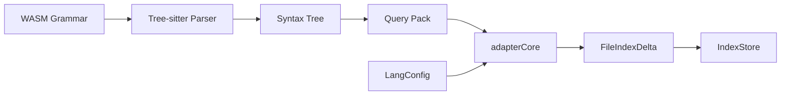

# Creating Language Adapters

This guide walks through adding a new language to the codepol semantic index. A language adapter tells the index how to extract symbols, scopes, references, and relations from source files using [tree-sitter](https://tree-sitter.github.io/tree-sitter/).

## Prerequisites

Before you start, you need:

1. **A tree-sitter WASM grammar** for your language. Most popular languages have community-maintained grammars. You can build a WASM binary from any tree-sitter grammar using `tree-sitter build --wasm`.
2. **Familiarity with the tree-sitter query syntax** -- S-expression patterns with captures. See the [tree-sitter query documentation](https://tree-sitter.github.io/tree-sitter/using-parsers#pattern-matching-with-queries).

## Architecture Overview



Each adapter consists of:

| Component | What it does |
|-----------|-------------|
| **Query pack** | Tree-sitter S-expression patterns that capture scopes, symbols, refs, calls, imports, exports, and type relations |
| **LangConfig** | Ties queries together with kind mappings, capture names, and reference filters |
| **Registration** | `langAdd()` registers the grammar; `adapterRegister()` registers the adapter factory |

## Step-by-Step Guide

We will build a hypothetical Rust adapter as an example, referencing the real TypeScript and Python adapters.

### 1. Set Up the File Structure

Create a directory under the adapters tree:

```
packages/core/src/adapters/treeSitter/languages/rust/
  config.ts           # LangConfig factory
  queries/
    scopes.ts         # Scope boundary patterns
    symbols.ts        # Symbol declaration patterns
    refs.ts           # Reference patterns
    calls.ts          # Call expression patterns (optional)
    imports.ts        # Import patterns (optional)
    exports.ts        # Export patterns (optional)
```

### 2. Write the Query Pack

Query packs are tree-sitter S-expression patterns exported as string constants. The adapter core runs these against the parse tree and uses the capture names to extract semantic information.

#### Required Queries

**Scopes** (`queries/scopes.ts`) -- capture nodes that define lexical boundaries:

```typescript
export const SCOPES_QUERY = `
; Function scopes
(function_item) @scope

; Impl blocks
(impl_item) @scope

; Block expressions
(block) @scope

; Trait definitions
(trait_item) @scope

; Module definitions
(mod_item) @scope
`;
```

The capture name must be `@scope` (matching your `captures.scopeNode`).

**Symbols** (`queries/symbols.ts`) -- capture declarations with their names:

```typescript
export const SYMBOLS_QUERY = `
; Functions
(function_item
  name: (identifier) @name) @decl.function

; Structs
(struct_item
  name: (type_identifier) @name) @decl.class

; Enums
(enum_item
  name: (type_identifier) @name) @decl.enum

; Traits
(trait_item
  name: (type_identifier) @name) @decl.interface

; Impl methods
(function_item
  name: (identifier) @name) @decl.method

; Constants
(const_item
  name: (identifier) @name) @decl.const

; Let bindings
(let_declaration
  pattern: (identifier) @name) @decl.variable
`;
```

Each pattern uses two captures:
- `@name` -- the identifier node (matched to `captures.symbolName`)
- `@decl.{suffix}` -- the declaration node (suffix is looked up in `symbolKinds.byCaptureSuffix`)

**References** (`queries/refs.ts`) -- capture identifier usages:

```typescript
export const REFS_QUERY = `
; Identifier references
(identifier) @ref.id

; Type references
(type_identifier) @ref.type_id
`;
```

References use `@ref.{suffix}` captures (matched to `captures.refPrefix`). The `refFilter` function later removes declaration sites and other non-reference identifiers.

#### Optional Queries

**Calls** (`queries/calls.ts`) -- for call graph construction:

```typescript
export const CALLS_QUERY = `
; Direct call: foo()
(call_expression
  function: (identifier) @callee.id) @callee.call

; Method call: obj.method()
(call_expression
  function: (field_expression
    field: (field_identifier) @callee.prop
    value: (_) @callee.obj)) @callee.call
`;
```

**Imports** (`queries/imports.ts`) -- for cross-file resolution:

```typescript
export const IMPORTS_QUERY = `
; use statements
(use_declaration
  argument: (scoped_identifier) @import.source) @import.decl
`;
```

**Exports** (`queries/exports.ts`) -- for cross-file resolution:

```typescript
export const EXPORTS_QUERY = `
; pub items
(function_item
  (visibility_modifier) @export.vis
  name: (identifier) @export.decl_name) @export.decl
`;
```

### 3. Create the Language Config

The config factory ties everything together:

```typescript
// languages/rust/config.ts
import type { Language } from 'web-tree-sitter';
import type { LangConfig, RefFilterContext } from '../../adapterTypes';
import { CAPTURE_NAMES_DEFAULT } from '../../adapterTypes';

import { SCOPES_QUERY } from './queries/scopes';
import { SYMBOLS_QUERY } from './queries/symbols';
import { REFS_QUERY } from './queries/refs';
import { CALLS_QUERY } from './queries/calls';
import { IMPORTS_QUERY } from './queries/imports';
import { EXPORTS_QUERY } from './queries/exports';

function rustRefFilter(ctx: RefFilterContext): boolean {
  // Skip function definition names (they are declarations, not references)
  if (ctx.parentType === 'function_item') return false;
  if (ctx.parentType === 'struct_item') return false;
  if (ctx.parentType === 'enum_item') return false;

  // Skip field access property names
  if (ctx.nodeType === 'field_identifier') return false;

  return true;
}

export function rustConfigCreate(language: Language): LangConfig {
  return {
    languageId: 'rust',
    language,
    queries: {
      scopes: SCOPES_QUERY,
      symbols: SYMBOLS_QUERY,
      refs: REFS_QUERY,
      calls: CALLS_QUERY,
      imports: IMPORTS_QUERY,
      exports: EXPORTS_QUERY,
      // typeRelations: optional, omit if not needed
    },
    captures: CAPTURE_NAMES_DEFAULT,
    symbolKinds: {
      byCaptureSuffix: {
        'function': 'function',
        'method': 'method',
        'class': 'class',       // struct -> class
        'interface': 'interface', // trait -> interface
        'enum': 'enum',
        'const': 'const',
        'variable': 'variable',
      },
      default: 'variable',
    },
    scopeKinds: {
      byNodeType: {
        'function_item': 'function',
        'impl_item': 'class',
        'trait_item': 'type',
        'mod_item': 'module',
        'block': 'block',
      },
      default: 'block',
    },
    refFilter: rustRefFilter,
  };
}
```

### 4. Register the Adapter

Registration happens in two places:

**Parser registration** (`langAdd`) -- tells the parser about the WASM grammar and file extensions:

```typescript
import { langAdd } from '@codepol/core';

langAdd({
  langId: 'rust',
  fileExtensions: ['.rs'],
  // wasmPath: optional, defaults to wasm/tree-sitter-rust.wasm
});
```

**Adapter registration** (`adapterRegister`) -- tells the index builder how to create an adapter for this language:

```typescript
import { adapterRegister } from '../index/indexBuilder';
import { indexAdapterCreate } from '../adapters/treeSitter/adapterCore';
import { rustConfigCreate } from '../adapters/treeSitter/languages/rust/config';

adapterRegister('rust', (lang) => indexAdapterCreate(rustConfigCreate(lang)));
```

For built-in adapters, add this alongside the existing registrations in `indexBuilder.ts`:

```typescript
// Register built-in adapters
adapterRegister('typescript', (lang) => indexAdapterCreate(typescriptConfigCreate(lang)));
adapterRegister('tsx', (lang) => indexAdapterCreate(typescriptConfigCreate(lang)));
adapterRegister('python', (lang) => indexAdapterCreate(pythonConfigCreate(lang)));
adapterRegister('rust', (lang) => indexAdapterCreate(rustConfigCreate(lang))); // new
```

### 5. Place the WASM Grammar

Put the compiled WASM file at `packages/core/wasm/tree-sitter-rust.wasm`. If your WASM is at a custom path, specify `wasmPath` in `langAdd`.

### 6. Initialize the Parser

Before building an index, ensure the parser is initialized:

```typescript
import { langAdd, parserInit, projectIndexBuild } from '@codepol/core';

// Register language
langAdd({ langId: 'rust', fileExtensions: ['.rs'] });

// Load WASM grammars (async, call once at startup)
await parserInit();

// Build index
const result = await projectIndexBuild({
  files: ['/project/src/main.rs', '/project/src/lib.rs'],
  dir: '/project',
});
```

## LangConfig Reference

| Field | Type | Required | Description |
|-------|------|----------|-------------|
| `languageId` | `string` | Yes | Language identifier (e.g., `'rust'`) |
| `language` | `Language` | Yes | Tree-sitter Language object (from WASM load) |
| `queries` | `QueryPack` | Yes | Tree-sitter query patterns |
| `captures` | `CaptureNames` | Yes | Capture name conventions (use `CAPTURE_NAMES_DEFAULT`) |
| `symbolKinds` | `SymbolKindMapping` | Yes | Maps capture suffixes to `SymbolKind` |
| `scopeKinds` | `ScopeKindMapping` | Yes | Maps node types to `ScopeKind` |
| `refFilter` | `(ctx: RefFilterContext) => boolean` | No | Post-filter for references |

## QueryPack Reference

| Query | Required | Captures | Purpose |
|-------|----------|----------|---------|
| `scopes` | Yes | `@scope` | Scope boundaries |
| `symbols` | Yes | `@name`, `@decl.{suffix}` | Symbol declarations |
| `refs` | Yes | `@ref.{suffix}` | Identifier references |
| `calls` | No | `@callee.id`, `@callee.obj`, `@callee.prop`, `@callee.call` | Call expressions for call graph |
| `imports` | No | `@import.source`, `@import.name`, `@import.default_name`, etc. | Import statements for cross-file resolution |
| `exports` | No | `@export.decl_name`, `@export.decl`, etc. | Export statements for cross-file resolution |
| `typeRelations` | No | `@typerel.child_name`, `@typerel.extends_target`, `@typerel.implements_target` | Extends/implements hierarchy |

## Writing a Reference Filter

The `refFilter` function receives a `RefFilterContext` and returns `true` to keep the reference or `false` to discard it. This is critical for accuracy -- without filtering, every identifier (including declaration sites) would be counted as a reference.

```typescript
type RefFilterContext = {
  name: string;            // Identifier text
  nodeType: string;        // Tree-sitter node type
  parentType: string;      // Parent node type
  grandparentType?: string;
  byteRange: ByteRange;
  declarationRanges: Set<string>;  // Known declaration ranges
};
```

Common patterns to filter out:

| Pattern | Why | Example |
|---------|-----|---------|
| Definition names | Not references | `function foo()` -- `foo` is a declaration |
| Parameter names | Already captured as symbols | `function f(x: number)` |
| Property access members | Object ref captured separately | `obj.prop` -- `prop` is not a standalone reference |
| Import/export specifiers | Handled by dedicated queries | `import { foo }` |
| Labels | Not symbol references | `break myLabel` |

## Existing Adapters as Reference

### TypeScript Adapter

Located at `packages/core/src/adapters/treeSitter/languages/typescript/`. This is the most complete adapter with all seven query packs including `typeRelations`.

Key features:
- Handles `class`, `abstract_class`, `interface`, `type`, `enum`, `enumMember`, `namespace`, `function`, `generator`, `method`, `constructor`, `variable`, `const`, `parameter`, `import_binding`, `field`
- Full import/export coverage: ESM, CommonJS `require()`, dynamic `import()`
- Type relations: `extends` and `implements` for classes and interfaces

### Python Adapter

Located at `packages/core/src/adapters/treeSitter/languages/python/`. A simpler adapter with six query packs (no `typeRelations`).

Key features:
- Handles `class`, `function`, `method`, `parameter`, `variable`, `import_binding`
- Imports via `import` and `from ... import` statements
- Exports via `__all__` and module-level definitions

## Testing Your Adapter

Write integration tests that build a `ProjectIndex` from test fixtures:

```typescript
import { describe, it, expect, beforeAll } from 'vitest';
import { langAdd, parserInit, projectIndexBuild } from '@codepol/core';
import fs from 'node:fs';
import path from 'node:path';
import os from 'node:os';

describe('Rust adapter', () => {
  beforeAll(async () => {
    langAdd({ langId: 'rust', fileExtensions: ['.rs'] });
    await parserInit();
  });

  it('extracts function symbols', async () => {
    // Create a temp file with known content
    const dir = fs.mkdtempSync(path.join(os.tmpdir(), 'rust-test-'));
    const file = path.join(dir, 'main.rs');
    fs.writeFileSync(file, `
      fn greet(name: &str) -> String {
        format!("Hello, {name}")
      }

      pub fn main() {
        let msg = greet("world");
        println!("{}", msg);
      }
    `);

    const result = await projectIndexBuild({ files: [file], dir });
    const index = result.index;

    // Check symbols were extracted
    const symbols = index.symbolsInFileGet(file);
    const greet = symbols.find(s => s.name === 'greet');
    expect(greet).toBeDefined();
    expect(greet!.kind).toBe('function');

    const main = symbols.find(s => s.name === 'main');
    expect(main).toBeDefined();
  });

  it('resolves cross-file imports', async () => {
    const dir = fs.mkdtempSync(path.join(os.tmpdir(), 'rust-xfile-'));

    // lib.rs exports a function
    fs.writeFileSync(path.join(dir, 'lib.rs'), `
      pub fn helper() -> i32 { 42 }
    `);

    // main.rs imports it
    fs.writeFileSync(path.join(dir, 'main.rs'), `
      use crate::lib::helper;
      fn main() { helper(); }
    `);

    const files = [path.join(dir, 'lib.rs'), path.join(dir, 'main.rs')];
    const result = await projectIndexBuild({ files, dir });

    // Verify import bindings exist
    const bindings = result.index.importBindingsGet(path.join(dir, 'main.rs'));
    expect(bindings.length).toBeGreaterThan(0);
  });
});
```

## Related Documentation

- [Semantic Index Architecture](./semantic-index) -- overall architecture and data model
- [ProjectIndex API Reference](./project-index-api) -- query methods available to plugins
- [Cross-File Analysis Rules](./cross-file-analysis) -- writing rules that use the index
