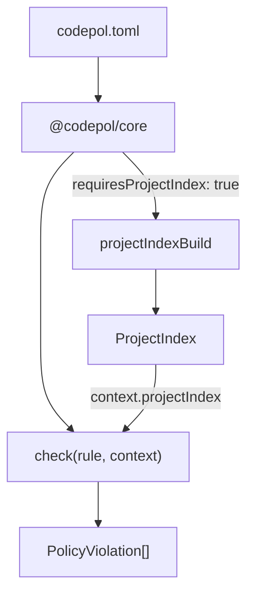

# Cross-File Analysis Rules

This guide shows how to write codepol plugin rules that use the `ProjectIndex` for cross-file analysis. If you haven't read the [Creating Custom Plugins](./creating-custom-plugins) guide yet, start there for the basics of rule authoring.

## The Pattern

Cross-file rules follow the same plugin structure as single-file rules, with two additions:

1. Set `requiresProjectIndex: true` in the rule capabilities
2. Access `context.projectIndex` in the check function



When at least one loaded plugin declares `requiresProjectIndex: true`, the core builds the project-wide semantic index before running checks. The index is then passed to every check function via `context.projectIndex`.

## Example 1: Unused Exports Detector

This is a real rule from `@codepol/plugin`. It detects exported symbols that no other file imports.

### Check Function

```typescript
import type {
  PolicyRule,
  PolicyCheckContext,
  PolicyViolation,
  ProjectIndex,
} from '@codepol/core';

export function unusedExportsCheck(
  rule: PolicyRule,
  context: PolicyCheckContext,
): PolicyViolation[] {
  const { projectIndex, source, filePath } = context;

  // Guard: skip gracefully if index is not available
  if (!projectIndex) {
    return [];
  }

  const violations: PolicyViolation[] = [];

  // Step 1: Get all exports from the current file
  const fileExports = projectIndex.fileExportsGet(filePath);

  // Step 2: Find which export names are imported by other files
  const importedNames = getImportedExportNames(projectIndex, filePath);

  // Step 3: Report exports that nobody imports
  for (const exp of fileExports) {
    if (exp.exportedName === '*') continue; // skip star re-exports

    if (!importedNames.has(exp.exportedName)) {
      const symbol = exp.symbolId
        ? projectIndex.symbolGet(exp.symbolId)
        : undefined;

      violations.push({
        ruleId: rule.id || rule.ruleId,
        filePath,
        message: `Exported ${symbol?.kind ?? 'export'} '${exp.exportedName}' is not imported by any other file`,
        line: byteOffsetToLine(source, exp.byteRange.start),
        column: 1,
      });
    }
  }

  return violations;
}
```

### Helper: Collect Imported Names

The key cross-file logic iterates over all files' import bindings to find which names are imported from the target file:

```typescript
function getImportedExportNames(
  projectIndex: ProjectIndex,
  targetFile: string,
): Set<string> {
  const importedNames = new Set<string>();

  // Get all unique files from the index
  const allSymbols = projectIndex.symbolsGet();
  const files = new Set(allSymbols.map(s => s.file));

  for (const file of files) {
    if (file === targetFile) continue;

    const bindings = projectIndex.importBindingsGet(file);

    for (const binding of bindings) {
      // Use resolvedModulePath when available (from cross-file resolution)
      if (binding.resolvedModulePath === targetFile) {
        importedNames.add(binding.importedName);
      }
    }
  }

  return importedNames;
}
```

### Rule Definition

```typescript
import { pluginRuleNew, treeCheckProviderNew } from '@codepol/core';
import { unusedExportsCheck } from './unusedExportsCheck';

const unusedExportsTreeCheck = treeCheckProviderNew({
  languages: ['typescript', 'tsx', 'javascript', 'jsx'],
  check: unusedExportsCheck,
});

export const unusedExportsRule = pluginRuleNew({
  id: 'no-unused-exports',
  capabilities: {
    treeCheckProvider: unusedExportsTreeCheck,
    requiresProjectIndex: true,  // triggers index building
  },
});
```

### Config Usage

```toml
[[plugins]]
id = "@codepol/plugin"
source = { kind = "builtin" }

[targets.src]
language = "typescript"
files = ["src/**/*.ts"]
exclude = ["**/*.spec.ts"]

[[rules]]
ruleId = "@codepol/plugin/no-unused-exports"
severity = "warn"
targets = ["src"]

[rules.args]
ignoreEntryPoints = true
```

## Architecture Check Capability

For project-wide rules that operate on the module graph (cycles, layer
boundaries, reachability), use the `architectureCheckProvider`
capability instead of `treeCheckProvider`. The runner invokes an
architecture check **once per matched rule** with the fully-built
`ProjectIndex` and `ModuleGraph`, rather than once per file.

Architecture providers always require the project index, so authors do
not need to set `requiresProjectIndex: true` separately.

```typescript
import {
  pluginRuleNew,
  type ArchitectureCheckContext,
  type PolicyRule,
  type PolicyViolation,
} from '@codepol/core';

function noOrphanCheck(
  rule: PolicyRule,
  context: ArchitectureCheckContext,
): PolicyViolation[] {
  const orphans = context.moduleGraph
    .moduleGraphEntryPointsGet()
    .filter((file) => file.includes('/internal/'));

  return orphans.map((file) => ({
    ruleId: rule.id || rule.ruleId,
    filePath: file,
    message: 'Internal module has no importers — possibly dead.',
    line: 1,
    column: 1,
  }));
}

export const noOrphanRule = pluginRuleNew({
  id: 'no-orphan-internal',
  capabilities: {
    architectureCheckProvider: {
      check: noOrphanCheck,
    },
  },
});
```

### Built-in Architecture Rules

`@codepol/plugin` ships three architecture rules out of the box. They
read the same `ProjectIndex` / `ModuleGraph` exposed to user-land rules,
so the patterns above generalise.

#### `no-cycles`

Reports one violation per circular import cycle. Anchors the violation
on the alphabetically-first cycle member; remaining members appear in
`relatedLocations`.

```toml
[[rules]]
ruleId = "@codepol/plugin/no-cycles"
targets = ["src"]

[rules.args]
maxCycles = 50   # default cap on emitted violations
minSize = 2      # ignore self-imports (length 1) by default
```

#### `no-layer-violation`

Classifies every indexed file into a named layer based on glob
membership and rejects edges that violate `allows` / `denies`. Files
without a matching layer are ignored. When two layer globs match the
same file with equal specificity, the rule emits an "ambiguous layer"
violation so the policy author can disambiguate.

```toml
[[rules]]
ruleId = "@codepol/plugin/no-layer-violation"
targets = ["src"]

[rules.args.layers.domain]
files = ["src/domain/**/*.ts"]
allows = ["shared"]

[rules.args.layers.infra]
files = ["src/infra/**/*.ts"]
allows = ["domain", "shared"]

[rules.args.layers.ui]
files = ["src/ui/**/*.ts"]
allows = ["domain", "shared"]

[rules.args.layers.shared]
files = ["src/shared/**/*.ts"]
```

A layer with no `allows` and no `denies` is a leaf — other layers may or
may not be allowed to depend on it depending on their own `allows`. A
layer with `allows = []` may only import from itself.

#### `dead-module`

Flags files that no entry point transitively imports. Pass entry points
explicitly via `args.entries` (glob patterns relative to the policy
`cwd`); when omitted, the natural entry points reported by the module
graph (files with no importers) are used.

```toml
[[rules]]
ruleId = "@codepol/plugin/dead-module"
targets = ["src"]

[rules.args]
entries = ["src/index.ts", "src/cli/**/*.ts"]
ignore = ["src/**/__fixtures__/**/*.ts"]
```

When an explicit `entries` glob matches no files, the rule emits zero
violations rather than reporting every file as dead — that pattern
catches typos in entry-point globs without flooding the report.

#### `max-cycle-size`

Caps the size of any individual circular import cycle. Useful as a
companion to `no-cycles` while a codebase still has legitimate legacy
cycles: keeps the bleeding contained even if a full cycle-free
codebase is still aspirational.

```toml
[[rules]]
ruleId = "@codepol/plugin/max-cycle-size"
targets = ["src"]

[rules.args]
max = 4                               # cycles of size > 4 are reported
ignore = ["src/legacy/**/*.ts"]       # files dropped before measuring
```

The `ignore` glob is applied to cycle members before measurement, so
a cycle that touches an ignored barrel file still counts only the
remaining members against `max`.

#### `no-cross-package-internal-import`

In a monorepo with multiple workspace packages (pnpm / npm / yarn
workspaces are auto-detected), this rule forbids cross-package imports
that bypass the importee package's declared public entry point —
typically `src/index.ts` derived from `package.json` `exports` /
`main`.

```toml
[[rules]]
ruleId = "@codepol/plugin/no-cross-package-internal-import"
targets = ["src"]

[rules.args]
allow = ["packages/*/src/cli/index.ts"]   # additional public surfaces
ignorePackages = ["@scope/legacy"]        # never police imports into these
```

Files outside any workspace package are ignored — the rule has no
opinion on root-level scripts.

#### `max-fan-in` and `max-fan-out`

Coupling budgets per file. Use `max-fan-in` to catch "god module"
growth (too many files depend on this one), and `max-fan-out` to catch
files that pull in too many collaborators.

```toml
[[rules]]
ruleId = "@codepol/plugin/max-fan-in"
targets = ["src"]

[rules.args]
max = 10
files = ["src/lib/**/*.ts"]   # only enforce on shared library code
ignore = ["src/lib/types.ts"]

[[rules]]
ruleId = "@codepol/plugin/max-fan-out"
targets = ["src"]

[rules.args]
max = 15
files = ["src/**/*.ts"]
```

Each violation lists the top-N counterparts via `relatedLocations`
(default 5; configurable through `topRelated`) so reviewers can see
exactly who is on the other end without opening the file.

#### `entry-point-allowlist`

Forces every entry point — every file with zero importers — to be
deliberately declared. Catches forgotten experiment files and
post-refactor orphans before they accumulate.

```toml
[[rules]]
ruleId = "@codepol/plugin/entry-point-allowlist"
targets = ["src"]

[rules.args]
entries = ["src/index.ts", "src/cli/**/*.ts", "scripts/**/*.ts"]
ignore = ["**/*.spec.ts", "**/__fixtures__/**"]
```

Set `entries = []` to enforce "no orphan files at all" — every file
must be reachable through an import chain.

## Example 2: Circular Dependency Detector

A from-scratch rule that uses the module graph to detect circular
imports. The built-in `@codepol/plugin/no-cycles` rule (see above) is
the production-ready version of this pattern; this example remains as a
tutorial showing the same logic re-implemented through `treeCheckProvider`.

### Check Function

```typescript
import type {
  PolicyRule,
  PolicyCheckContext,
  PolicyViolation,
} from '@codepol/core';

export function circularDepsCheck(
  rule: PolicyRule,
  context: PolicyCheckContext,
): PolicyViolation[] {
  const { projectIndex, filePath } = context;
  if (!projectIndex) return [];

  const violations: PolicyViolation[] = [];

  // Get all cycles in the module graph
  const cycles = projectIndex.moduleCyclesGet();

  // Only report if the current file participates in a cycle
  for (const cycle of cycles) {
    if (!cycle.includes(filePath)) continue;

    // Only report once per cycle (from the first file alphabetically)
    const sorted = [...cycle].sort();
    if (sorted[0] !== filePath) continue;

    const cycleStr = cycle
      .map(f => f.split('/').pop())
      .join(' -> ');

    violations.push({
      ruleId: rule.id || rule.ruleId,
      filePath,
      message: `Circular dependency: ${cycleStr}`,
      line: 1,
      column: 1,
    });
  }

  return violations;
}
```

### Rule Definition

```typescript
import { pluginRuleNew, treeCheckProviderNew } from '@codepol/core';
import { circularDepsCheck } from './circularDepsCheck';

export const circularDepsRule = pluginRuleNew({
  id: 'no-circular-deps',
  capabilities: {
    treeCheckProvider: treeCheckProviderNew({
      languages: ['typescript', 'tsx'],
      check: circularDepsCheck,
    }),
    requiresProjectIndex: true,
  },
});

export default [circularDepsRule];
```

## Example 3: Deep Inheritance Detector

A rule that uses type relations to flag classes with deep inheritance chains.

### Check Function

```typescript
import type {
  PolicyRule,
  PolicyCheckContext,
  PolicyViolation,
  ProjectIndex,
  SymbolId,
} from '@codepol/core';

const MAX_DEPTH = 3;

function inheritanceDepth(
  projectIndex: ProjectIndex,
  symbolId: SymbolId,
  visited: Set<SymbolId>,
): number {
  if (visited.has(symbolId)) return 0; // cycle guard
  visited.add(symbolId);

  const rels = projectIndex.typeRelationsGet(symbolId);
  const extendsRels = rels.filter(r => r.relationKind === 'extends');

  if (extendsRels.length === 0) return 0;

  let maxParentDepth = 0;
  for (const rel of extendsRels) {
    if (rel.resolvedTargetId) {
      const parentDepth = inheritanceDepth(
        projectIndex,
        rel.resolvedTargetId,
        visited,
      );
      maxParentDepth = Math.max(maxParentDepth, parentDepth);
    }
  }

  return 1 + maxParentDepth;
}

export function deepInheritanceCheck(
  rule: PolicyRule,
  context: PolicyCheckContext,
): PolicyViolation[] {
  const { projectIndex, filePath, source } = context;
  if (!projectIndex) return [];

  const violations: PolicyViolation[] = [];
  const args = (context.ruleArgs as { maxDepth?: number }) ?? {};
  const maxDepth = args.maxDepth ?? MAX_DEPTH;

  // Check all classes in this file
  const classes = projectIndex.symbolsGet({ file: filePath, kind: 'class' });

  for (const cls of classes) {
    const depth = inheritanceDepth(projectIndex, cls.id, new Set());

    if (depth > maxDepth) {
      violations.push({
        ruleId: rule.id || rule.ruleId,
        filePath,
        message: `Class '${cls.name}' has inheritance depth ${depth} (max: ${maxDepth})`,
        line: byteOffsetToLine(source, cls.byteRange.start),
        column: 1,
      });
    }
  }

  return violations;
}

function byteOffsetToLine(source: string, offset: number): number {
  return source.slice(0, Math.min(offset, source.length)).split('\n').length;
}
```

## Example 4: Catch Accidental Structural Implementers

A rule that flags classes which satisfy an interface by shape but do
not declare an `implements` clause. Useful for codebases where the
type-hierarchy graph treats accidental matches as load-bearing
participants — a future signature change to the interface then
ripples in ways the class author did not consent to.

This rule lives in the codepol bundle as `no-undeclared-implementer`
(see [`packages/plugin/src/noUndeclaredImplementerCheck.ts`](../packages/plugin/src/noUndeclaredImplementerCheck.ts)).
The example below is a slightly trimmed copy meant to illustrate the
pattern — `subTypesGet` with `{ confidence: 'all' }` opts in to the
Phase 9.4 structural-shape relations.

> **Note.** Default `subTypesGet(id)` does NOT return structural-shape
> relations; this rule opts in by passing `{ confidence: 'all' }`.
> See the "Type-hierarchy fidelity tiers (Phase 9.4 / 9.5)" section
> below for the full picture.

### Args

```typescript
export type NoUndeclaredImplementerArgs = {
  /** Glob patterns matched against interface symbol names. */
  interfaces?: string[];
  /** Glob patterns (relative to cwd) for implementer files to exempt. */
  ignore?: string[];
  /** Glob patterns matched against implementer class names (e.g. `*Mock`). */
  ignoreImplementers?: string[];
};
```

### Check Function

```typescript
import type {
  ArchitectureCheckContext,
  ArchitectureCheckFn,
  PolicyRule,
  PolicyViolation,
} from '@codepol/core';

export const noUndeclaredImplementerCheck: ArchitectureCheckFn = (
  rule: PolicyRule,
  context: ArchitectureCheckContext,
): PolicyViolation[] => {
  const ruleId = rule.id || rule.ruleId;
  const violations: PolicyViolation[] = [];

  for (const iface of context.projectIndex.symbolsGet({ kind: 'interface' })) {
    // Phase 9.4 / Gap 3 — `confidence: 'all'` returns declared edges
    // PLUS structural-shape edges (from the cross-file member-shape
    // comparison). Default `subTypesGet(id)` returns only declared
    // edges and remains byte-identical to the pre-Phase-9.4 result.
    const subtypes = context.projectIndex.subTypesGet(iface.id, {
      confidence: 'all',
    });

    for (const relation of subtypes) {
      // Declared `implements` is fine — we only flag accidental
      // satisfaction.
      if (relation.confidence !== 'structural-shape') continue;

      const implementer = context.projectIndex.symbolGet(relation.symbolId);
      if (!implementer) continue;

      violations.push({
        ruleId,
        filePath: implementer.file,
        message:
          `Class \`${implementer.name}\` satisfies interface ` +
          `\`${iface.name}\` by shape only. Add \`implements ${iface.name}\` ` +
          `or rename a member to break the accidental match.`,
        line: 1,
        column: 1,
      });
    }
  }

  return violations;
};
```

### Rule Definition

```typescript
import { pluginRuleNew, type CodepolPluginRule } from '@codepol/core';
import { noUndeclaredImplementerCheck } from './noUndeclaredImplementerCheck';

export const noUndeclaredImplementerRule: CodepolPluginRule = pluginRuleNew({
  id: 'no-undeclared-implementer',
  capabilities: {
    architectureCheckProvider: { check: noUndeclaredImplementerCheck },
  },
});
```

### Config Usage

```toml
[[rules]]
ruleId = "@codepol/plugin/no-undeclared-implementer"
targets = ["src"]

  [rules.args]
  # Only enforce on the public-contract interface family.
  interfaces = ["I*", "*Contract", "*Port"]
  # Test stubs are intentional shape matches.
  ignoreImplementers = ["*Mock", "*Stub", "Test*"]
```

## ProjectIndex Methods for Rule Authors

Quick reference for the most useful methods when writing cross-file rules. See the [full API reference](./project-index-api) for complete details.

| Category | Method | Returns | Use Case |
|----------|--------|---------|----------|
| **Symbols** | `symbolsGet(filter?)` | `SymbolRecord[]` | Find all symbols matching criteria |
| | `symbolGet(id)` | `SymbolRecord?` | Look up a symbol by ID |
| | `symbolsInFileGet(file)` | `SymbolRecord[]` | Get all symbols in a file |
| **Imports** | `importBindingsGet(file)` | `ImportBindingRelation[]` | Get import bindings for cross-file matching |
| | `importResolve(from, spec, name)` | `SymbolId?` | Resolve an import to its source symbol |
| **Exports** | `fileExportsGet(file)` | `ExportsRelation[]` | Get all exports from a file |
| | `exportedSymbolsGet(filter?)` | `SymbolRecord[]` | Get symbols with Exported flag |
| **Module graph** | `moduleImportersGet(file)` | `string[]` | Files that import a given file |
| | `moduleImporteesGet(file)` | `string[]` | Files imported by a given file |
| | `moduleCyclesGet()` | `string[][]` | All circular dependency cycles |
| | `moduleEntryPointsGet()` | `string[]` | Files with no importers |
| **Type relations** | `typeRelationsGet(symbolId)` | `TypeRelation[]` | What a symbol extends/implements |
| | `subTypesGet(symbolId)` | `TypeRelation[]` | What extends/implements a symbol |
| **Call graph** | `callersGet(symbolId)` | `SymbolId[]` | Symbols that call this symbol |
| | `calleesGet(symbolId)` | `SymbolId[]` | Symbols called by this function |
| **Symbol flow** | `symbolFlowsForSymbolGet(id)` | `SymbolFlowRelation[]` | Sites where a function flows as a value (e.g. passed as a callback) |
| | `symbolFlowsForReceiverGet(id)` | `SymbolFlowRelation[]` | Sites whose receiving call resolves to this symbol |
| **Control flow** | `cyclomaticComplexityGet(id)` | `number?` | Cyclomatic complexity of a function |

### Call-graph fidelity tiers (Phase 9.2)

The workspace surface (`queryCallGraph`) classifies each edge along two
orthogonal axes:

| Axis | Values | Default (absent) |
| ---- | ------ | ---------------- |
| `callGraphConfidence` | `'structural'` (from the index) · `'type-aware'` (from a registered language-server binding) | `'structural'` |
| `callGraphKind` | `'direct'` · `'dynamic-dispatch'` · `'higher-order'` | `'direct'` |

Hosts (the LSP server, an editor extension, a CLI binding) opt in to
type-aware answers by registering a `TypeAwareCallGraphSource` with the
`WorkspaceServiceEngine`. When no source is registered the result is
byte-identical to before — the merge is purely additive. The merge
itself is conservative: a structural edge missing from the type-aware
source is *preserved as `'structural'`* rather than dropped, because
language servers can lag, fail to index a file, or return partial
results, and silently dropping structural edges to a transient
type-aware response would be a correctness regression. Higher-order
data flow (functions passed as arguments) is exposed *separately* via
`querySymbolFlow` so the structural call graph stays honest about what
the source code actually expresses.

### Type-hierarchy fidelity tiers (Phase 9.4 / 9.5)

The workspace surface (`queryTypeHierarchy`) classifies each edge by
its source. Three tiers are defined and ordered from least to most
authoritative:

| `typeRelationConfidence` | Where the edge came from |
| ------------------------ | ------------------------ |
| `'declared'` *(default)* | A source-level `extends` / `implements` clause, resolved via the cross-file pass. |
| `'structural-shape'`     | The Phase 9.4 cross-file member-shape comparison: a class whose public members satisfy an interface's required (non-optional) members. Always emitted as `relationKind: 'implements'`. Opt in with `queryTypeHierarchy({ includeStructural: true })`. |
| `'type-aware'`           | A registered `TypeAwareTypeHierarchySource` (typically a host-supplied binding around a language server) confirmed or contributed the edge. Authoritative — overrides shape matches on overlap. |

The `minConfidence` filter on `queryTypeHierarchy` drops edges below
the requested tier. Default is `'declared'`, which keeps every tier
present in the result. Pass `'type-aware'` to verify a language-server
binding actually contributed edges (typically combined with
`requireTypeAware: true`, which raises a structured
`{ code: 'type-aware-source-missing', languageId }` error when no
source is registered for the seed symbol's language).

The shape-match pass is honest about its limits. It looks at name +
member kind (method / property / getter / setter) + `static` flag +
parameter arity (the class may accept extra optional params), and
nothing else. Anonymous structural targets (e.g.
`function f(x: { read(): string })`) and type-system-derived
relationships (`Pick`, `Omit`, mapped types, generics) are *out of
scope* — those remain the language server's responsibility. Owners
that exceed `MEMBER_SHAPE_CAP_PER_TYPE` (64 public members) are
flagged truncated and never participate in shape comparison on either
side, because comparing against an incomplete picture would silently
emit false positives.

## Testing Cross-File Rules

Cross-file rules need multi-file test fixtures. Here is the recommended pattern:

```typescript
import { describe, it, expect, beforeAll } from 'vitest';
import { langAdd, parserInit, projectIndexBuild } from '@codepol/core';
import type { PolicyRule, PolicyCheckContext, PolicyRuleTarget } from '@codepol/core';
import fs from 'node:fs';
import path from 'node:path';
import os from 'node:os';
import { circularDepsCheck } from './circularDepsCheck';

describe('circularDepsCheck', () => {
  beforeAll(async () => {
    langAdd({ langId: 'typescript', fileExtensions: ['.ts'] });
    await parserInit();
  });

  function createFixture(files: Record<string, string>): {
    dir: string;
    paths: string[];
  } {
    const dir = fs.mkdtempSync(path.join(os.tmpdir(), 'test-'));
    const paths: string[] = [];
    for (const [name, content] of Object.entries(files)) {
      const filePath = path.join(dir, name);
      fs.mkdirSync(path.dirname(filePath), { recursive: true });
      fs.writeFileSync(filePath, content);
      paths.push(filePath);
    }
    return { dir, paths };
  }

  it('detects circular dependency', async () => {
    const { dir, paths } = createFixture({
      'a.ts': 'import { b } from "./b"; export const a = 1;',
      'b.ts': 'import { a } from "./a"; export const b = 2;',
    });

    const result = await projectIndexBuild({ files: paths, dir });
    const fileA = paths[0];

    const rule: PolicyRule = {
      ruleId: 'no-circular-deps',
      severity: 'error',
      targets: ['test'],
    };

    const target: PolicyRuleTarget = {
      language: 'typescript',
      files: ['**/*.ts'],
    };

    const context: PolicyCheckContext = {
      filePath: fileA,
      source: fs.readFileSync(fileA, 'utf8'),
      policy: { targets: { test: target }, rules: [rule] },
      dir,
      target,
      projectIndex: result.index,
    };

    const violations = circularDepsCheck(rule, context);
    expect(violations.length).toBe(1);
    expect(violations[0].message).toContain('Circular dependency');
  });

  it('no violations when no cycles', async () => {
    const { dir, paths } = createFixture({
      'a.ts': 'export const a = 1;',
      'b.ts': 'import { a } from "./a"; export const b = a + 1;',
    });

    const result = await projectIndexBuild({ files: paths, dir });
    const fileB = paths[1];

    const rule: PolicyRule = {
      ruleId: 'no-circular-deps',
      severity: 'error',
      targets: ['test'],
    };

    const target: PolicyRuleTarget = {
      language: 'typescript',
      files: ['**/*.ts'],
    };

    const context: PolicyCheckContext = {
      filePath: fileB,
      source: fs.readFileSync(fileB, 'utf8'),
      policy: { targets: { test: target }, rules: [rule] },
      dir,
      target,
      projectIndex: result.index,
    };

    const violations = circularDepsCheck(rule, context);
    expect(violations).toEqual([]);
  });
});
```

### Test Tips

- **Always guard for `projectIndex`** -- your check should return `[]` when the index is unavailable.
- **Use `projectIndexBuild`** directly in tests rather than going through the full policy pipeline. This keeps tests fast and focused.
- **Create temp directories** with `fs.mkdtempSync` so tests don't interfere with each other.
- **Test edge cases**: empty files, files with no exports, self-imports, external packages, re-export chains.

## PR-Level Architecture Gating

Phase 6 ships two pieces that work together to gate architectural regressions in pull requests:

1. **`codepol graph snapshot`** captures the live workspace dependency graph (nodes, edges, cycles, entry points) into a labeled sidecar file under `.codepol/graph-snapshots/<label>.json`.
2. **`codepol graph diff`** compares the live graph against a labeled or inline baseline and exits non-zero when `--fail-on-new-cycle` is set and the diff added at least one cycle.

The two-step CI flow looks like:

```bash
# On the base branch (e.g. main): capture the baseline once per merge.
git checkout main
codepol graph snapshot --label base

# On the PR head: compare against the baseline and gate on regressions.
git checkout pr-branch
codepol graph diff base --fail-on-new-cycle
```

`graph diff` writes a `WorkspaceDependencyDiffResult` JSON payload to stdout regardless of the exit code, so CI bots can parse the diff for richer reporting (added/removed nodes, edges, cycles).

### GitHub Actions snippet

```yaml
name: codepol-architecture-gate
on:
  pull_request:
    branches: [main]

jobs:
  graph-diff:
    runs-on: ubuntu-latest
    steps:
      - uses: actions/checkout@v4
        with:
          fetch-depth: 0

      - name: Capture base snapshot
        run: |
          git checkout ${{ github.event.pull_request.base.sha }}
          npx codepol graph snapshot --label base

      - name: Diff PR head against base
        run: |
          git checkout ${{ github.event.pull_request.head.sha }}
          npx codepol graph diff base --fail-on-new-cycle
```

The job fails when the PR introduces a new cycle even if every individual file type-checks cleanly. To avoid losing the diff JSON when the gate fires, redirect stdout to a file before `--fail-on-new-cycle` short-circuits the run:

```bash
npx codepol graph diff base --fail-on-new-cycle > graph-diff.json
```

### Local preview in the editor

Codepol's VS Code extension mirrors the same baseline label via the
`codepol.architecture.baselineLabel` setting. Set it to the snapshot
label your CI uses (e.g. `base`) and the editor publishes a
`codepol/architecture/new-since-baseline` warning in the Problems panel
for every cycle and dead module that the PR introduced. This lets
contributors preview gating outcomes locally before pushing.

The overlay is independent of the upstream `codepol/architecture` info
diagnostics and respects the user's diagnostic-source filters, so
muting one source never silences the other. Leave the setting empty to
disable the overlay entirely.

## Related Documentation

- [Semantic Index Architecture](./semantic-index) -- how the index works internally
- [ProjectIndex API Reference](./project-index-api) -- complete API documentation
- [Creating Custom Plugins](./creating-custom-plugins) -- general plugin authoring (single-file rules)
- [Creating Language Adapters](./creating-language-adapters) -- adding new language support
