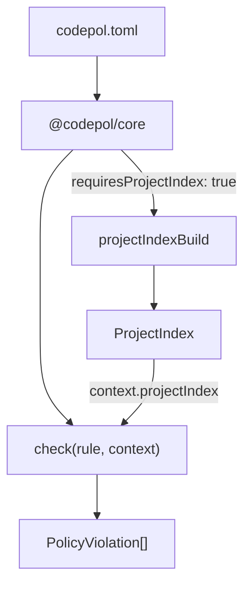

# Cross-File Analysis Rules

This guide shows how to write codepol plugin rules that use the `ProjectIndex` for cross-file analysis. If you haven't read the [Creating Custom Plugins](./creating-custom-plugins) guide yet, start there for the basics of rule authoring.

## The Pattern

Cross-file rules follow the same plugin structure as single-file rules, with two additions:

1. Set `requiresProjectIndex: true` in the rule capabilities
2. Access `context.projectIndex` in the check function



When at least one loaded plugin declares `requiresProjectIndex: true`, the core builds the project-wide semantic index before running checks. The index is then passed to every check function via `context.projectIndex`.

## Example 1: Unused Exports Detector

This is a real rule from `@codepol/plugin`. It detects exported symbols that no other file imports.

### Check Function

```typescript
import type {
  PolicyRule,
  PolicyCheckContext,
  PolicyViolation,
  ProjectIndex,
} from '@codepol/core';

export function unusedExportsCheck(
  rule: PolicyRule,
  context: PolicyCheckContext,
): PolicyViolation[] {
  const { projectIndex, source, filePath } = context;

  // Guard: skip gracefully if index is not available
  if (!projectIndex) {
    return [];
  }

  const violations: PolicyViolation[] = [];

  // Step 1: Get all exports from the current file
  const fileExports = projectIndex.fileExportsGet(filePath);

  // Step 2: Find which export names are imported by other files
  const importedNames = getImportedExportNames(projectIndex, filePath);

  // Step 3: Report exports that nobody imports
  for (const exp of fileExports) {
    if (exp.exportedName === '*') continue; // skip star re-exports

    if (!importedNames.has(exp.exportedName)) {
      const symbol = exp.symbolId
        ? projectIndex.symbolGet(exp.symbolId)
        : undefined;

      violations.push({
        ruleId: rule.id || rule.ruleId,
        filePath,
        message: `Exported ${symbol?.kind ?? 'export'} '${exp.exportedName}' is not imported by any other file`,
        line: byteOffsetToLine(source, exp.byteRange.start),
        column: 1,
      });
    }
  }

  return violations;
}
```

### Helper: Collect Imported Names

The key cross-file logic iterates over all files' import bindings to find which names are imported from the target file:

```typescript
function getImportedExportNames(
  projectIndex: ProjectIndex,
  targetFile: string,
): Set<string> {
  const importedNames = new Set<string>();

  // Get all unique files from the index
  const allSymbols = projectIndex.symbolsGet();
  const files = new Set(allSymbols.map(s => s.file));

  for (const file of files) {
    if (file === targetFile) continue;

    const bindings = projectIndex.importBindingsGet(file);

    for (const binding of bindings) {
      // Use resolvedModulePath when available (from cross-file resolution)
      if (binding.resolvedModulePath === targetFile) {
        importedNames.add(binding.importedName);
      }
    }
  }

  return importedNames;
}
```

### Rule Definition

```typescript
import { pluginRuleNew, treeCheckProviderNew } from '@codepol/core';
import { unusedExportsCheck } from './unusedExportsCheck';

const unusedExportsTreeCheck = treeCheckProviderNew({
  languages: ['typescript', 'tsx', 'javascript', 'jsx'],
  check: unusedExportsCheck,
});

export const unusedExportsRule = pluginRuleNew({
  id: 'no-unused-exports',
  capabilities: {
    treeCheckProvider: unusedExportsTreeCheck,
    requiresProjectIndex: true,  // triggers index building
  },
});
```

### Config Usage

```toml
[[plugins]]
id = "@codepol/plugin"
source = { kind = "builtin" }

[targets.src]
language = "typescript"
files = ["src/**/*.ts"]
exclude = ["**/*.spec.ts"]

[[rules]]
ruleId = "@codepol/plugin/no-unused-exports"
severity = "warn"
targets = ["src"]

[rules.args]
ignoreEntryPoints = true
```

## Example 2: Circular Dependency Detector

A from-scratch rule that uses the module graph to detect circular imports.

### Check Function

```typescript
import type {
  PolicyRule,
  PolicyCheckContext,
  PolicyViolation,
} from '@codepol/core';

export function circularDepsCheck(
  rule: PolicyRule,
  context: PolicyCheckContext,
): PolicyViolation[] {
  const { projectIndex, filePath } = context;
  if (!projectIndex) return [];

  const violations: PolicyViolation[] = [];

  // Get all cycles in the module graph
  const cycles = projectIndex.moduleCyclesGet();

  // Only report if the current file participates in a cycle
  for (const cycle of cycles) {
    if (!cycle.includes(filePath)) continue;

    // Only report once per cycle (from the first file alphabetically)
    const sorted = [...cycle].sort();
    if (sorted[0] !== filePath) continue;

    const cycleStr = cycle
      .map(f => f.split('/').pop())
      .join(' -> ');

    violations.push({
      ruleId: rule.id || rule.ruleId,
      filePath,
      message: `Circular dependency: ${cycleStr}`,
      line: 1,
      column: 1,
    });
  }

  return violations;
}
```

### Rule Definition

```typescript
import { pluginRuleNew, treeCheckProviderNew } from '@codepol/core';
import { circularDepsCheck } from './circularDepsCheck';

export const circularDepsRule = pluginRuleNew({
  id: 'no-circular-deps',
  capabilities: {
    treeCheckProvider: treeCheckProviderNew({
      languages: ['typescript', 'tsx'],
      check: circularDepsCheck,
    }),
    requiresProjectIndex: true,
  },
});

export default [circularDepsRule];
```

## Example 3: Deep Inheritance Detector

A rule that uses type relations to flag classes with deep inheritance chains.

### Check Function

```typescript
import type {
  PolicyRule,
  PolicyCheckContext,
  PolicyViolation,
  ProjectIndex,
  SymbolId,
} from '@codepol/core';

const MAX_DEPTH = 3;

function inheritanceDepth(
  projectIndex: ProjectIndex,
  symbolId: SymbolId,
  visited: Set<SymbolId>,
): number {
  if (visited.has(symbolId)) return 0; // cycle guard
  visited.add(symbolId);

  const rels = projectIndex.typeRelationsGet(symbolId);
  const extendsRels = rels.filter(r => r.relationKind === 'extends');

  if (extendsRels.length === 0) return 0;

  let maxParentDepth = 0;
  for (const rel of extendsRels) {
    if (rel.resolvedTargetId) {
      const parentDepth = inheritanceDepth(
        projectIndex,
        rel.resolvedTargetId,
        visited,
      );
      maxParentDepth = Math.max(maxParentDepth, parentDepth);
    }
  }

  return 1 + maxParentDepth;
}

export function deepInheritanceCheck(
  rule: PolicyRule,
  context: PolicyCheckContext,
): PolicyViolation[] {
  const { projectIndex, filePath, source } = context;
  if (!projectIndex) return [];

  const violations: PolicyViolation[] = [];
  const args = (context.ruleArgs as { maxDepth?: number }) ?? {};
  const maxDepth = args.maxDepth ?? MAX_DEPTH;

  // Check all classes in this file
  const classes = projectIndex.symbolsGet({ file: filePath, kind: 'class' });

  for (const cls of classes) {
    const depth = inheritanceDepth(projectIndex, cls.id, new Set());

    if (depth > maxDepth) {
      violations.push({
        ruleId: rule.id || rule.ruleId,
        filePath,
        message: `Class '${cls.name}' has inheritance depth ${depth} (max: ${maxDepth})`,
        line: byteOffsetToLine(source, cls.byteRange.start),
        column: 1,
      });
    }
  }

  return violations;
}

function byteOffsetToLine(source: string, offset: number): number {
  return source.slice(0, Math.min(offset, source.length)).split('\n').length;
}
```

## ProjectIndex Methods for Rule Authors

Quick reference for the most useful methods when writing cross-file rules. See the [full API reference](./project-index-api) for complete details.

| Category | Method | Returns | Use Case |
|----------|--------|---------|----------|
| **Symbols** | `symbolsGet(filter?)` | `SymbolRecord[]` | Find all symbols matching criteria |
| | `symbolGet(id)` | `SymbolRecord?` | Look up a symbol by ID |
| | `symbolsInFileGet(file)` | `SymbolRecord[]` | Get all symbols in a file |
| **Imports** | `importBindingsGet(file)` | `ImportBindingRelation[]` | Get import bindings for cross-file matching |
| | `importResolve(from, spec, name)` | `SymbolId?` | Resolve an import to its source symbol |
| **Exports** | `fileExportsGet(file)` | `ExportsRelation[]` | Get all exports from a file |
| | `exportedSymbolsGet(filter?)` | `SymbolRecord[]` | Get symbols with Exported flag |
| **Module graph** | `moduleImportersGet(file)` | `string[]` | Files that import a given file |
| | `moduleImporteesGet(file)` | `string[]` | Files imported by a given file |
| | `moduleCyclesGet()` | `string[][]` | All circular dependency cycles |
| | `moduleEntryPointsGet()` | `string[]` | Files with no importers |
| **Type relations** | `typeRelationsGet(symbolId)` | `TypeRelation[]` | What a symbol extends/implements |
| | `subTypesGet(symbolId)` | `TypeRelation[]` | What extends/implements a symbol |
| **Call graph** | `callersGet(symbolId)` | `SymbolId[]` | Symbols that call this symbol |
| | `calleesGet(symbolId)` | `SymbolId[]` | Symbols called by this function |
| **Control flow** | `cyclomaticComplexityGet(id)` | `number?` | Cyclomatic complexity of a function |

## Testing Cross-File Rules

Cross-file rules need multi-file test fixtures. Here is the recommended pattern:

```typescript
import { describe, it, expect, beforeAll } from 'vitest';
import { langAdd, parserInit, projectIndexBuild } from '@codepol/core';
import type { PolicyRule, PolicyCheckContext, PolicyRuleTarget } from '@codepol/core';
import fs from 'node:fs';
import path from 'node:path';
import os from 'node:os';
import { circularDepsCheck } from './circularDepsCheck';

describe('circularDepsCheck', () => {
  beforeAll(async () => {
    langAdd({ langId: 'typescript', fileExtensions: ['.ts'] });
    await parserInit();
  });

  function createFixture(files: Record<string, string>): {
    dir: string;
    paths: string[];
  } {
    const dir = fs.mkdtempSync(path.join(os.tmpdir(), 'test-'));
    const paths: string[] = [];
    for (const [name, content] of Object.entries(files)) {
      const filePath = path.join(dir, name);
      fs.mkdirSync(path.dirname(filePath), { recursive: true });
      fs.writeFileSync(filePath, content);
      paths.push(filePath);
    }
    return { dir, paths };
  }

  it('detects circular dependency', async () => {
    const { dir, paths } = createFixture({
      'a.ts': 'import { b } from "./b"; export const a = 1;',
      'b.ts': 'import { a } from "./a"; export const b = 2;',
    });

    const result = await projectIndexBuild({ files: paths, dir });
    const fileA = paths[0];

    const rule: PolicyRule = {
      ruleId: 'no-circular-deps',
      severity: 'error',
      targets: ['test'],
    };

    const target: PolicyRuleTarget = {
      language: 'typescript',
      files: ['**/*.ts'],
    };

    const context: PolicyCheckContext = {
      filePath: fileA,
      source: fs.readFileSync(fileA, 'utf8'),
      policy: { targets: { test: target }, rules: [rule] },
      dir,
      target,
      projectIndex: result.index,
    };

    const violations = circularDepsCheck(rule, context);
    expect(violations.length).toBe(1);
    expect(violations[0].message).toContain('Circular dependency');
  });

  it('no violations when no cycles', async () => {
    const { dir, paths } = createFixture({
      'a.ts': 'export const a = 1;',
      'b.ts': 'import { a } from "./a"; export const b = a + 1;',
    });

    const result = await projectIndexBuild({ files: paths, dir });
    const fileB = paths[1];

    const rule: PolicyRule = {
      ruleId: 'no-circular-deps',
      severity: 'error',
      targets: ['test'],
    };

    const target: PolicyRuleTarget = {
      language: 'typescript',
      files: ['**/*.ts'],
    };

    const context: PolicyCheckContext = {
      filePath: fileB,
      source: fs.readFileSync(fileB, 'utf8'),
      policy: { targets: { test: target }, rules: [rule] },
      dir,
      target,
      projectIndex: result.index,
    };

    const violations = circularDepsCheck(rule, context);
    expect(violations).toEqual([]);
  });
});
```

### Test Tips

- **Always guard for `projectIndex`** -- your check should return `[]` when the index is unavailable.
- **Use `projectIndexBuild`** directly in tests rather than going through the full policy pipeline. This keeps tests fast and focused.
- **Create temp directories** with `fs.mkdtempSync` so tests don't interfere with each other.
- **Test edge cases**: empty files, files with no exports, self-imports, external packages, re-export chains.

## Related Documentation

- [Semantic Index Architecture](./semantic-index) -- how the index works internally
- [ProjectIndex API Reference](./project-index-api) -- complete API documentation
- [Creating Custom Plugins](./creating-custom-plugins) -- general plugin authoring (single-file rules)
- [Creating Language Adapters](./creating-language-adapters) -- adding new language support
