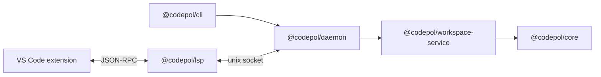

# Editor Integration

Codepol ships a language server and a VS Code extension. Together they surface
policy diagnostics, fixes, and architecture navigation inside the editor, backed
by a shared daemon so the semantic index is built once and reused.



## The daemon

Building a project index is the expensive part of everything Codepol does. The
daemon exists so that cost is paid once and shared: it owns the tree-sitter
parsers, the semantic index, file watchers, unsaved-buffer overlays, and the
type-aware bridge, then serves multiple clients — editor sessions and
short-lived CLI invocations alike.

It is started automatically. The CLI and the LSP both discover a healthy daemon
or spawn one, so there is nothing to run by hand.

| Aspect | Behavior |
| ------ | -------- |
| Transport | Unix domain socket, newline-delimited JSON |
| Discovery | Descriptor file in `CODEPOL_DAEMON_RUNTIME_DIR` (falls back to `XDG_RUNTIME_DIR`, then tmpdir) |
| Handshake | Negotiates protocol version and rejects mismatched builds |
| Sessions | One session per client; several may attach to the same workspace and share its index |
| Warm cache | Debounced persistence under `CODEPOL_DAEMON_CACHE_DIR`, so re-attaching after a restart is fast |
| Overlays | Unsaved editor buffers are analyzed without touching disk |

It is also deliberately disposable. The daemon exits on the first tree-sitter
WASM abort rather than serving results from a poisoned module, and it watches its
own entry file so a reinstall takes effect. Clients respawn it. To restart it
manually, run **Codepol: Restart Daemon**.

To bypass it entirely and analyze in-process:

```bash
CODEPOL_WORKSPACE_SERVICE_MODE=in_process codepol
```

## The language server

`@codepol/lsp` speaks JSON-RPC over stdio. Its standard LSP surface is
deliberately narrow:

| Capability | Notes |
| ---------- | ----- |
| `textDocument/didOpen`, `didChange`, `didClose` | Incremental sync |
| `textDocument/publishDiagnostics` | Pushed on open and change |
| `textDocument/codeAction` | Quickfixes plus `source.fixAll` and `source.fixAll.codepol` |
| `workspace/symbol` | Index-backed symbol search |
| `workspace/executeCommand` | Applies edit plans and diagnostics commands |

Everything distinctive lives under custom `codepol/*` requests rather than
standard methods:

| Request | Purpose |
| ------- | ------- |
| `semanticHover`, `semanticDefinition`, `semanticReferences` | Navigation over Codepol's own semantic classes |
| `prepareRename`, `previewRename` | Two-phase rename: preview the full cross-file edit, then apply |
| `dependencyGraph`, `impactRadius`, `dependencyPath`, `deadModules`, `dependencyDiff` | Module graph queries |
| `callGraph`, `typeHierarchy`, `symbolFlow` | Symbol-level graph queries |
| `architectureSummary` | Workspace-level architecture health |
| `semanticSearch`, `symbolLookup`, `symbolAtPosition` | Index lookups |
| `lintRules`, `lintRuleDetails` | The active policy, for UI |
| `indexStatus` | Index build progress and readiness |
| `diagnosticsConfig`, `diagnosticsEscalations` | Observability control |

### Why not standard `textDocument/hover` and `rename`?

Because Codepol is not trying to replace your language server. It owns its own
semantic classes — domain entities, architecture nodes, config components,
generated artifacts, relation anchors — and surfaces them *alongside* tsserver or
Pyright rather than competing for the same requests. Merging the two would make
it ambiguous which tool answered, and would degrade results the real language
server answers better.

The server can also call *back* into the editor: `codepol/editorTypeAwareRequest`
lets it ask the host for type information, which is how the VS Code extension
answers type-aware queries using the editor's own TypeScript integration instead
of spawning a second tsserver.

### Fix-on-save

Rules tagged `fix = "on-save"` participate in the `source.fixAll.codepol` code
action:

```jsonc
// .vscode/settings.json
"editor.codeActionsOnSave": {
  "source.fixAll.codepol": "explicit"
}
```

`fix = "manual"` (the default) keeps fixes available as quickfixes but never runs
them automatically. See [Policy Schema → Fix
Application](./policy-schema.md#fix-application-fix).

## The VS Code extension

Activates when the workspace contains `codepol.toml`. Requires VS Code 1.96+.

### Views

A **Codepol** activity-bar container with three views:

| View | Type | Contents |
| ---- | ---- | -------- |
| Search & Details | webview | Semantic search and symbol details for the current context |
| Lint Rules | tree | The active policy's rules, with drill-down |
| Packages & Targets | tree | Workspace packages and rename targets |

### Commands

**Architecture**

| Command | Description |
| ------- | ----------- |
| Show Architecture Summary | Workspace architecture health overview |
| Show Dependency Graph | Render the module graph |
| Show Architecture Links | Architecture relationships for the current file |
| Peek Architecture | Inline peek at architecture context |
| Show Full Cycle | Expand the cycle a diagnostic belongs to |
| Show Dependency Path… | Paths between two files |
| Show Dead Modules | Modules unreachable from entry points |
| Show Dependency Diff | Compare against the configured baseline |

**Symbols**

| Command | Description |
| ------- | ----------- |
| Show Semantic Definition | Codepol's definition for the symbol at the cursor |
| Semantic Search | Search the semantic index |
| Show Call Graph | Callers and callees |
| Show Type Hierarchy | Supertypes and subtypes |
| Find Callbacks | Sites where this function is passed as an argument |
| Peek Signature Impact | What a signature change would affect |
| Rename Codepol Entity | Cross-file rename with preview |

**Policy and diagnostics**

| Command | Description |
| ------- | ----------- |
| Open Lint Rule Details Panel | Details for a rule |
| Quick Fix… | Fixes for the diagnostic at the cursor |
| Refresh Lint Rules / Refresh Packages & Targets | Re-read policy state |
| Set Diagnostics Environment | Switch preset |
| Add / Clear Diagnostics Escalation(s) | Time-bounded verbosity |
| Show Current Diagnostics Config | Inspect the effective config |
| Restart Daemon | Terminate and respawn the analysis daemon |

### Inline surfaces

Beyond commands, the extension decorates the editor directly:

- **CodeLens** on exports (importer counts), symbols (call counts), architecture
  nodes, and type hierarchies
- **Hover** for architecture context and import specifiers
- **Gutter decorations** marking files in a dependency cycle
- **Code actions** on cycle diagnostics
- **Diff overlay** highlighting what changed against the architecture baseline
- **Status bar** readiness indicator, driven by index build progress

### Settings

| Setting | Default | Description |
| ------- | ------- | ----------- |
| `codepol.lsp.verboseDiagnostics` | `false` | Verbose language-server trace output |
| `codepol.diagnostics.environment` | `"user"` | Diagnostics preset: `user`, `dev`, `test`, `verbose` |
| `codepol.diagnostics.overrides` | `{}` | Per-dimension diagnostics overrides |
| `codepol.diagnostics.escalations` | `[]` | Standing time-bounded escalations |
| `codepol.diagnostics.showCycleDecorations` | `true` | Show cycle gutter decorations |
| `codepol.architecture.baselineLabel` | `""` | Snapshot label used by the diff overlay |

Example:

```jsonc
// .vscode/settings.json
{
  "codepol.diagnostics.environment": "dev",
  "codepol.architecture.baselineLabel": "main",
  "editor.codeActionsOnSave": {
    "source.fixAll.codepol": "explicit"
  }
}
```

## Other editors

Any LSP client can drive `@codepol/lsp` — launch `codepol-lsp` over stdio. The
standard capabilities (diagnostics, code actions, workspace symbols) work
anywhere. The `codepol/*` requests are custom, so surfacing dependency graphs or
architecture peek in another editor means adding a client for them; the VS Code
extension is the reference implementation.

## Building from source

```bash
pnpm build:extension-vscode-vsix-stack   # build the full extension stack
pnpm package:extension-vscode:vsix       # produce a .vsix
pnpm reinstall:extension-vscode:dev      # build and install locally
```
