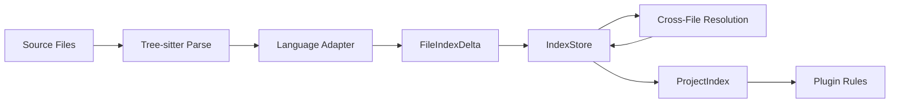
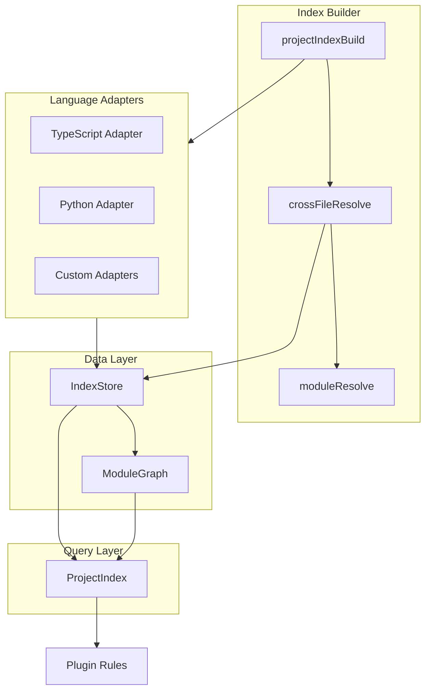
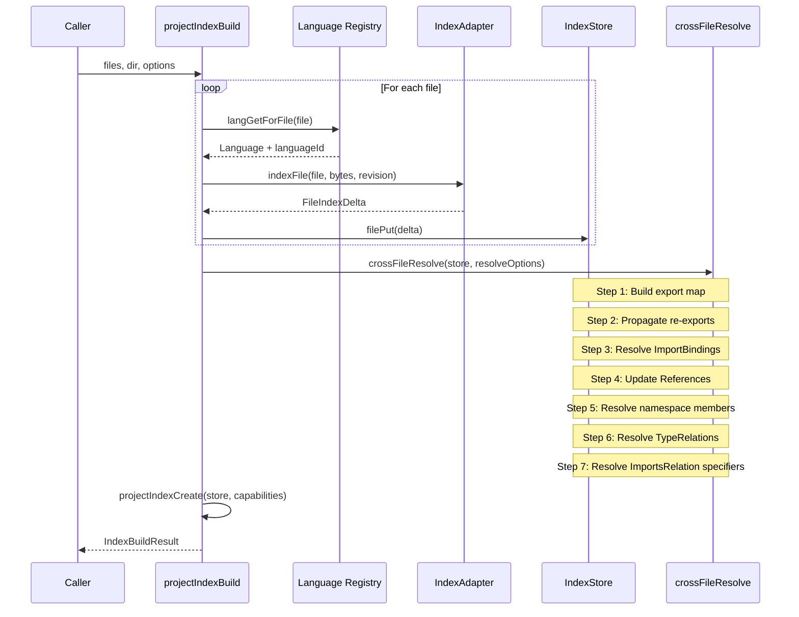
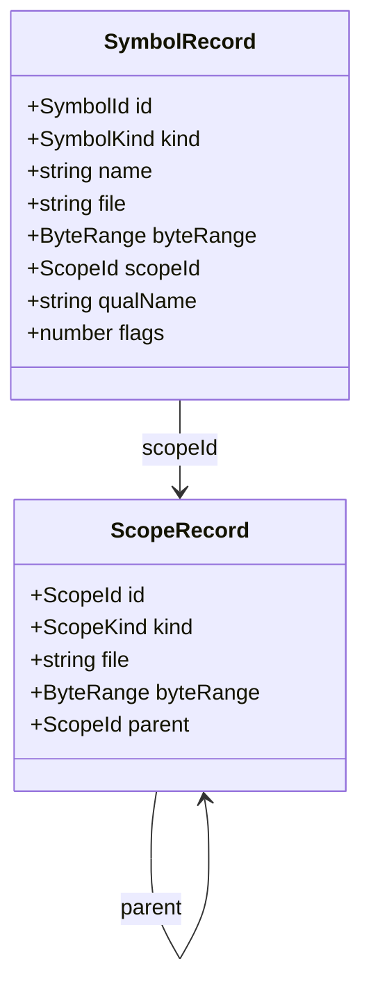
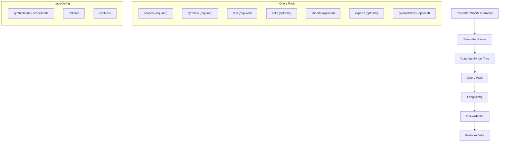

# Semantic Index Architecture

The semantic index is a project-wide code analysis engine built into `@codepol/core`. It extracts language-agnostic semantic information from source files using [tree-sitter](https://tree-sitter.github.io/tree-sitter/) and exposes it through the `ProjectIndex` query API for plugin rules.

## Overview

The semantic index provides:

- **Symbol extraction** -- functions, classes, variables, types, interfaces, enums, and their attributes
- **Scope trees** -- lexical/semantic boundaries for name resolution
- **Cross-file resolution** -- import/export binding, re-export chains, namespace members
- **Call graph** -- heuristic caller/callee detection
- **Module graph** -- dependency order, cycle detection, entry points
- **Type relations** -- extends/implements hierarchy with cross-file resolution
- **Control flow graphs** -- per-function CFGs with cyclomatic complexity

## Data Flow

1. **Parse** -- each source file is parsed into a concrete syntax tree by tree-sitter (WASM grammars, no native deps)
2. **Adapter extraction** -- a language adapter runs query packs against the tree to extract symbols, scopes, relations, and CFGs into a `FileIndexDelta`
3. **Store** -- deltas are merged into the `IndexStore`, the central mutable data store
4. **Cross-file resolution** -- after all files are indexed, `crossFileResolve` links import bindings to their source exports, resolves namespace members, updates type relations, and resolves module specifiers
5. **ProjectIndex** -- a read-only query facade over the store, exposed to plugin rules

## Component Architecture

| Component | File | Purpose |
|-----------|------|---------|
| `projectIndexBuild` | `indexBuilder.ts` | Orchestrates per-file indexing, cross-file resolution, and returns `ProjectIndex` |
| `crossFileResolve` | `indexBuilder.ts` | Links imports to exports, resolves namespace members, updates type relations |
| `IndexStore` | `indexStore.ts` | Mutable store of all symbols, scopes, and relations with indexed lookups |
| `ModuleGraph` | `moduleGraph.ts` | Dependency graph with topological sort (Kahn's) and cycle detection (Tarjan's SCC) |
| `ProjectIndex` | `indexQuery.ts` | Read-only query API exposed to plugins |
| `IndexAdapter` | `adapterTypes.ts` | Language-specific extraction (tree-sitter queries + kind mappings) |
| `moduleResolve` | `moduleResolver.ts` | Node-style module specifier resolution with path alias support |

## Index Build Pipeline

`projectIndexBuild(options)` executes these steps:

### Cross-File Resolution Steps

1. **Export map** -- build `Map<filePath, Map<exportedName, SymbolId>>` from all `ExportsRelation` entries
2. **Re-export propagation** -- follow `sourceModule` chains iteratively until stable (handles `export * from`, `export { foo } from`, `export * as ns from`)
3. **ImportBinding resolution** -- match each `ImportBindingRelation` to its source export via module resolution
4. **Reference update** -- update `ReferencesRelation.resolvedSymbolId` for references that resolved to import binding symbols
5. **Namespace member resolution** -- resolve dotted references like `utils.alpha` against the namespace's module export map
6. **TypeRelation resolution** -- update `TypeRelation.resolvedTargetId` from local import binding to actual exported symbol
7. **ImportsRelation resolution** -- set `resolvedModulePath` on side-effect and dynamic imports for module graph edges

## Data Model

### Core Records

**SymbolKind**: `module`, `namespace`, `class`, `interface`, `type`, `function`, `method`, `variable`, `const`, `field`, `parameter`, `enum`, `enumMember`

**ScopeKind**: `file`, `module`, `type`, `function`, `block`, `class`, `namespace`

**SymbolFlags** (bitset): `Exported`, `Async`, `Generator`, `Static`, `Abstract`, `Readonly`, `Optional`, `Private`, `Protected`, `Public`

### Relations

Relations are append-only facts extracted by adapters and refined during cross-file resolution.

| Relation | Purpose | Key Fields |
|----------|---------|------------|
| `DefinesRelation` | Scope declares a symbol | `scopeId`, `symbolId` |
| `ContainsRelation` | Scope contains child scope | `scopeId`, `childScopeId` |
| `ReferencesRelation` | Identifier refers to a symbol | `name`, `byteRange`, `resolvedSymbolId?` |
| `CallsRelation` | Call expression in a scope | `calleeName`, `byteRange`, `resolvedSymbolId?` |
| `ImportsRelation` | Scope imports from module specifier | `spec`, `resolvedModulePath?` |
| `ImportBindingRelation` | Links imported name to source module | `localSymbolId`, `importedName`, `moduleSpec`, `resolvedExportId?`, `isDefault`, `isNamespace` |
| `ExportsRelation` | Symbol exported from module | `symbolId`, `exportedName`, `isDefault`, `sourceModule?`, `sourceName?` |
| `TypeRelation` | Extends/implements hierarchy edge | `symbolId`, `targetName`, `relationKind`, `resolvedTargetId?` |

### Control Flow Graph

Each function/method scope gets a `FlowGraph` with:

- **FlowNode** kinds: `entry`, `exit`, `statement`, `branch`, `merge`, `loop`, `return`, `throw`
- **FlowEdge** labels: `true`, `false`, `loop-back`, `unconditional`, `break`, `continue`, `case`, `default`, `exception`, `finally`
- **Cyclomatic complexity**: V(G) = E - N + 2

## Adapter Architecture

Language adapters are the bridge between tree-sitter parse trees and the language-agnostic data model.

Each adapter provides:

1. **QueryPack** -- tree-sitter S-expression patterns with named captures
2. **Kind mappings** -- map capture suffixes / node types to canonical `SymbolKind` and `ScopeKind`
3. **Capture names** -- standard convention (`@scope`, `@name`, `@decl.*`, `@ref.*`, `@callee.*`, etc.)
4. **Reference filter** -- post-filter function to remove declaration sites, property keys, etc.

See [Creating Language Adapters](./creating-language-adapters) for a step-by-step guide.

## Built-in Language Support

| Language | Adapter | Query Packs | Type Relations |
|----------|---------|-------------|----------------|
| TypeScript (`.ts`, `.mts`, `.cts`) | `typescriptConfigCreate` | scopes, symbols, refs, calls, imports, exports, typeRelations | Yes |
| TSX (`.tsx`) | `typescriptConfigCreate` | same as TypeScript | Yes |
| JavaScript (`.js`, `.mjs`, `.cjs`, `.jsx`) | Uses TS/TSX adapter | same as TypeScript | Yes |
| Python (`.py`, `.pyw`) | `pythonConfigCreate` | scopes, symbols, refs, calls, imports, exports | No |

## Known Limitations

These are intentional design constraints, not bugs:

1. **No AST exposure** -- the index contains semantic primitives, not syntax nodes. Plugins never see tree-sitter trees.
2. **Best-effort resolution** -- unresolved references are valid results (returned with `resolvedSymbolId: undefined`).
3. **No type inference** -- tree-sitter alone cannot do type analysis. `TypeOf` relations are not supported.
4. **Heuristic call detection** -- may miss indirect calls (callbacks, dynamic dispatch) and may report false positives.
5. **Single-threaded indexing** -- files are indexed sequentially. Could be parallelized per-file in the future.
6. **In-memory only** -- no disk persistence. Large projects re-index on every run.

## Related Documentation

- [ProjectIndex API Reference](./project-index-api) -- full API documentation for all query methods
- [Creating Language Adapters](./creating-language-adapters) -- guide for adding new language support
- [Cross-File Analysis Rules](./cross-file-analysis) -- examples of plugin rules using the semantic index
- [Creating Custom Plugins](./creating-custom-plugins) -- general plugin authoring guide
