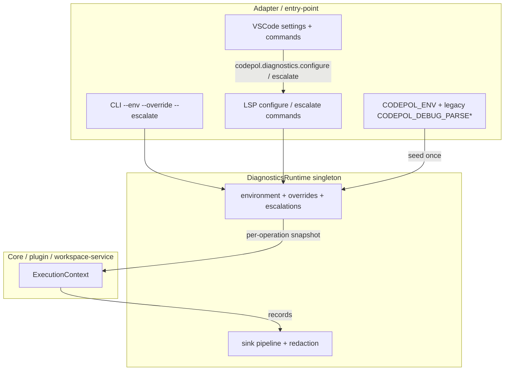

# @codepol/core/diagnostics

Runtime-configurable diagnostics with environment presets, capability
intersection, scoped escalations, and a central redaction pipeline.

## Two axes

The system keeps two concerns separate:

1. **Shipped capabilities** (compile-time). `ShippedDebugCapabilities` is a
   constant, resolved from `CODEPOL_BUILD_PROFILE` at module load, that says
   what the binary can possibly do. Bundlers may `define` the
   `__CODEPOL_BUILD_PROFILE__` literal to bake a profile.
2. **Runtime policy** (runtime). `RuntimeDiagnosticsPolicy` says what is
   actually active in this process right now. Callers control it through
   `setEnvironment`, `setOverrides`, `setConfig`, and `escalate`.

Effective behaviour at any moment is `policy ∩ shipped`, represented as
`EffectiveDiagnosticsPolicy`.

## Environment presets

Presets are data, not branches. There are four built-in presets:

| Preset    | Posture                            |
|-----------|------------------------------------|
| `user`    | Safe field posture. Default.       |
| `dev`     | Productive daily engineering.      |
| `test`    | Deterministic verification (CI).   |
| `verbose` | Explicit investigation.            |

Every preset sets `checks.invariants` explicitly so a level bump never
silently implies a check-depth change. Sinks are preset-specific; interactive
entry points (CLI with TTY, LSP) override them at boot so `user` ships with
`['stdout']` by default but turns into `['console']` where appropriate.

## Runtime control plane

Operations in flight bind their `EffectiveDiagnosticsPolicy` snapshot once —
later mutations never retroactively change what an in-flight `Diagnostics`
emits.

## Scoped escalations

`DiagnosticsRuntime.escalate(rule)` adds a time-bounded entry to the
process-global escalation store. Each rule carries:

- `scope` – `global`, `scope:<dotted>`, `request:<id>`, or `workspace:<id>`.
- `level` – the new minimum level while the rule is active.
- `policyOverrides` – optional additional overlays (e.g. turn snapshots on
  while this escalation applies).
- `ttlMs` – automatic expiry; expired rules are pruned on the next resolve.

Audit events (`escalation.added`, `escalation.revoked`,
`escalation.expired`) are emitted through the runtime's own `Diagnostics`
handle so they flow to whichever sink is currently active.

## Redaction pipeline

Sinks never decide redaction on their own. `sinkPipelineCreate` wraps the
composite dispatcher with a `RedactionExecutor`:

- `off` – passthrough.
- `standard` – redacts `*Token`, `*Secret`, `*Password`, `*Key`,
  `*SessionId`, `*ApiKey`, `Auth*` fields.
- `strict` – everything `standard` does, plus source-like fields
  (`source`, `sourcePreview`, `errorStack`, …) and string values longer than
  512 characters are truncated.

## Control surfaces

- **Core API**: `diagnosticsRuntimeSetEnvironment`,
  `diagnosticsRuntimeSetOverrides`, `diagnosticsRuntimeSetConfig`,
  `diagnosticsRuntimeEscalate`, `diagnosticsRuntimeRevokeEscalation`,
  `diagnosticsRuntimeListEscalations`.
- **CLI** (`apps/cli`): `--env <preset>`, `--override <dim=value>`
  (repeatable), `--escalate <scope=level@ttlSec:reason>` (repeatable).
- **Daemon IPC**: `set_diagnostics_config`, `get_diagnostics_config`,
  `set_diagnostics_escalation`, `revoke_diagnostics_escalation`,
  `list_diagnostics_escalations`.
- **LSP**: `codepol/diagnosticsConfig`, `codepol/diagnosticsEscalations`,
  `workspace/executeCommand codepol.diagnostics.configure`,
  `codepol.diagnostics.escalate`, `codepol.diagnostics.revokeEscalation`.
- **VSCode**: `codepol.diagnostics.environment`,
  `codepol.diagnostics.overrides`, `codepol.diagnostics.escalations`,
  commands `Codepol: Set Diagnostics Environment`, `Codepol: Add Diagnostics
  Escalation`, `Codepol: Clear Diagnostics Escalations`, `Codepol: Show
  Current Diagnostics Config`.

## Capability adapters (not diagnostics)

When a real behaviour must differ between environments (local filesystem vs
cloud blob store, SQLite vs managed database), use an adapter interface and
swap the implementation at the process boundary. Don't add `if (env === …)`
inside core code. Diagnostics policy and infrastructure adapters are
independent axes.
